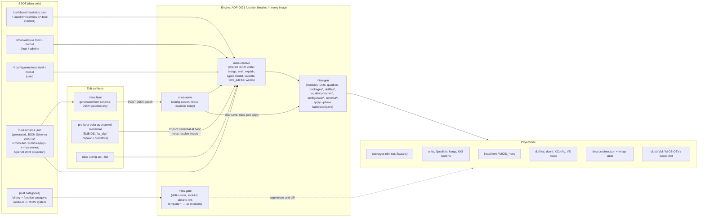

<!-- AI-hint: Prior art and gap plan for the SSOT engine: mios.toml + typed schema -> generated mios.html -> categorized local Rust binaries in every image -> projections. -->
# SSOT engine research: one mios.toml, a categorized set of Rust binaries, every image

- **Run:** 2026-10-03 (UTC). Repository baselines: mios.git `486c2bc2` (one map lane read `fe90e938`, origin/main), mios-bootstrap.git `91dc899`.
- **Scope:** how an operator-edited `mios.toml` (edited in `usr/share/mios/configurator/mios.html` before build or at startup) drives packages, dotfiles, settings, layout, units, Quadlets and the devcontainer/cloud images, and which upstream patterns to borrow.
- **Engine shape (operator directive, verbatim):** "everything is driven by the local mios rust binaries that are several bins with seperate functions mapped by categories—to MiOS systems/functions". So the engine is **not** one monolith and **not** Python or bash. It is a set of local Rust static binaries that ship in every MiOS image. The shape is already decided by accepted ADR-0021 (`usr/share/doc/mios/adr/0021-rust-static-binary-consolidation.md`): six to eight binaries named by **function** (`mios-gate`, `mios-gen`, `mios-resolve`, `mios-serve`, `mios-probe`, ...), registered in `[rust.categories]`. Section 2.0 reconciles the directive with that ADR. Every finding below names the ADR-0021 binary and module that owns the function, and the Python, bash or PowerShell that still does that work (grandfathered under Law 14, to be ported).
- **Method:** three read-only map lanes over both repos (the configurator; the mios.toml-to-system engine; dotfiles, settings and layout), then seven upstream research families, then this synthesis.
- **Evidence rules:** repository facts cite `path:line` in this tree at the baseline. Upstream facts cite primary docs or source with the version read. **unverified** marks a claim not confirmed from a primary source; **inference** marks the author's reasoning. GitHub REST was blocked (403) for some lanes, so some versions come from release pages, crates.io/npm or doc headers, as marked.
- **Status:** staging draft. Nothing in this file has been implemented. The gap list in section 4 proposes tasks; it does not edit `tasks.jsonl`.

---

## 1. Target architecture



`*` = proposed module of an ADR-0021 binary (no new binary is proposed anywhere in this doc).

The SSOT is data only. That means the three-tier `mios.toml` overlay (vendor < host < user, each tier followed by its `mios.d` fragments in tier-major order, Laws 1 and 13), a **generated** typed schema, and the ADR-0021 `[rust.categories]` registry that says which binary and module owns which table. `mios.html` stops being a hand-written second implementation. It is rendered from the schema, reads the effective config as JSON with per-key provenance from the config server, and sends JSON patches back. One Rust writer in the shared SSOT crate (built on `toml_edit`, surfaced as `mios-resolve set`) applies each patch as a comment-preserving delta to the target tier, and never to the vendor tier.

The engine is the ADR-0021 set of function-named Rust static binaries that ships in every image (bootc OCI, devcontainer/Codespaces, cloud VM, MiOS-DEV):
- `mios-resolve` resolves the tiers and owns the typed model, validation and tier writes (the shared SSOT crate is today's `tools/native/mios-resolver`, per ADR-0021 Decision 5).
- `mios-gen` projects: one module per MiOS system (units/boot, containers, packages, dotfiles/desktop, AI plane, devcontainer, configurator, schema), and `mios-gen apply` runs them at a phase.
- `mios-serve` serves the configurator and calls `mios-gen apply` after a validated save.
- `mios-gate` runs regenerate-and-diff over every projection.
- `mios-probe` checks host readiness.

The same `mios-gen` modules run in three places:
- at **bake** (Containerfile phases);
- at **startup** (a boot oneshot for the system tier, plus a `systemd --user` unit for the user tier);
- **after each validated save**.

A pre-boot edit to an image that is already built reaches it as a systemd credential, which is imported into the host tier. Nothing is rebuilt and `/usr` is never touched.

---

## 2. Design decisions and the prior art each borrows

### 2.0 Engine shape: the operator directive read through ADR-0021

The directive ("several bins with seperate functions mapped by categories—to MiOS systems/functions") does not need a new design. Accepted ADR-0021 already fixes the shape, and this doc adopts it without change:
- **Shape (Decision 1).** Six to eight separate binaries named by **function**: `mios-gate`, `mios-gen`, `mios-resolve`, `mios-serve`, `mios-probe`, and up to three more. Function is the only naming axis. Rationale 2 rejects lifecycle and domain as axes, so this doc does not name binaries `packages`, `dotfiles`, `boot` or `provision`. Lifecycle is expressed by which binaries an image ships and, here, by a `phase` field.
- **Registry (Decision 1).** `[rust.categories]` is the SSOT. It is declared by the ADR but **absent** from `usr/share/mios/mios.toml` today: only `[rust]` (`max_untested_crates`, line 12869) and `[rust.untested_crates]` (line 12872) exist. This doc does not invent a parallel `[engine.binaries.*]` table.
- **Invocation (Decision 2).** Real separate binaries, not multicall. Legacy names survive as `tmpfiles.d` `L+` symlink shims.
- **Location (Decision 3).** One workspace at `src/mios-rs/` (today its members are `miosd`, `mios-build`, `mios-config`, `mios-node`, `mios-gate`, `mios-probe`; `src/mios-rs/Cargo.toml`). The 21 crate directories under `tools/native/` today (ADR-0021 counted 14 when written) are absorbed as **modules** of the category crates (LANG-02, T-1007). No new crate is proposed under `tools/native/`.
- **Migration (Decision 9).** Strangler parity: byte-identical output on the real tree, planted negative controls still fail for the planted reason, and the script is deleted **in the same commit** that proves parity.
- **Shared crate (Decision 5, as corrected).** The one cascade implementation is the existing `mios-resolver` library. `mios-config`'s separate loader is retired (LANG-03, T-1008), so its typed model and `validator.rs` move into the shared crate rather than becoming a binary.

**The two mappings.** The directive asks for binary -> category -> MiOS system. Under ADR-0021, **the binary is the function category**: `mios-gen` *is* the "generate" category. The second mapping, to the MiOS system or function it drives, is a `system` field on each module row. One binary therefore drives several systems through its modules (`mios-gen` modules `units`, `quadlets`, `packages`, `dotfiles`, ...), and one system can be touched by several binaries in different functions (systemd units: generated by `mios-gen units`, checked by `mios-gate`).

**miosd's `render-*` and `generate-*` verbs belong in `mios-gen`.** They are projections (`src/mios-rs/miosd/src/main.rs`: `render-ports` 727, `render-repos` 1369, `render-nut` 2171, `render-chrony` 2237, `render-uki-cmdline` 2294; `generate-quadlets` at 2086-2103 still shells out to Python). ROADMAP LANG-06 (T-1010) already puts the `render-*` scripts in `mios-gen`. ADR-0021's Consequences say `miosd` "remains as a daemon and keeps the subcommands it already serves". This doc reads that as call-site compatibility: each `miosd render-*` verb becomes a thin exec of the matching `mios-gen` module in the parity commit that ports it, and the daemon half of `miosd` (config-server, ThemeWatcher) is the seed of `mios-serve` (LANG-07, T-1011). **inference:** the operator should confirm this reading, because it decides whether `miosd` shrinks to a shim set.

**Function, not a new binary.** Functions that earlier drafts gave their own binary become modules or verbs:

| Earlier draft | ADR-0021 owner |
|---|---|
| `mios-packages` (proposed) | `mios-gen packages` |
| `mios-dotfiles` (proposed) | `mios-gen dotfiles` (render/diff/apply); drift verdict via `mios-gate` |
| `mios-render-devcontainer` (proposed) | `mios-gen devcontainer` |
| `miosd render-configurator` (proposed) | `mios-gen configurator` |
| `mios-config schema` (proposed) | `mios-gen schema` (the schema is a projection) |
| `mios-config set/apply --tier`, validate | `mios-resolve set` / `mios-resolve import --tier`, `mios-resolve validate` (shared crate) |
| `mios-firstboot` (proposed) | a boot unit that runs `mios-resolve import --credentials` then `mios-gen apply --phase boot` |
| `miosd apply` (proposed) | `mios-gen apply --phase` (bake, boot or save), called by `mios-serve` after a save |

**Slots 6-8 are open.** ADR-0021 names five functions. Existing crates with no named home are `mios-install`, `mios-task`, `mios-build` + `mios-bake-plan` + `xtask` + `mios-toolchain-pin`, and `mios-node`. ROADMAP LANG-07 puts daemons in `mios-serve`, which would cover `mios-node` and `mios-wallpaperd`. The candidates for the remaining slots are `install`, `build` and `task`. That choice is the residual open question 7.

### 2.1 Schema source of truth

**Decision.** A JSON Schema 2020-12 document, `usr/share/mios/schemas/mios.toml.schema.json`, generated by `mios-gen schema` from the typed model in the shared SSOT crate and guarded by regenerate-and-diff (Law 8). It has two modes:
- **partial:** every key optional. Used to validate one tier or one fragment.
- **resolved:** stricter. Used to validate the merged result.

Per-key MiOS extensions, all `x-` prefixed so the schema stays valid 2020-12:
- `x-mios-tier`: which tiers may set the key, e.g. host-only for kargs and `[security.privileged_quadlets]`.
- `x-mios-apply`: `bake | reboot | live`.
- `x-mios-owner`: the `[rust.categories]` binary and module that consumes the key (e.g. `gen.units`).
- `x-mios-merge`: `replace | append | by-key:<field>`.
- `x-mios-secret`: Law 11 tagging.

An OpenAI strict projection (`additionalProperties:false`, every property required) is generated from the same model for agent tool schemas. That satisfies "OpenAI-format schemas everywhere" without keeping a second schema by hand. Decide which keys get typed declarations using the RFC 42 rule (ports, model names, security flags, secret references). The long tail stays freeform.

| Borrowed from | What | Source (version read) |
|---|---|---|
| NixOS module system | one declaration per option (`type, default, defaultText, example, description`); the same evaluation returns `options` and `config`; `mkRenamedOptionModuleWith` is the shape for declared aliases | https://raw.githubusercontent.com/NixOS/nixpkgs/master/lib/modules.nix ; https://raw.githubusercontent.com/NixOS/nixpkgs/master/nixos/doc/manual/development/option-declarations.section.md (nixpkgs master; NixOS 26.05) |
| NixOS make-options-doc | `options.json` is one machine-readable artifact; the manual, man page and search are downstream; `visible`/`internal`/`readOnly` filters | https://raw.githubusercontent.com/NixOS/nixpkgs/master/nixos/lib/make-options-doc/default.nix |
| NixOS RFC 42 | structured `settings` freeform plus a few declared "valuable" options | https://raw.githubusercontent.com/NixOS/rfcs/master/rfcs/0042-config-option.md |
| Guix `define-configuration` | field = type predicate + default + doc + serializer; Guix admits docs are not wired into the manual, which is the gap Law 8 forbids | https://guix.gnu.org/manual/en/html_node/Complex-Configurations.html (Guix 1.5.0) |
| schemars + jsonschema (Rust) | derive the schema from the typed Rust model; validate with the same crate in Rust and in WASM | https://crates.io/api/v1/crates/schemars (1.2.2) ; https://github.com/Stranger6667/jsonschema (0.58.5) ; https://json-schema.org/understanding-json-schema/reference/annotations |
| VS Code `contributes.configuration` | per-key `scope`, `deprecationMessage`, `enumDescriptions`, `order`; the Settings UI shows which layer set a value | https://code.visualstudio.com/api/references/contribution-points |
| Taplo | `#:schema /usr/share/mios/schemas/mios.toml.schema.json` header in every tier gives offline editor validation; `x-taplo.docs/initKeys` | https://taplo.tamasfe.dev/configuration/directives.html (taplo 0.14.0; documents Draft 4, so 2020-12 keywords are **unverified**) |
| Helm `values.schema.json` | validate the **merged** values, not each file | https://helm.sh/docs/chart_template_guide/values_files/ (Helm 4.3.0) |

**Repository facts.**
- No crate depends on `schemars` or `jsonschema`; a grep of every Cargo.toml finds 0 hits.
- `mios.toml [schema]` is a register of Postgres tables, not an option schema.
- `mios-config` already holds a typed Figment model and a `validator.rs` (`src/mios-rs/mios-config/src/{lib,validator}.rs`). Under ADR-0021 Decision 5 and LANG-03 (T-1008) its loader is retired, so the model and validator move into the shared SSOT crate rather than making `mios-config` a binary. Its hand-written serde `default_*()` functions are a second copy of the defaults and should be generated from, or read from, mios.toml.

### 2.2 Editor generation and round-trip

**Decision.**
- `mios-gen configurator` (a `mios-gen` module; see 2.0) emits the page from schema + UI-layout projection at bake. A drift check (Law 8) guards it.
- The page ships a dependency-light vanilla renderer, baked and never CDN-fetched (Law 12).
- `GET /portal/config` returns JSON with three parts: `{effective, schema_slice, provenance{key: tier+file}}`.
- `POST` accepts a JSON patch list `[{path, value, tier}]`.
- `mios-resolve set` (shared crate, toml_edit) writes only the changed bytes into the target tier. Validation errors come back keyed by JSON pointer.
- The browser contains **no** TOML grammar.

| Borrowed from | What | Source |
|---|---|---|
| JSON Forms / RJSF | data schema + separate UI schema (Categorization, rules SHOW/HIDE on condition) | https://jsonforms.io/docs/uischema/ (@jsonforms/core 3.8.0) ; https://registry.npmjs.org/@rjsf/core/latest (6.11.0) |
| Home Assistant config flows | server sends the schema, the client renders it, errors come back keyed per field | https://developers.home-assistant.io/docs/config_entries_config_flow_handler/ |
| toml_edit / tomlkit | format-preserving edits ("comments, spaces and relative order"); what `cargo add` uses | https://raw.githubusercontent.com/toml-rs/toml/main/crates/toml_edit/README.md (0.25.15+spec-1.1.0) |
| Figment value metadata | each value records the provider that set it, which yields a free `--explain KEY` | https://docs.rs/figment/latest/figment/struct.Figment.html (0.10.19) |

**Pitfalls carried forward.**
- toml_edit accepts TOML 1.1. Python `tomllib` in grandfathered consumers is TOML 1.0, so `mios-gate` (its absorbed `ssot-lint` module) must refuse 1.1-only syntax in the vendor file.
- A single form for ~10k lines must lazy-load its categories.
- The server-side Rust validator is authoritative over any browser validator.

### 2.3 Startup injection into an immutable image

**Decision.** No new binary (2.0). First-boot provisioning is two ADR-0021 verbs run by one boot unit, `mios-firstboot.service`: `mios-resolve import` (credential -> host tier) then `mios-gen apply --phase boot`. The same code has two entry points:

1. `--root <mounted image>`: offline. Called by `mios-install` / `mios-build` at install or bake.
2. No flag, at boot. The unit has `ImportCredential=mios.*`. `mios-resolve import` writes delivered fragments into `/etc/mios/mios.d/` (host tier, never `/usr`), then `mios-gen apply --phase boot` runs the registered modules. It writes one sentinel per phase, keyed on `sha256(resolved mios.toml) + image digest`, not on bare first-boot.

Locale, keymap, timezone and hostname are projected into `/usr/lib/credstore/firstboot.*`, so stock `systemd-firstboot` applies them. `[users]`/`[tmpfiles]` go out as `sysusers.extra`/`tmpfiles.extra`.

Degrade open at boot (Law 12). Fail closed only at pre-build validation.

| Borrowed from | What | Source |
|---|---|---|
| systemd credentials | SMBIOS type 11 / fw_cfg / nspawn `--set-credential` / initrd / UKI sidecar / `/usr/lib/credstore` / TPM-sealed `.encrypted`; well-known `systemd.extra-unit.*`, `sysusers.extra`, `tmpfiles.extra`, `firstboot.*` | https://systemd.io/CREDENTIALS/ ; https://github.com/systemd/systemd/blob/main/man/systemd.system-credentials.xml (systemd v262 tag; release dates **unverified**) |
| systemd-firstboot | one small tool; `--root/--image` offline mode; `--reset` (v254) to re-run | https://github.com/systemd/systemd/blob/main/man/systemd-firstboot.xml |
| systemd-confext | the host tier as a signed, versioned, removable `/etc` extension (`CONFEXT_LEVEL` from SSOT) | https://github.com/systemd/systemd/blob/main/man/systemd-sysext.xml (interaction with bootc `/etc` 3-way merge **unverified**; keep it as an option, not the default) |
| cloud-init | instance-id-keyed first-boot decision; `status --wait` (exit 0/1/2); `clean`; `schema --annotate`; declared merge algebra | https://docs.cloud-init.io/en/latest/explanation/first_boot.html ; https://docs.cloud-init.io/en/latest/reference/merging.html (26.2). Cloud-init is a **transport** only, never a second SSOT |
| Ignition/Butane | human format -> versioned strict machine spec via a validating transpiler; render and apply are separate | https://coreos.github.io/ignition/rationale/ ; https://coreos.github.io/butane/specs/ (fcos v1.7.0). Its run-once, fail-closed model is **not** copied |
| Talos `apply-config` | `--mode auto\|no-reboot\|staged\|try` with timed rollback, `--dry-run`; partial-config patches | https://docs.siderolabs.com/talos/latest/configure-your-talos-cluster/system-configuration/patching (v1.14.0) |
| nixos-rebuild-ng / switch-to-configuration-ng | build and activate are separate binaries; the activator was rewritten in Rust and the Perl one was removed after a period of running both side by side | https://nixos.org/manual/nixos/stable/release-notes (25.11, 26.05) |

**Repository facts.**
- Startup provisioning is all bash today: `usr/libexec/mios/{mios-ai-firstboot,mios-models-firstboot,mios-bound-images-firstboot,mios-adguard-firstboot,mios-hermes-firstboot,hermes-worker-firstboot,mios-swarm-pack-firstboot,wsl-firstboot,...}`. These scripts source `install.env` and touch `/var/lib/mios/.*-done`.
- No binary reads credentials.

**Image-parity caveat.** WSL2 has no SMBIOS or fw_cfg, and Codespaces has no TPM. Every image needs a credstore-file fallback projected by the same generator (**inference**).

### 2.4 Dotfile, settings and layout apply

**Decision.** Add a `dotfiles` module to `mios-gen` (no new crate; ADR-0021 Decision 3 forbids new crates in `tools/native`), with these verbs (`mios-gen dotfiles <verb>`; the drift verdict is also registered with `mios-gate`):
- `render`: bake. Writes `/usr` and `/etc/skel` targets.
- `check`: regenerate-and-diff.
- `diff`
- `apply`: HOME. Backup on collision, skip identical files, refuse by default.
- `verify`: exit 0/1.

Per-surface `mode = create | replace | link | merge-keys | exact-dir` in `[dotfiles.registry.*]`. An archetype/platform predicate replaces any per-variant template.

Each apply writes an owned-key/owned-file manifest to `/var/lib/mios/dotfiles/` (declared in tmpfiles, Law 2), so keys dropped from mios.toml are reset rather than orphaned.

Desktop databases:
- **dconf:** a keyfile rendered from `[appearance]`/`[theme.*]`, then `dconf compile` to `/usr/share/dconf/db/mios`. The profile gets `user-db:user` / `system-db:local` / `file-db:/usr/share/dconf/db/mios`.
- **KConfig:** fragments on `XDG_CONFIG_DIRS` (forward-looking; `[desktop].session = "gnome"` today).

| Borrowed from | What | Source |
|---|---|---|
| chezmoi | one merged data dict before any template; `diff/apply/verify`; `create_`/`modify_`/`exact_` target types; `run_onchange_` content-hash gating; dicts merge, lists replace | https://www.chezmoi.io/reference/special-files/chezmoidata-format/ ; https://www.chezmoi.io/reference/commands/verify/ (v2.73.0) |
| Home Manager | generation manifest; prune keys the old generation owned and the new one does not (`dconf reset`); backup-ext on collision; `onChange` | https://raw.githubusercontent.com/nix-community/home-manager/master/modules/misc/dconf.nix ; https://raw.githubusercontent.com/nix-community/home-manager/master/modules/files.nix (master 26.11) |
| dconf | `system-db:` opens only under `/etc/dconf/db`; `file-db:<abs path>` reads an immutable precompiled DB; locks bind lower DBs | https://gitlab.gnome.org/GNOME/dconf/-/raw/main/engine/dconf-engine-source-system.c ; https://gitlab.gnome.org/GNOME/dconf/-/raw/main/NEWS (51.0) |
| KConfig | XDG_CONFIG_DIRS cascade; `[$i]` immutability; per-key `kwriteconfig6 --notify` | https://invent.kde.org/frameworks/kconfig/-/raw/master/src/core/kconfigini.cpp (KF 6.30.0) |
| VS Code settings | Default < User < Remote < Workspace < Folder < Policy; objects merge, primitives and arrays replace | https://code.visualstudio.com/docs/configure/settings |
| GNU Stow | link mode for read-only, image-tracked consumer files | https://www.gnu.org/software/stow/manual/stow.html (fetch failed this run; semantics **unverified**) |

**Repository fact, likely live defect (static reading only; to be proven on a booted image).** `automation/10-locale-theme.sh:40-45` runs `dconf update || true` and then moves the compiled DB to `/usr/share/dconf/db/`. The shipped profile says `system-db:local`, and dconf opens system DBs only from `/etc/dconf/db/<name>`, so the vendor GNOME defaults are probably never read.

### 2.5 Drift detection

**Decision.** Every projection is listed in one registry row: `[rust.categories.<binary>.modules.<module>].outputs = [{path, check}]` (3.2), which absorbs `[laws.projection_registry]` (`mios.toml:2312`). `mios-gate` iterates that registry and re-runs each owning module in `--check` mode. A missing binary is a **failure**, never an advisory skip.

The resolver twins are proved by a golden fixture corpus covering:
- an empty string over a non-empty value;
- an absent tier;
- list replace;
- nested tables;
- cross-tier fragment ordering;
- same-name fragments;
- an empty `XDG_CONFIG_HOME`;
- stack_id port shifting.

Each implementation runs the whole corpus, and all must produce byte-identical canonical JSON. The Python leg runs with `MIOS_RESOLVER_NATIVE=0` forced.

| Borrowed from | What | Source |
|---|---|---|
| NixOS `documentation.nixos.options.warningsAreErrors` | gate the generated schema/docs build from day one | https://raw.githubusercontent.com/NixOS/nixpkgs/master/nixos/modules/misc/documentation.nix |
| chezmoi `verify`, cloud-init `status` exit codes | binary 0/1(/2) drift verdicts | see 2.3, 2.4 |
| devcontainer CLI `read-configuration` | diff the tool's own merged view against the rendered one | https://raw.githubusercontent.com/devcontainers/cli/main/README.md (@devcontainers/cli 0.89.0) |
| UAPI.6 / libeconf | a conformance corpus as the contract for several implementations | https://uapi-group.org/specifications/specs/configuration_files_specification/ (v1.0) |

### 2.6 Layering semantics (written down once, implemented once)

The decision is to keep MiOS's deliberate departures from the upstream specs, and to put them in a `[resolver]` contract table that the docs and `mios.html` render from:
- **Tier-major fragment order.** systemd and UAPI.6 sort drop-ins lexicographically across all directories; MiOS sorts within a tier, and every higher tier wins over every lower one (Law 13).
- **Key-wise merge**, where UAPI replaces the whole file.
- **Empty string never overrides**, where systemd uses an empty value to clear a setting.
- **Explicit unset marker for deletion.** Helm uses `null` and kustomize uses `$patch: delete`; the MiOS key is a reserved name declared in SSOT.
- **Per-path `merge_keys`** for arrays of tables (kustomize strategic merge).
- An optional `/run/mios/mios.d` tier for credentials and runtime input.

Sources:
- systemd.unit(5): https://raw.githubusercontent.com/systemd/systemd/main/man/systemd.unit.xml
- XDG Base Directory 0.8: https://specifications.freedesktop.org/basedir/latest/
- kustomize strategic merge: https://kubectl.docs.kubernetes.io/references/kustomize/kustomization/patchesstrategicmerge/
- Ansible `DEFAULT_HASH_BEHAVIOUR`. Its own docs warn that a global deep-merge toggle is fragile: https://raw.githubusercontent.com/ansible/ansible/devel/lib/ansible/config/base.yml
- mkosi, for the opposite choice on empty values ("empty assignment resets"): https://github.com/systemd/mkosi/blob/main/mkosi/resources/man/mkosi.1.md (v27.1)

**Verified defect (local repro at `486c2bc2`).**
- `mios-resolver` stacks tiers with Figment `merge` at two sites: `layers::create_figment` (`tools/native/mios-resolver/src/layers.rs:174`, which `resolve_merged` calls at `lib.rs:49`) and the private loop in `resolve_below_user` (`lib.rs:63`, the base a user-tier write sits on). Figment's `merge` takes the incoming value, so the empty-string-aware `merge::deep_merge` is bypassed.
- Repro: vendor `[ai] endpoint='http://vendor:1/v1'` plus user `endpoint=''` drops `MIOS_AI_ENDPOINT` from `--emit json`. The Python twin keeps the vendor value.
- `mios-config` (`src/mios-rs/mios-config/src/lib.rs:173`), `mios-bake-plan` (`src/main.rs:123`, `src/latest.rs:55`) and `mios-render-quadlets` (`src/main.rs:93`) call `create_figment` directly and inherit the defect. `mios-drift-runner` does not call it (it has no resolver or figment dependency).
- The twin-parity gate has no empty-string fixture and skips when the binary is absent.

**Code-read gap (unrun).** `XDG_CONFIG_HOME=''` builds `/mios/mios.toml` instead of falling back to `$HOME/.config` as the spec requires.

### 2.7 Devcontainer / Codespaces / cloud VM parity

**Decision.**
1. Render `devcontainer.json` with a `devcontainer` module of `mios-gen` (2.0). Inputs: `[ports]` via `[dotfiles.devcontainer].forward_port_keys`, resolver-emitted MIOS_* for `containerEnv`, `[workspace]`, `[profiles]`, and a new `[dotfiles.devcontainer].extensions`. Guard it with regenerate-and-diff plus a `devcontainer read-configuration` diff in CI.
2. Stamp the merge-safe subset as the image's `devcontainer.metadata` LABEL so any thin `devcontainer.json` that points at the image inherits it. `hostRequirements` and `forwardPorts` stay in the JSON because Codespaces reads them only from there.
3. Lifecycle: `onCreateCommand` runs `mios-resolve import` + `mios-gen apply --phase boot`, `updateContentCommand` runs `mios-gen apply --phase bake` (cached by prebuilds), `postStartCommand` runs service start. Each hook is a single binary call, not `boot-mios-systems.sh`.
4. The user tier persists under `/workspaces` (or through the Codespaces dotfiles hook calling `mios-gen dotfiles apply`).
5. Pin Features by digest through `devcontainer-lock.json` (CLI ≥0.87.0) and whitelist and track it.

| Borrowed from | Source |
|---|---|
| devcontainer.json reference, lifecycle placement, `secrets` names-only | https://containers.dev/implementors/json_reference/ ; https://raw.githubusercontent.com/devcontainers/spec/main/schemas/devContainer.base.schema.json |
| image metadata label merge table (lifecycle commands *collected*, env last-wins) | https://containers.dev/implementors/spec/ |
| Codespaces prebuild runs only onCreate + updateContent; `/workspaces` persists | https://docs.github.com/en/codespaces/prebuilding-your-codespaces/about-github-codespaces-prebuilds ; https://containers.dev/supporting |
| lockfile stable in CLI 0.87.0 | https://raw.githubusercontent.com/devcontainers/cli/main/CHANGELOG.md |
| Templates `${templateOption}` as the upstream analogue of Law 16 (one-shot only, so MiOS keeps its own drift gate) | https://containers.dev/implementors/templates/ |
| BlueBuild: published recipe JSON Schema + `validate` verb + module metadata naming the consumer | https://schema.blue-build.org/recipe-v1.json ; https://blue-build.org/reference/module/ (CLI 0.9.37, date from crates.io) |
| image-builder: deployment defaults embedded in the image at `/usr/lib/bootc-image-builder/config.toml` (bootc-image-builder is deprecated in favour of image-builder) | https://osbuild.org/docs/bootc/deprecation-notice/ |
| osbuild blueprint: per-table build / first-boot / installer split | https://osbuild.org/docs/user-guide/blueprint-reference/ |
| mkosi profiles + `[Match]`: one config, conditional per image kind | https://github.com/systemd/mkosi/blob/main/mkosi/resources/man/mkosi.1.md |

**Pitfall.** Collected lifecycle commands run twice if they appear in both the label and the JSON, so pick one owner per hook.

---

## 3. Current state

### 3.1 Surfaces (from the three map lanes)

| Surface | Driven by SSOT? | Owner today (binary, or script to port) | Gap |
|---|---|---|---|
| Config serve + save | yes | `miosd config-server` (`src/mios-rs/miosd/src/server.rs:213,232,280`) + `mios-resolver::resolve_merged`, writes the user delta only | Validation is a hand copy of Python rules (server.rs:224), not `mios-config` / schema. No re-projection after save. No host-tier mode |
| Duplicate Portal config server | yes (dup) | **Python** `usr/lib/mios/agent-pipe/mios_pipe/routing/portal.py:1372-1540` | Same routes and port as miosd, and it usually wins. Two serializers. Law 14 |
| mios.html form (627 `data-key="…"` attributes, 626 distinct keys; method: `grep -o 'data-key="[^"]*"'` counted raw, then after `sort -u`; `grep -c 'data-key='` also gives 627 lines) | partly | hand-written HTML (`mios.html:4312,4805`) | 561 of 6127 keys covered (~9%); 91 of 163 tables have no fields; 67 data-keys point at keys that don't exist |
| mios.html JS catalogs (QUADLETS 3703, PACKAGES 3723, DEPLOY_TARGETS 3787, COLOR_* 3804/3832, PRESET_PALETTES 3861, FLATPAKS 4055, DEFAULTS_TOML 4863) | no | hand-maintained JS | PACKAGES lacks 7 of the 52 groups; QUADLETS has drifted; DEFAULTS_TOML says version 0.2.4; retired port 8640 from `[docs].retired_ports` on 10 lines (Law 5). Cause: `[docs].port_clean` (`mios.toml:11827-11927`), the file list `check_doc_port_scheme` (`tools/drift-checks.py:4630`) scans, does not name `mios.html`. (The `/configurator/` exclusion at `98-drift-checks.sh:3518` belongs to `check_no_hardcoded_ssot_literal`, a fedora-NN/version-literal check, and is unrelated.) The embedded DEFAULTS_TOML also copies the `retired_ports` list itself |
| Browser TOML parse/emit | partly, lossy | hand JS `parseToml` 4127 / `emitToml` 4211 | `#RRGGBB` stripped as a comment (`[colors]` lost); multi-line and inline tables mangled; output fails tomllib at line 854; comments dropped |
| On-host launcher | partly | **bash** `usr/libexec/mios/mios-configurator-launch` | literal agent_pipe port fallback ×4 (Law 7); offline staging copies one tier, not the merged view |
| Pre-build pass (Windows) | partly | **PowerShell** `build-mios.ps1:1657-1847` (bootstrap-owned) | full lossy file frozen into the user tier; literal model-id fallbacks |
| `mios build` promote | partly, **damaging** | **PowerShell** `mios-bootstrap/field/lib/Get-MiOS-Backend.ps1:4447-4560` | copies a Downloads TOML over the **vendor** `M:\usr\share\mios\mios.toml` and over the page itself (Law 1); a retired port (Law 5) |
| Bootstrap user profile | no (parallel copy) | hand file `mios-bootstrap/mios.toml` (1839 lines) + `seed-merge.sh:79-88` | second SSOT (Law 15); `[identity]` diverges (`profile.toml` username `mios` vs vendor `user`) |
| Resolver (Rust) | yes | `mios-resolver` (six tiers, `--emit shell\|powershell\|json\|install-env`) | empty-string defect (2.6); 983-key divergence from Python ratcheted (`[resolver] max_key_divergence`); alias map hand-mirrored (`aliases.rs` 492 lines) |
| Resolver (Python/bash twins) | yes | **Python** `usr/lib/mios/mios_toml.py`, **bash** `usr/lib/mios/userenv.sh` (+ `tools/lib/` copy) | Law 14; aliases are procedural prefix-matching logic in `get_aliases()` (`mios_toml.py:374-754`), not a data table; legacy env.toml/flatpaks.list reader `userenv.sh:80-144`; hand port list |
| globals.sh / globals.ps1 | build-time snapshot | **Python** `tools/render-globals.py` | a third MIOS_* emitter; frozen literals; generator not shipped (`Containerfile:128`) |
| install.env | partly | `miosd render-ports` via `automation/35-render-ports.sh` | vendor tier only; two Rust emitters (also `mios-resolver --emit=install-env`); bake only |
| Projection orchestrator | yes | **bash** `tools/sync-generated.sh` (~20 Python + 6 Rust steps) | not shipped; hand-coded order; silently skips missing native bins |
| Packages | partly | **bash+python** `automation/lib/packages.sh` | first file wins, not layered; pinned to vendor at bake; no Rust owner |
| Quadlet generation | vendor only | `miosd generate-quadlets` → **Python** `tools/generate-pod-quadlets.py` (main.rs:2086-2103) | Rust facade over Python; cannot run on a booted host |
| Quadlet placeholder render | yes | `mios-render-quadlets` | bake only; locator boilerplate in 6 scripts |
| Boot renders (kargs, UKI cmdline, chrony, nut, repos, cosign) | partly | `miosd render-*` + `mios-unit-gen` | two UKI cmdline producers; `cosign-policy` is a Python shim; vendor only, bake only |
| systemd units | partly | `mios-unit-gen` + `[units.*]` | 55 drifted, 52 of 120 unsourced (`mios.toml:75-77`); a retired port from `[docs].retired_ports` in `mios-userdb-render.service:13`, `mios-sys-env-refresh.service:36` |
| Drop-in fan-out | partly | **bash+python** `automation/48-mios-dropin-fanout.sh` | vendor only, ignores `mios.d` |
| mios.d fragments | mechanism only | both resolvers | no fragment directory exists; bypassing consumers would ignore them anyway |
| Dotfile engine (16 surfaces) | yes (render) / partly (lifecycle) | **Python** `usr/libexec/mios/mios-dotfiles-render` (1321 lines), `mios-dotfiles` | runs only at dev time; outputs committed; no bake, boot or login re-render |
| Runtime theme bridge | yes | **bash+python** `mios-sync-theme(.service)` | system service, so it reads root's `~/.config`; 2 outputs only |
| VS Code / code-server settings | partly | **Python** `tools/sync-dotfiles.py` | 67 hex literals per file, not from `[colors]`; mobile theme extension 150 literals, copied |
| devcontainer.json / workspace | partly | **Python** `tools/sync-dotfiles.py` | literal `MIOS_AI_ROLE`, extension lists (13 vs 10 across repos), hostRequirements |
| dconf | no | hand keyfile `etc/dconf/db/local.d/00-mios-theme` + **bash** `10-locale-theme.sh` | literals already diverged (font 11 vs `[theme.font].size=12`); DB probably unread (2.4) |
| Flatpak overrides | partly | **bash** `10-locale-theme.sh:18-32`, `mios-flatpak-overrides-apply` | literals at build; two-layer private resolver at runtime |
| Cursor env | no | static `usr/lib/environment.d/50-mios.conf` | duplicates `[theme.cursor_linux]` |
| Flatpak list | yes | **bash** `61-flatpak-bake.sh`, `mios-flatpak-install` | `[desktop].flatpaks` vs `[[desktop.apps]]`: two registries (Law 9) |
| Wallpaper | partly | **Python** `ux/wallpaperd.py` (Linux); `mios-wallpaperd` (Windows, Rust) | no `[wallpaper]` table; one function split across languages |
| miosd ThemeWatcher | no | `src/mios-rs/miosd/src/daemon/theme.rs:18-58` | watches a non-existent `etc/mios/theme.toml`; literals |
| Verb dispatcher | no | `src/mios-rs/miosd/src/cli/dispatcher.rs:8-54` literal array | `[verbs]` has no `target`; not projected |
| Native binary catalogue | partly; **three vocabularies** | `[build.native.categories.{cli,apps,services,daemons}]` (`mios.toml:1894-1925`, install shape) + `miosd native-targets`; `55-native-build.sh:16` literal list of 8 prebuilt bins; ADR-0021's `[rust.categories]` (function) | `[rust.categories]` is declared by ADR-0021 but **absent** from mios.toml (only `[rust]` and `[rust.untested_crates]`, line 12869). Fix: create `[rust.categories]` with fields `binary, category, system, owns, outputs, phase, replaces, install_shape` (3.2) and **project** `[build.native.categories]`, the `55-native-build.sh:16` list and `[laws.projection_registry]` from it. `mios-build`, `mios-config`, `mios-ssot-walk` are libraries and not listed today |
| Phase runner | yes | **bash** `automation/build.sh` + `miosd build --list` | `apply_class` exists, but no phase maps to an owning binary and there is no re-apply entry point in the image |
| Duplicate names | partly | — | `[appearance].cursor_*` ≡ `[theme.cursor_linux]`; `[appearance].adw_color_scheme` ≡ `[desktop].color_scheme` (Law 9) |

### 3.2 Binary catalogue keyed to ADR-0021 (binary = function category -> module -> MiOS system)

The source is each crate's `src/` and `Cargo.toml` `description` at `486c2bc2`, mapped onto ADR-0021 Decisions 1 and 3 and ROADMAP LANG-02..07. **E** = exists as its own crate today (absorbed as a module and kept as an `L+` shim name, per LANG-02/T-1007), **P** = proposed module, **L** = library crate. No row proposes a new binary.

| Binary (category) | Module | MiOS system / function | Status | Absorbs (Law 14 port backlog) |
|---|---|---|---|---|
| `mios-resolve` | shared SSOT crate (`mios-resolver` lib) | three-tier + `.d` merge; emits MIOS_* (shell/ps/json/install-env); `--explain`; `--get` | E (`mios-resolver`) | `mios_toml.py` merge + aliases, `userenv.sh` body, `mios-toml-get`, `render-globals.py`, `mios-sync-toml` |
| `mios-resolve` | `walk` | key enumeration shared by gates | L (`mios-ssot-walk`) | — |
| `mios-resolve` | `model`, `validate`, `set`, `import` | typed model (from `mios-config`), validate, toml_edit tier writes, credential/patch import | L → P (LANG-03 retires `mios-config`'s loader) | `validate_portal_save` copy, `kernel/config.py` writers, PowerShell seed/promote |
| `mios-serve` | `config-server`, `theme-watch` | config serve + save, then `mios-gen apply --phase save`; ThemeWatcher | E (daemon half of `miosd`) | `portal.py` `/portal/config*`, `mios-configurator-launch` |
| `mios-serve` | `node`, `wallpaper` | edge micro-node runtime; living wallpaper | E (`mios-node`; `mios-wallpaperd`, Windows-only today) | `ux/wallpaperd.py` |
| `mios-gen` | `apply` | phase runner: run registered modules at `bake`/`boot`/`save` | P | `sync-generated.sh` order, `usr/libexec/mios/*-firstboot*` (with `mios-resolve import`) |
| `mios-gen` | `units` | `[units.*]`, drop-ins, kargs, UKI cmdline, chrony, nut, repos, fan-out | E (`mios-unit-gen`) | `miosd render-{kargs,uki-cmdline,chrony,nut,repos}`, `48-mios-dropin-fanout.sh` |
| `mios-gen` | `quadlets` | Quadlet generation + `${MIOS_*}` render, ports | E (`mios-render-quadlets`) | `tools/generate-pod-quadlets.py`, `miosd generate-quadlets`, `miosd render-ports` |
| `mios-gen` | `packages` | resolve `[packages.*]` + profile sections -> dnf/flatpak sets | P | `automation/lib/packages.sh`, `61-flatpak-bake.sh`, `mios-flatpak-install` |
| `mios-gen` | `ai` | lane/model config projection | E (`mios-ai-config`) | AI-manifest Python generators (**inference**) |
| `mios-gen` | `dotfiles` | `[dotfiles.registry.*]`, dconf, KConfig, VS Code, theme bridge; render/diff/apply | P | `mios-dotfiles-render`, `mios-dotfiles`, `mios-theme-render`, `mios-theme-broadcast`, `mios-sync-theme`, `sync-dotfiles.py`, `10-locale-theme.sh` |
| `mios-gen` | `devcontainer` | devcontainer.json, workspace, `devcontainer.metadata` label | P | `sync-dotfiles.py` devcontainer half, `boot-mios-systems.sh` |
| `mios-gen` | `configurator`, `schema` | `mios.html` + catalogs; `mios.toml.schema.json` + OpenAI strict projection | P | hand-written `mios.html` |
| `mios-gen` | `names` | names registry projection | E (`generate-names-registry`) | — |
| `mios-gate` | `drift`, `ssot-lint`, `aiplane-lint`, `template-conform`, `template-compile`, `comment-lex`, `version-check`, `size-ceiling`, `edge-status` | regenerate-and-diff, laws, schema conformance, templates, `[theme.edge.reach]` | E (`mios-gate` in `src/mios-rs`; the rest in `tools/native`) | `automation/98-drift-checks.sh` checks (incl. twin parity), LANG-05/T-1009 |
| `mios-probe` | — | host readiness (`[preflight]`) | E (T-1003) | — |
| slot 6-8 (open, 2.0) | `install` | bootc to disk/existing root; installer projection of `[install]` | E (`mios-install`) | `config/artifacts/*.toml` sed templating |
| slot 6-8 (open, 2.0) | `build` | phase registry, profile closure, bake plan, toolchain pin | E (`mios-build` L, `mios-bake-plan`, `xtask`, `mios-toolchain-pin`) | `automation/build.sh` runner |
| slot 6-8 (open, 2.0) | `task` | `tasks.jsonl` ledger | E (`mios-task`) | — |

**How it is declared.** Create `[rust.categories]` in `usr/share/mios/mios.toml` next to `[rust]` (line 12869), as ADR-0021 Decision 1 requires. One row per binary, with one module sub-row per MiOS system. The `install_shape` field is the source of `[build.native.categories]`, which becomes a projection, as do the `55-native-build.sh:16` prebuilt list and `[laws.projection_registry]`.

```toml
[rust.categories.gen]
binary        = "mios-gen"
category      = "gen"                          # function axis only (ADR-0021 Rationale 2)
install_shape = "cli"                          # projects [build.native.categories.cli]
phase         = ["bake", "boot", "save"]       # where mios-gen apply runs it

[rust.categories.gen.modules.units]
system   = "systemd units, kargs, UKI cmdline"     # second mapping: MiOS system/function
owns     = ["units", "kargs", "uki", "blade.requires"]   # top-level tables consumed
outputs  = [{ path = "usr/lib/systemd/system", check = "check_unit_projection" }]
replaces = ["tools/native/mios-unit-gen", "automation/48-mios-dropin-fanout.sh"]   # shimmed, then deleted in the parity commit
```

Gate rules (Guix fold-services style), in `mios-gate`:
- every crate in `src/mios-rs/` and `tools/native/` maps to exactly one binary or module row;
- the binary count is 6-8 (ADR-0021 Decision 1);
- every top-level table has exactly one owning module;
- every `outputs` entry has a check, which absorbs `[laws.projection_registry]`;
- no `replaces` path survives once its owner marks it as ported (ADR-0021 Decision 9: same-commit deletion).

---

## 4. Prioritized gap list (one proposed task each)

Notation:
- **AC** is an EARS acceptance criterion.
- **+** is the positive control and **−** is the planted negative control, which must go red naming the plant.
- `dep:` lists dependencies.
- IDs are proposals (`SSOT-Gnn`); the ledger assigns real T-numbers.
- **IEC** = the running image-equivalence chain T-1173..T-1181 (WS-IMAGE).
- **Cloud lane** = T-1164, T-1166, T-1167, T-1180, T-1182.

**P0: correctness defects that corrupt or silently drop operator intent**

1. **SSOT-G01: Resolver honours "empty never overrides" in every binary.** WS-RESOLVER.
   - AC: When any tier sets a key to `""` and a lower tier sets it non-empty, `mios-resolver --emit json` (`mios-resolve` after LANG-02; the old name stays a shim), `resolve_below_user`, and every `create_figment` caller (`mios-config` `lib.rs:173`, `mios-bake-plan` `main.rs:123` and `latest.rs:55`, `mios-render-quadlets` `main.rs:93`) shall emit the lower value. Fix both fold sites, `layers.rs:174` and `lib.rs:63`. When `XDG_CONFIG_HOME` is set but empty, the user tier shall resolve to `$HOME/.config/mios`.
   - +: vendor `endpoint='http://vendor:1/v1'` + user `''` emits the vendor URL.
   - −: revert the fold to Figment `merge`; the fixture goes red naming `MIOS_AI_ENDPOINT`.
   - dep: none.

2. **SSOT-G02: Twin-parity corpus that cannot skip.** WS-RESOLVER / WS-DRIFTRUST.
   - AC: `mios-gate` (its absorbed `drift` module) shall run a golden corpus (2.5) through Rust, Python (`MIOS_RESOLVER_NATIVE=0`) and bash and compare canonical JSON of the merged tree. If the native leg is missing, the gate shall fail. The negative control joins the `just drift-gate` recipe in `Justfile` (ADR-0021 Decision 10).
   - +: corpus green at HEAD after G01.
   - −: delete the built binary, and the gate reports FAIL, not "advisory skip".
   - dep: G01.

3. **SSOT-G03: Stop the bootstrap promote from writing the vendor tier.** WS-BOOTSTRAP (both repos, Law 15).
   - AC: When the operator finishes the pre-build configurator pass, the flow shall write only a validated delta to the host or user tier through `mios-resolve import --tier`. It shall never write `usr/share/mios/mios.toml` or `mios.html`.
   - +: `mios build` with an edited color leaves the vendor file byte-identical and adds one host-tier key.
   - −: plant a copy to `M:\usr\share\mios\mios.toml`; a `mios-gate` check over the bootstrap scripts fails naming it.
   - dep: G05 (the `import --tier` verb). A minimal interim fix (delete the vendor-tier copy) needs nothing.

4. **SSOT-G04: The configurator never parses TOML in the browser.** WS-CONFIG.
   - AC: When `mios.html` loads under the config server (`miosd config-server` today, `mios-serve` after LANG-07), it shall read `GET /portal/config` as JSON `{effective, schema_slice, provenance}`. On save it shall POST JSON patches, and the server shall apply them with toml_edit, preserving comments and order.
   - +: round-trip of the vendor file through a no-op save is byte-identical; `[colors].bg` survives.
   - −: plant a `#`-in-string truncation in the serializer; the round-trip test fails naming `colors.bg`.
   - dep: G05.

**P1: the engine backbone**

5. **SSOT-G05: The shared SSOT crate owns the typed model, validate and tiered writes; `mios-gen schema` emits the schema.** WS-CONFIG / WS-LANG (LANG-03, T-1008).
   - AC: `mios-config`'s typed model and `validator.rs` shall move into the shared crate (no `mios-config` binary; ADR-0021 Decision 5). `mios-gen schema` shall emit `usr/share/mios/schemas/mios.toml.schema.json` (2020-12, partial and resolved modes, `x-mios-tier/apply/owner/merge/secret`) plus an OpenAI strict projection. `mios-resolve set|import --tier host|user` shall write deltas only and refuse the vendor tier and keys whose `x-mios-tier` excludes the target. The config server's POST shall call this validator instead of `validate_portal_save`.
   - +: the vendor file validates against the resolved schema; regenerating the schema gives no diff.
   - −: (a) hand-edit the generated schema and the drift check fails; (b) `set --tier user kargs.x` is refused.
   - dep: G01.

6. **SSOT-G06: Create ADR-0021's `[rust.categories]` registry + ownership gate.** WS-LANG / WS-SSOT.
   - AC: `usr/share/mios/mios.toml` shall gain `[rust.categories]` (declared by ADR-0021 Decision 1, absent today) with per-binary fields `binary, category, install_shape, phase` and per-module fields `system, owns, outputs, replaces` (3.2). Every crate in both workspaces shall map to exactly one row, and there shall be 6-8 binaries. `mios-gate` shall fail when a crate is unmapped, a top-level table has zero or several owning modules, or an output lacks a check. `[build.native.categories]` (`mios.toml:1894-1925`), the `55-native-build.sh:16` literal list and `[laws.projection_registry]` (`mios.toml:2312`) shall be projected from it and guarded by regenerate-and-diff (Law 8).
   - +: gate green with the table seeded from 3.2; the three projections regenerate with no diff.
   - −: (a) add a dummy crate, or drop the `units` owner, and the gate fails naming it; (b) hand-add a binary to `[build.native.categories.cli]` and the projection diff fails.
   - dep: none. Coordinate with T-1007 (LANG-02 workspace absorption) and T-1173 (profile keys use the same table shape).

7. **SSOT-G07: `mios-gen apply` re-projects after save and at boot.** WS-LANG (LANG-06, T-1010).
   - AC: When a validated save lands (the config server calls it), or the boot unit runs, `mios-gen apply --phase save|boot --mode live|staged|try [--dry-run]` shall run each registered module whose `owns` intersects the changed keys. It shall restart only the affected units and print a plan. Keys with `x-mios-apply=bake` shall be reported as needing a rebuild, not applied.
   - +: change `[ports].searxng` in the user tier; the rendered Quadlet and install.env change and only that unit restarts.
   - −: plant a module that exits 0 without writing; the post-apply `--check` fails naming the output.
   - dep: G05, G06.

8. **SSOT-G08: One config server.** WS-LANG.
   - AC: The agent-pipe Portal shall proxy `/portal/config*` and `/portal/configurator` to the Rust config server (`miosd config-server`, moving to `mios-serve` under LANG-07/T-1011); `portal.py:1410-1475` shall be deleted. The db-config reseed shall become a registered `apply` step.
   - +: both ports return identical bytes for GET.
   - −: re-add a Python handler; a gate that greps for route ownership fails.
   - dep: G07.

9. **SSOT-G09: Build-time consumers read the layered resolver, including host-tier pre-build edits.** WS-BUILD.
   - AC: `packages.sh` (→ `mios-gen packages`), `35-render-ports.sh`, `33-generate-quadlets.sh` and `48-mios-dropin-fanout.sh` shall resolve through the shared SSOT crate (`mios-resolver` today) over vendor + `.d` + host, not the vendor monolith or the first file found.
   - +: a host-tier `[packages.base]` delta changes the bake plan.
   - −: re-pin `TOML_FILE` to vendor; the layered fixture fails.
   - dep: G01. **IEC:** lands in the rendered Containerfile (T-1175) and profile-gated phases (T-1177).

**P2: projections to port into categorized binaries**

10. **SSOT-G10: `mios-gen dotfiles` module.** WS-DOTFILES / WS-LANG.
    - AC: `mios-gen dotfiles render|check|diff|apply|verify` (no new crate; ADR-0021 Decision 3) shall render all `[dotfiles.registry.*]` surfaces from the merged tiers. It runs at bake, from a boot oneshot (system tier) and from a `systemd --user` unit (user tier), keeps an owned-key manifest under `/var/lib/mios/dotfiles/`, and backs up on collision. The Python engine is deleted in the parity commit (ADR-0021 Decision 9).
    - +: output is byte-identical to the Python output for all 16 surfaces.
    - −: (a) drop a key from mios.toml and it is reset on the next apply; (b) plant an orphan and `verify` exits 1.
    - dep: G01, G06.

11. **SSOT-G11: dconf from SSOT, readable at runtime.** WS-DESKTOP.
    - AC: The GNOME defaults shall be a keyfile rendered by `mios-gen dotfiles` from `[appearance]`/`[theme.*]`, compiled with `dconf compile` into `/usr/share/dconf/db/mios` and referenced by `file-db:` in the profile. 99-postcheck shall `dconf read` a vendor key in the built image.
    - +: `gtk-theme` reads back the SSOT value.
    - −: revert to `system-db:local` plus the move; postcheck fails.
    - dep: G10, G12.

12. **SSOT-G12: Collapse duplicate appearance names; remove literals.** WS-ZEROHC.
    - AC: `[appearance].cursor_*` and `[desktop].color_scheme` duplicates shall become aliases of one canonical key (Law 9). `50-mios.conf`, the `10-locale-theme.sh` flatpak overrides and `theme.rs` shall read the resolver. The retired pgvector port shall be removed from the two units and `mios.toml:1416`.
    - +: drift check green.
    - −: reintroduce `XCURSOR_THEME=` literal; the hardcode gate fails.
    - dep: G06.

13. **SSOT-G13: First-boot credential import as two ADR-0021 verbs (no new binary).** WS-BOOT.
    - AC: When the system boots with a `mios.*` credential (SMBIOS, fw_cfg, nspawn, credstore), `mios-firstboot.service` shall run `mios-resolve import --credentials`, which validates it and writes it to `/etc/mios/mios.d/`, then `mios-gen apply --phase boot --mode staged`, and record a sentinel keyed on the resolved-config hash. With no credential it shall degrade open. `--root` shall do the same offline.
    - +: a qemu boot with an SMBIOS credential changes the hostname and one port.
    - −: a malformed credential is logged and skipped, and boot reaches `multi-user.target`.
    - dep: G05, G07. **Cloud lane:** the cloud VM injects its delta the same way (T-1180).

14. **SSOT-G14: Rust devcontainer projector + image metadata label.** WS-IMAGE.
    - AC: `devcontainer.json` (both repos) and `mios.code-workspace` shall be rendered by the registered `mios-gen devcontainer` module. Extensions shall come from a new `[dotfiles.devcontainer].extensions`. The image shall carry a `devcontainer.metadata` label rendered from the same data. Lifecycle hooks shall be single binary calls, with heavy work in `onCreate`/`updateContent`.
    - +: `devcontainer read-configuration` matches the render on selected keys.
    - −: hand-add a forward port; the drift check fails.
    - dep: G06. **IEC:** T-1179 (devcontainer builds the root target), T-1180, T-1181. **Cloud lane:** T-1164, T-1182.

15. **SSOT-G15: Schema-generated configurator.** WS-CONFIG.
    - AC: `mios-gen configurator` shall generate the form and every catalog (packages, quadlets, flatpaks, palettes, deploy targets) from the schema and mios.toml, with no embedded DEFAULTS_TOML (the page reads JSON, G04). `usr/share/mios/configurator/mios.html` shall be in `[docs].port_clean` scope (`mios.toml:11827-11927`), so `check_doc_port_scheme` (`tools/drift-checks.py:4630`) scans it (Law 5). Separately, the `/configurator/` exclusion in `check_no_hardcoded_ssot_literal` (`98-drift-checks.sh:3518`, version literals) shall be dropped once the page is generated. Every table not marked `x-mios-internal` shall be editable, and each field shall show its provenance tier.
    - +: field coverage is 100% of non-internal keys; `check_doc_port_scheme` is green with `mios.html` in `port_clean`.
    - −: (a) hand-edit a catalog in the generated page; regenerate-and-diff fails. (b) plant a retired port (e.g. `http://localhost:8640/v1`) in `mios.html`; `check_doc_port_scheme` fails naming `mios.html:<line>`.
    - dep: G04, G05.

16. **SSOT-G16: Verb dispatcher projected; miosd render verbs moved into `mios-gen`.** WS-LANG (LANG-06, T-1010).
    - AC: `[verbs]` shall carry `target` and the owning `[rust.categories]` binary; `dispatcher.rs` shall be generated from it. Each `miosd render-*` / `generate-*` verb shall become a thin exec of its `mios-gen` module in the commit that proves parity (2.0). `generate-quadlets` and `cosign-policy` shall not spawn `python3`. The UKI cmdline shall have one producer.
    - +: `mios <verb>` parity for every verb.
    - −: a verb without a target fails the gate.
    - dep: G06.

**P3: debt that the engine makes removable**

17. **SSOT-G17: Aliases become an SSOT table; Python and bash twins consume `--emit json`.** WS-RESOLVER.
    - AC: The alias map shall live in mios.toml (`{from, to, since}`), with `aliases.rs` and `mios_toml.py:374-754` generated from or reading it. `[resolver].max_key_divergence` shall ratchet to 0.
    - +: the ratchet reaches 0.
    - −: an alias in one twin only fails parity.
    - dep: G02.

18. **SSOT-G18: Bootstrap profile becomes a sparse host-tier delta.** WS-BOOTSTRAP (both repos).
    - AC: `mios-bootstrap/mios.toml` shall contain only keys that differ from vendor and shall validate against the partial schema. `mios-sync-toml` and its regex splice shall be retired. `[identity]` shall have one canonical source.
    - +: the bootstrap file is ≤ N keys, with every key differing from vendor.
    - −: plant a vendor-equal key; the gate flags it as redundant.
    - dep: G05, G03.

19. **SSOT-G19: `mios-resolve --explain KEY`.** WS-RESOLVER.
    - AC: The resolver shall print the winning tier, file and line, plus the shadowed values. The configurator shall use it for provenance badges.
    - +: the fixture shows user over host over vendor.
    - −: break the metadata wiring; the expected tier assertion fails.
    - dep: G01.

---

## 5. Open questions for the operator

1. **Live vs re-bake.** Which tables may `mios-gen apply` change on a running host, and which require `bootc` rebuild/switch? Proposal: declare `x-mios-apply` per key. Packages and kargs are `bake`, ports and theme are `live`.
2. **Pre-build user tier.** `sync-generated.sh:37-38` excludes the user tier from builds by design. Should a pre-build `mios.html` edit be saved to the **host** tier (which the build reads), or should builds start reading the user tier too?
3. **Bootstrap `mios.toml`.** May it shrink to a delta-only host overlay (G18)? It is the most visible operator file in mios-bootstrap.
4. **List merge.** Should arrays keep replace semantics globally, or should selected paths opt into `merge_keys` / `append`? (Changing this silently alters existing user deltas.)
5. **Masking and a `/run` tier.** Should an empty or `/dev/null` fragment mask a same-named lower fragment (UAPI), and should `/run/mios/mios.d` exist for credentials?
6. **Configurator runtime language.** Is a generated vanilla-JS page acceptable, or must the page be Bun/TS per Law 14's Portal target? Either way it would be generated.
7. **Engine shape: decided by ADR-0021, two residuals.** The shape is no longer open (2.0): function-named binaries registered in `[rust.categories]`, `miosd`'s `render-*`/`generate-*` work in `mios-gen`, its daemon half seeding `mios-serve`. Residuals for the operator: (a) confirm that ADR-0021's "`miosd` keeps the subcommands it already serves" means thin exec shims, not a second implementation; (b) which functions fill slots 6-8: `install`, `build`, `task`, or a merge of them into the named five?
8. **`[identity].default_password = "mios"`** in vendor mios.toml. Does this pass Law 11, or should it become a credential/secrets.env reference?

### Operator decisions (2026-10-03)

- **Q2 pre-build tier:** a pre-build `mios.html` edit is saved to the **host tier** (`/etc/mios/mios.d/`) as a validated delta via `mios-resolve import --tier host`; builds keep excluding the per-user tier. (G03, G18.)
- **Q1 live vs bake:** **per-key `x-mios-apply`** (`live|boot|bake`) declared in the schema; packages and kargs are `bake`, ports/theme/dotfiles are `live`; `mios-gen apply` applies live/boot keys and reports bake keys as needing a rebuild. (G05, G07.)
- **Q7 engine slots 6-8:** **fold into the five** named binaries -- install, build and task become modules of `mios-gate`/`mios-gen`/`mios-resolve`/`mios-serve`/`mios-probe` (no 6th-8th binary); `miosd` remains a thin exec shim over them (one implementation). ADR-0021 to be amended accordingly. (G06, G16.)
- **Q8 default password:** **move to a credential** -- remove `[identity].default_password` from vendor mios.toml; first boot takes it from a systemd credential / `secrets.env` (Law 11) and forces a change at first login when none is provided.

Q3-Q6 remain open.
