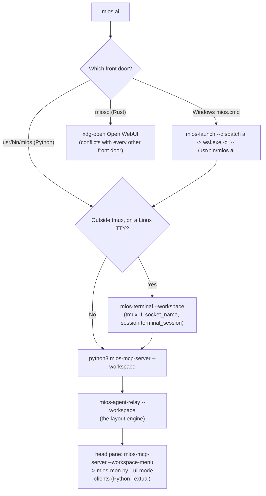

<!-- AI-hint: Tmux-as-OS: the dual-tier tmux topology, 'mios ai' dispatch as it actually runs, and milestone M8 -- one ratatui tmux desktop, a miosd applet, in every MiOS image, replacing today's monitors and TUIs. -->
<!-- AI-related: docs/design/doc-desktop-terminal-interaction.md, usr/share/mios/mios.toml [mcp.tmux], [keybindings], [agent_cli], [terminal], tools/native/mios-agent-relay/src/main.rs, src/mios-rs/miosd/src/cli.rs, usr/libexec/mios/mios-terminal, usr/libexec/mios/mios-mcp-server, .devloop/GOALS.md, .agents/COORDINATION.md -->
# Tmux-as-OS Architectural Integration & Upstream FOSS Patterns

## 1. Executive Summary & Vision

MiOS ("My OS") bridges an immutable Linux system substrate (bootc/OCI FHS overlay) with dual-plane execution: a bare-metal Blade or host Windows/Xbox gaming platform, and a local, self-replicating agentic AI operating system. 

In traditional desktop computing, floating window managers (X11/Wayland compositors or Windows DWM) dictate workspace geometry. For an AI-native OS, this paradigm is inverted: **Tmux is the OS runtime surface**. The multiplexer serves not merely as a terminal tool, but as the universal workspace, process governor, headless automation canvas, and human-agent interaction cockpit.

Whether an operator launches `mios ai` from a Windows Terminal desktop shortcut or invokes it within a mobile SSH shell or headless automation runner, the system resolves a single unified multiplexing architecture governed by:
1. **Universal Harness Neutrality**: Zero hardcoded master/worker/monitor roles across Antigravity, Codex, Claude Code, OpenCode, and Gemini.
2. **Dual-Tier Tmux Topology**: Strict separation between the live human viewport (`tmux -L mios-human`) and isolated headless automation slots (`/run/mios-tmux/` or `/tmp/mios-tmux/`).
3. **Structured MCP Instrumentation**: Full MadAppGang `tmux-mcp` v2 protocol alignment with 13 native slot tools and transaction-verified receipts.

---

## 2. Upstream FOSS Patterns & Ecosystem Analysis

The concept of "Tmux as the Operating System" synthesizes proven patterns from contemporary open-source developments:

### 2.1 Workspace & Worktree Autodiscovery (`twm` & `tms`)
- **`tms` (tmux-sessionizer)**: Pattern for instantaneous fuzzy project switching based on Git repository discovery. In MiOS, this is extended into worktree-aware navigation where each concurrent lane (e.g. `.devloop/worktrees/*`) is dynamically bound to dedicated tmux windows without cluttering the operator's primary viewport.
- **`twm` (tmux workspace manager)**: Manages named layouts with declarative YAML/TOML presets. MiOS implements this natively in Rust (`workspace()` in `tools/native/mios-agent-relay/src/main.rs`) via SSOT-driven `[mcp.tmux.workspace]` definitions for responsive 5-pane desktop and portrait presets. M8 moves this engine into the miosd desktop applet (section 7).

### 2.2 Multi-Agent Orchestration Multiplexers (`rmux`)
- **`rmux`**: Explores a universal multiplexer daemon with typed Rust SDKs designed specifically for AI agent swarms. Rather than scraping terminal ANSI escapes, agents interact through structured RPC endpoints.
- **MiOS Implementation**: Implemented via `mios-agent-relay` and `mios-mcp-server`. Agents communicate via transactional caller-owned mailboxes (`mios_agent_send`, `mios_agent_receive`, `mios_agent_ack`) while terminal helpers execute inside bounded slots returning structured exit receipts (`exitCode`, `duration_s`, `receiptVerified`, `structuredContent`).

### 2.3 Terminal UI Multiplexer Dashboards (`tuimux` & `btop`)
- Upstream TUI dashboards leverage Ratatui to render real-time session lists, client attachments, and resource consumption.
- MiOS uses no ratatui today: neither Rust workspace depends on it.
  - `mios mon` is Python Textual (`usr/libexec/mios/mios-mon.py`), and it `pip install`s its own
    dependencies at runtime.
  - The head-pane chooser is also Python Textual.
- Ruling R2 (M8) moves every pane to ratatui with crossterm, in Rust.

---

## 3. Dual-Tier Tmux Architecture

```
+---------------------------------------------------------------------------------------+
|                                     HOST DESKTOP                                      |
|          Windows Terminal / Xbox Mode Desktop / SSH Client / Remote Control           |
+-------------------------------------------+-------------------------------------------+
                                            |
                            +---------------+---------------+
                            |                               |
                  [Desktop Shortcut]               [Direct Terminal]
                            |                               |
                            v                               v
               +-------------------------+    +-------------------------+
               |   C:\ProgramData\MiOS\  |    |  tmux -L mios-human     |
               |       mios.cmd ai       |    |  (Interactive Desktop)  |
               +------------+------------+    +------------+------------+
                            |                              |
                            +--------------+---------------+
                                           |
                                           v
                     +-------------------------------------------+
                     |      MiOS Unified Environment Gateway     |
                     |       (Detects $TMUX, Socket, TTY)        |
                     +---------------------+---------------------+
                                           |
                   +-----------------------+-----------------------+
                   |                                               |
                   v                                               v
+-------------------------------------+             +-----------------------------+
|        HUMAN DESKTOP PLANE          |             |   HEADLESS AUTOMATION PLANE |
|   Socket: /tmp/tmux-1000/mios-human |             |   Socket: /run/user/<uid>/  |
|                                     |             |           mios-tmux/        |
| [Portrait Observer (above head)]    |             |                             |
| +-----------------+---------------+ |             | - Slot 0: Helper Slot 0     |
| |                 | Worker 0 | W1 | |             | - Slot 1: Helper Slot 1     |
| |    HEAD PANE    |----------+----| |             | - Slot 2: Helper Slot 2     |
| |  (LEFT ~1/3)    | Worker 2 | W3 | |             | - Slot 3: Helper Slot 3     |
| +-----------------+---------------+ |             +-----------------------------+
|    (Head Left + 4 Workers Right 2x2)|
+-------------------------------------+
```

### 3.1 Tier 1: Human Interactive Desktop (`tmux -L mios-human`)
- **Socket Path**: `/tmp/tmux-<uid>/mios-human` (configured in `[keybindings].socket_name`).
- **Layout**: Managed multi-pane responsive layout adhering to the operator's geometry:
  * **Head Pane (Left ~1/3 Width)**: Primary active interaction head (Antigravity, Codex, Claude Code, OpenCode, or Bash shell) chosen via the native paginated head CLI chooser.
  * **Four Blank Worker Panes (Right 2×2 Grid)**: Pre-allocated, caller-owned blank worker slots reserved for dynamic helper tasks and tool executions without hardcoded roles (Worker 0, Worker 1, Worker 2, Worker 3).
  * **Portrait Observer Pane**: Positioned above the active head pane in portrait display configurations (monitor on top; head on bottom). In compact landscape, the active agent is on the left and the monitor/observer on the right.
- **Keybindings**: SSOT prefix `Ctrl+B` (with `Ctrl+Alt+Shift` desktop shortcuts mapped globally).

### 3.2 Tier 2: Headless Automation Slots (`/run/user/<uid>/mios-tmux/`)
- **Socket Path**: Caller-owned private runtime `/run/user/<uid>/mios-tmux/` or `/tmp/mios-tmux-<uid>/` with mode `0700` (strict owner-only access; never shared 0755/0775).
- **Socket Length Constraint**: Enforces the 108-character `sockaddr_un` limit on Linux Unix domain sockets, preventing silent binding failures.
- **Lifecycle**: Managed via `_TerminalSessions` in `usr/libexec/mios/mios-mcp-server`. Slots are allocated on-demand with private session tokens, executed asynchronously, and reclaimed upon command termination without polluting the human operator's viewport.

---

## 4. Unified Dispatch Mechanics: `mios ai`

This section describes the code as it runs at integration `45e325b4`. Its earlier version described a
Rust chooser, launched in a hard-coded WSL distro, that production never ran.



Defects that M8 removes:
- **Two meanings of `mios ai`:**
  - miosd routes `ai` to Open WebUI (`src/mios-rs/miosd/src/cli.rs:296-297`), and so does
    `usr/share/mios/docs/terminal/INVOCATIONS.md:68`;
  - `usr/bin/mios` and `mios-launch --dispatch` route it to the tmux workspace.
- **Five verb routers:** `usr/bin/mios`, miosd `cli.rs`, `etc/profile.d/mios-verbs.sh`,
  `mios-launch --dispatch` and `mios-native-entry.ps1` disagree on `mon` as well. Whether an
  interactive bash login gets the mios-dashboard zipapp or Textual depends on the profile function.
- **A literal WSL distro.** The Windows paths in `mios-mon.py` call `wsl.exe -d podman-MiOS-DEV`
  (`:413`, `:600`, `:1641`, `:1660`). `mios-launch` already resolves the distro from the native
  binding.

### 4.1 Head CLI chooser
The head pane offers the `[agent_cli]` tools and then runs `mios agent NAME`. Three implementations
exist:
- **Production:** `mios-mcp-server --workspace-menu` (`:1917-1921`) runs `_run_monitor_ui("clients")`,
  which starts `mios-mon.py --ui-mode clients`: the Python `mios_agent_tui.ClientView`.
- **Test only:** the Rust `mios-agent-relay --workspace-menu` (`workspace_menu`) is called only from a
  test.
- **Bash:** `usr/libexec/mios/mios-ai-terminal` is a prompt REPL.

The agent observer is duplicated the same way: Python `AgentView`, and Rust `render_observation`,
which has no production caller. Under M8 the Rust chooser and observer become the primary views of the
desktop applet (section 7), and the Python and bash copies are retired.

All three keep the same contract:
1. **SSOT agent catalog:** the tools come from `[agent_cli]` in `mios.toml`.
2. **Environment injection:** `$MIOS_AI_ENDPOINT` (Law 5), `OPENAI_BASE_URL` and local dummy keys, so
   every completion goes to the local inference lanes.
3. **PID preservation:** reconfiguring or rotating panes keeps the worker processes.

---

## 5. Host Integration & Silent Window Management

### 5.1 Elimination of Acrylic Blank Popups on Windows / Xbox Mode
On modern Windows 11 builds (Build 26220+ / 24H2 Insider Preview, used in MiOS-Xbox), Windows Terminal (`wt.exe` / `OpenConsole.exe`) is registered as the default system console host. When standard background tasks or scheduled services launch console binaries using `powershell.exe -WindowStyle Hidden`, Windows Terminal intercepts console allocation and renders an acrylic, empty square frame on the desktop before minimization.

MiOS eliminates this artifact permanently across all deployment pipelines:
- **Subsystem 2 Win32 GUI Dispatch (`run-hidden.vbs`)**: The primary prevention mechanism is launching background jobs via `wscript.exe` (Subsystem 2 Win32 GUI) using `WScript.Shell.Run(cmd, 0, False)` with integer window state `0` (`SW_HIDE`), which prevents the default console host (`OpenConsole.exe` / Windows Terminal) from allocating a console window at process creation.
- **Console Handle Detachment**: For processes invoked with an inherited console, `[OSCW32]::FreeConsole()` is called on startup within `mios-oscontrol-server.ps1` as secondary handle release. Upstream `microsoft/terminal#14416` documented that calling `FreeConsole` post-allocation can leave an orphaned host window frame, making pre-creation Subsystem 2 execution (`run-hidden.vbs`) the load-bearing requirement.
- **SSOT Pipeline Parity**: Staged across offline DISM (`autounattend.xml`, `New-MiOSISO.ps1`), first-boot scripts (`mios-firstboot.cmd`, `MiOS-FirstBoot.ps1`, `SetupComplete.cmd`), and live background services (`MiOS-OSControl-Server`). Live probe confirms `http://127.0.0.1:8950/health` answers `{"ok": true}` with `MainWindowHandle: 0`.

---

## 6. Verification & Architectural Invariants

1. **Law 5 (UNIFIED-AI-REDIRECTS)**: All agent CLIs inside tmux slots route strictly to `$MIOS_AI_ENDPOINT`; cloud endpoints (`api.openai.com`, `generativelanguage.googleapis.com`, `api.anthropic.com`) remain blocked.
2. **Universal Harness Neutrality**: AGY, Codex, Claude Code, and OpenCode coordinate as peers via `mios_agent_send`, `mios_agent_receive`, and `mios_agent_ack` without static hierarchy.
3. **Standing Gate Compliance**: All changes are validated against `ci-suites --check`, `phase-registry`, `version-literals-ssot`, `credential-literals`, `ratchet-direction`, and `signature-policy`.

---

## 7. M8: one tmux TUI desktop in every MiOS image

tmux is MiOS's graphical desktop for managing and reaching VMs, images, services and agents. The same
TUI runs inside tmux in every MiOS image:
- L1 SystemRescue, as the attended console on the iGPU;
- L2 MiOS VMs and their nested MiOS containers;
- WSL2, including inside `mios-xbox`;
- cloud and devcontainer;
- Windows, in native `tmux.exe`.

It replaces today's monitors, dashboards and choosers. The goal, phases U1–U7 and their controls are in
`.devloop/GOALS.md` M8, and the work is tracked under the M8 epic in `tasks.jsonl`.

**Operator rulings, 2026-10-09:**
- **R1.** The desktop is an applet in the `miosd` multicall binary. This is an explicit exception to the
  M2 rule that new code goes into its own domain rather than miosd. miosd is already:
  - the Rust `mios` dispatcher (`cli.rs`);
  - the tmux namespace guard (`terminal-runtime-check`);
  - the build-progress renderer;
  - built static for Linux musl and for Windows.
- **R2.** Panes render natively in Rust with ratatui and crossterm, inside tmux. Python Textual/Rich and
  the runtime `pip install` are retired.

### 7.1 What becomes the desktop

| Piece | Built from | Today |
|---|---|---|
| Session and namespace | `mios-terminal` (folded in; a path shim stays), the miosd guard, the runtime projection | bash `usr/libexec/mios/mios-terminal` creates `tmux -L <socket_name>` |
| Layout engine | `workspace()` and `workspace_layout` from `mios-agent-relay`, generalized to every profile | Five engines: the relay, the Windows Terminal split panes in `launcher.rs`, three PowerShell copies, and `mios-a2o` |
| Views | One ratatui panel set, listed below | Python Textual `mios-mon.py`, the mios-dashboard zipapp, `mios-gen dashboard`, PowerShell banners |
| Dispatch | One Rust table for terminal, ai, agents, mon, dash, mini and btop | Five routers that disagree (section 4) |
| Projections | `mios-gen`: the tmux theme, keys and runtime config | `mios-gen` shells out to `mios-unit-gen` and to Python `theme_sync.py --render-prompt` |

The views are:
- **Clients chooser and agents observer:** the Rust versions from `mios-agent-relay`.
- **System and services:** the `mios-service-core` dashboard catalog and probe. Host facts come from
  `mios-probe` instead of an external fastfetch.
- **Build progress:** read from the `mios-build` progress ledger, not by scraping logs from hard-coded
  paths.
- **Flash.**
- **VMs (new):** L2 VMs, nested MiOS containers, and the M7 GPU-arbiter state.
- **Images (new):** bootc and podman images, and the testing/stable channels. No surface lists VMs or
  images today.
- **btop:** an optional embedded pane.

### 7.2 Home and supporting domains

- **`miosd`:** the desktop applet (R1).
- **`mios-gen`:** keeps the tmux.conf, theme and key projections. It folds in the `mios-unit-gen`
  keybindings and a Rust port of `theme_sync.py --render-prompt`, so the runtime render needs no
  Python.
- **`mios-resolver`:** the only layered loader. `terminal.rs::load_layered` and `service-core::ssot`
  are deleted.
- **`mios-probe`:** host facts.
- **`mios-agent-relay`:** keeps the mailbox and observe data only.
- **`mios-launch`:** only places windows on Windows.

Conflicts to clear on the way:
- `[rust.categories.probe].scope` claims `mios-mon.py` and `mios_agent_tui.py`.
- The ADR-0021 amendment plans miosd as a thin exec shim, so it must record R1.
- `[rust.categories.serve]` names a binary, `mios-serve`, that nothing builds.

### 7.3 SSOT

- **`[terminal.desktop]`:** the namespace and session.
- **`[terminal.desktop.layout]`:** absorbs the `[mcp.tmux.workspace]` geometry and
  `[terminal.monitor]`.
- **`[terminal.desktop.views.<id>]`:** absorbs the `[mcp.agents.observation]` UI keys, `[dashboard]`, and
  `[btop]` as an embedded view.
- **`[terminal.desktop.env.<sysrescue|vm|wsl|cloud|windows>]`:** per-environment overrides.
- `[desktop]` is already GNOME/Flatpak's, so the family lives under `[terminal]`.
- **`[terminal.startup]`** returns to vendor. `etc/profile.d/zz-mios-motd.sh` reads it, but only
  bootstrap's `mios.toml` has it.
- **Bootstrap's `[terminal.monitor]` schema** is reconciled with mios.git's (Law 15).
- **Unchanged:** `[keybindings]`, `[theme.tmux]`, `[colors]` and `[theme.font]`.

### 7.4 Per environment

| Environment | What changes |
|---|---|
| L1 SystemRescue | Static musl `miosd`, `mios-gen` and `mios-resolver`, plus a rendered vendor `mios.toml`, go on the MiOS-Field data partition. The autorun starts the desktop on tty1 in attended mode. VT glyphs are ASCII. Views degrade without MiOS units or podman. The two drifted `01-sysrescue-firstboot.sh` copies (mios.git and bootstrap) are reconciled first. |
| L2 MiOS VMs and nested containers | The applet replaces `mios-terminal` and Textual. The desktop hotkeys call an installed terminal from SSOT, not alacritty, which no `[packages]` section installs. |
| WSL2, including in `mios-xbox` | The same as L2, with no literal `podman-MiOS-DEV`. |
| Cloud and devcontainer | Runs without systemd or user units, with the socket root under `/tmp`. |
| Windows | `miosd.exe` runs inside `tmux.exe` panes and gets its data through `wsl.exe` resolver and relay JSON. `mios-launch` only places the window. `host_tmux::stage` is the only `.tmux.conf` writer; bootstrap's PowerShell writers are deleted (Law 15). |
| Blink | The SSH `RemoteCommand` goes through `mios terminal`, and so through the namespace guard, instead of a raw `tmux new-session` on the default socket. |

### 7.5 Retired, and kept out

The following are deleted:
- the mios-dashboard zipapp and `tools/compile-dashboard-binary.py` (the zipapp has no tracked source);
- `mios-mon.py`, `mios_agent_tui.py` and `mios-ai-terminal`, once their tests are ported;
- the relay chooser and observer duplicates;
- the human-UI branches of `mios-mcp-server`;
- the `mios-verbs.sh` mon/dash/mini routing;
- the PowerShell monitors and dashboards, and the `mios-native-entry.ps1` routing (Law 15 surfaces,
  changed in both repos).

`mios-a2o` adopts the layout engine. The retired paths go into `[rust.categories.daemon_meta].replaces`,
so `check_rust_categories` fails if one comes back.

### 7.6 Kept separate

The agent planes are not the human desktop, and they keep their own namespaces:
- `mios-mcp-server` and its tmux bridge;
- `mios-shell-session`;
- the vendored `tmux-mcp`.
