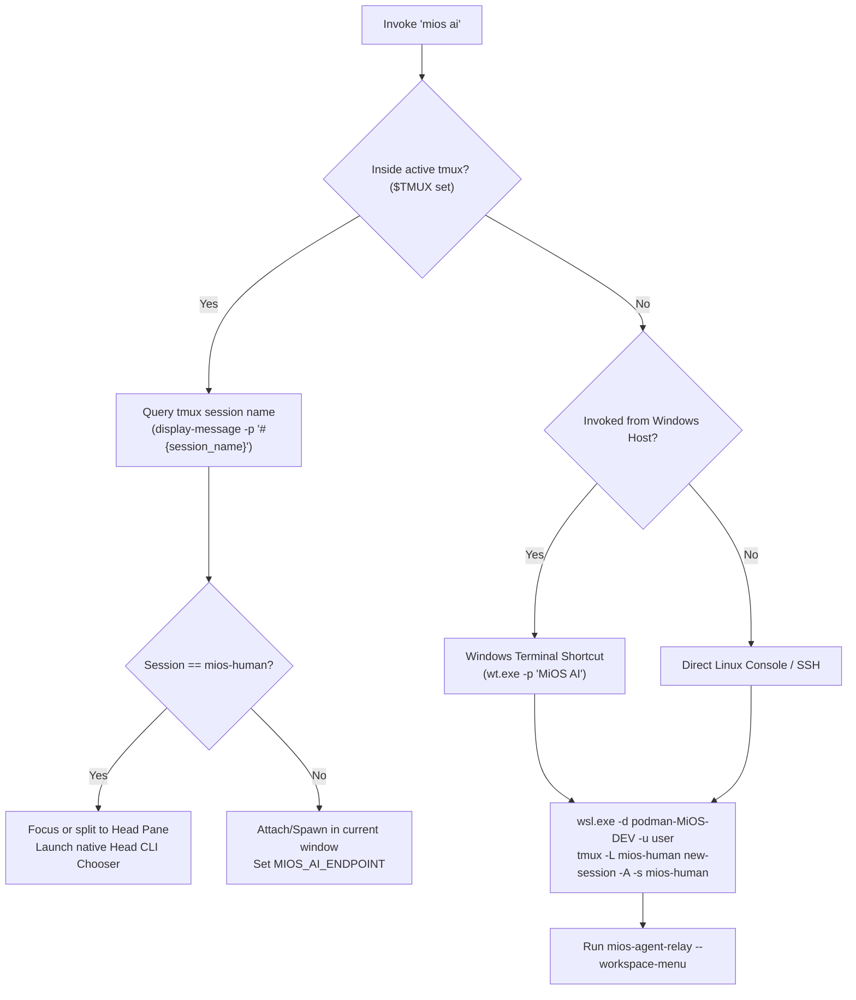

<!-- AI-hint: Architectural specification for Tmux-as-OS integration, upstream FOSS multiplexer patterns, and unified 'mios ai' dispatch across Windows Terminal and desktop tmux. -->
<!-- AI-related: docs/design/doc-desktop-terminal-interaction.md, usr/share/mios/mios.toml [mcp.tmux], [keybindings], [agent_cli], tools/native/mios-agent-relay/src/main.rs, .agents/COORDINATION.md -->
# Tmux-as-OS Architectural Integration & Upstream FOSS Patterns

## 1. Executive Summary & Vision

MiOS ("My OS") bridges an immutable Linux system substrate (bootc/OCI FHS overlay) with dual-plane execution: a bare-metal Blade or host Windows/Xbox gaming platform, and a local, self-replicating agentic AI operating system. 

In traditional desktop computing, floating window managers (X11/Wayland compositors or Windows DWM) dictate workspace geometry. For an AI-native OS, this paradigm is inverted: **Tmux is the OS runtime surface**. The multiplexer serves not merely as a terminal tool, but as the universal workspace, process governor, headless automation canvas, and human-agent interaction cockpit.

Whether an operator launches `mios ai` from a Windows Terminal desktop shortcut or invokes it within a mobile SSH shell or headless automation runner, the system resolves a single unified multiplexing architecture governed by:
1. **Universal Harness Neutrality**: Zero hardcoded master/worker/monitor roles across Antigravity, Codex, Claude Code, OpenCode, and Gemini.
2. **Dual-Tier Tmux Topology**: Strict separation between the live human viewport (`tmux -L mios-human`) and isolated headless automation slots (`/run/mios-tmux/` or `/tmp/mios-tmux/`).
3. **Structured MCP Instrumentation**: Full MadAppGang `tmux-mcp` v2 protocol alignment with 13 native slot tools and transaction-verified receipts.

---

## 2. Upstream FOSS Patterns & Ecosystem Analysis

The concept of "Tmux as the Operating System" synthesizes proven patterns from contemporary open-source developments:

### 2.1 Workspace & Worktree Autodiscovery (`twm` & `tms`)
- **`tms` (tmux-sessionizer)**: Pattern for instantaneous fuzzy project switching based on Git repository discovery. In MiOS, this is extended into worktree-aware navigation where each concurrent lane (e.g. `.devloop/worktrees/*`) is dynamically bound to dedicated tmux windows without cluttering the operator's primary viewport.
- **`twm` (tmux workspace manager)**: Manages named layouts with declarative YAML/TOML presets. MiOS implements this natively in Rust (`tools/native/mios-agent-relay/src/main.rs`) via SSOT-driven `[mcp.tmux.workspace]` definitions for responsive 5-pane desktop and portrait presets.

### 2.2 Multi-Agent Orchestration Multiplexers (`rmux`)
- **`rmux`**: Explores a universal multiplexer daemon with typed Rust SDKs designed specifically for AI agent swarms. Rather than scraping terminal ANSI escapes, agents interact through structured RPC endpoints.
- **MiOS Implementation**: Implemented via `mios-agent-relay` and `mios-mcp-server`. Agents communicate via transactional caller-owned mailboxes (`mios_agent_send`, `mios_agent_receive`, `mios_agent_ack`) while terminal helpers execute inside bounded slots returning structured exit receipts (`exitCode`, `duration_s`, `receiptVerified`, `structuredContent`).

### 2.3 Terminal UI Multiplexer Dashboards (`tuimux` & `btop`)
- Upstream TUI dashboards leverage Ratatui to render real-time session lists, client attachments, and resource consumption.
- In MiOS, this visibility is provided by `mios mon` (#ai-log-box and Headless Slots view) and native CLI selection choosers rendered in the head pane.

---

## 3. Dual-Tier Tmux Architecture

```
+---------------------------------------------------------------------------------------+
|                                     HOST DESKTOP                                      |
|          Windows Terminal / Xbox Mode Desktop / SSH Client / Remote Control           |
+-------------------------------------------+-------------------------------------------+
                                            |
                            +---------------+---------------+
                            |                               |
                  [Desktop Shortcut]               [Direct Terminal]
                            |                               |
                            v                               v
               +-------------------------+    +-------------------------+
               |   C:\ProgramData\MiOS\  |    |  tmux -L mios-human     |
               |       mios.cmd ai       |    |  (Interactive Desktop)  |
               +------------+------------+    +------------+------------+
                            |                              |
                            +--------------+---------------+
                                           |
                                           v
                     +-------------------------------------------+
                     |      MiOS Unified Environment Gateway     |
                     |       (Detects $TMUX, Socket, TTY)        |
                     +---------------------+---------------------+
                                           |
                   +-----------------------+-----------------------+
                   |                                               |
                   v                                               v
+-------------------------------------+             +-----------------------------+
|        HUMAN DESKTOP PLANE          |             |   HEADLESS AUTOMATION PLANE |
|   Socket: /tmp/tmux-1000/mios-human |             |   Socket: /run/user/<uid>/  |
|                                     |             |           mios-tmux/        |
| [Portrait Observer (above head)]    |             |                             |
| +-----------------+---------------+ |             | - Slot 0: Helper Slot 0     |
| |                 | Worker 0 | W1 | |             | - Slot 1: Helper Slot 1     |
| |    HEAD PANE    |----------+----| |             | - Slot 2: Helper Slot 2     |
| |  (LEFT ~1/3)    | Worker 2 | W3 | |             | - Slot 3: Helper Slot 3     |
| +-----------------+---------------+ |             +-----------------------------+
|    (Head Left + 4 Workers Right 2x2)|
+-------------------------------------+
```

### 3.1 Tier 1: Human Interactive Desktop (`tmux -L mios-human`)
- **Socket Path**: `/tmp/tmux-<uid>/mios-human` (configured in `[keybindings].socket_name`).
- **Layout**: Managed multi-pane responsive layout adhering to the operator's geometry:
  * **Head Pane (Left ~1/3 Width)**: Primary active interaction head (Antigravity, Codex, Claude Code, OpenCode, or Bash shell) chosen via the native paginated head CLI chooser.
  * **Four Blank Worker Panes (Right 2×2 Grid)**: Pre-allocated, caller-owned blank worker slots reserved for dynamic helper tasks and tool executions without hardcoded roles (Worker 0, Worker 1, Worker 2, Worker 3).
  * **Portrait Observer Pane**: Positioned above the active head pane in portrait display configurations (monitor on top; head on bottom). In compact landscape, the active agent is on the left and the monitor/observer on the right.
- **Keybindings**: SSOT prefix `Ctrl+B` (with `Ctrl+Alt+Shift` desktop shortcuts mapped globally).

### 3.2 Tier 2: Headless Automation Slots (`/run/user/<uid>/mios-tmux/`)
- **Socket Path**: Caller-owned private runtime `/run/user/<uid>/mios-tmux/` or `/tmp/mios-tmux-<uid>/` with mode `0700` (strict owner-only access; never shared 0755/0775).
- **Socket Length Constraint**: Enforces the 108-character `sockaddr_un` limit on Linux Unix domain sockets, preventing silent binding failures.
- **Lifecycle**: Managed via `_TerminalSessions` in `usr/libexec/mios/mios-mcp-server`. Slots are allocated on-demand with private session tokens, executed asynchronously, and reclaimed upon command termination without polluting the human operator's viewport.

---

## 4. Unified Dispatch Mechanics: `mios ai`

When `mios ai` is invoked, the dispatch engine executes a deterministic decision tree:



### 4.1 Native Head CLI Chooser
Rather than unconditionally assuming a single vendor harness, `mios-agent-relay --workspace-menu` presents the operator with a high-speed, interactive menu rendered in the head pane:
1. **SSOT Agent Catalog**: Discovers installed and configured agents from `[agent_cli]` in `mios.toml` (`agy`, `codex`, `claude`, `opencode`, `gemini`, `copilot`, `aider`).
2. **Environment Injection**: Injects `$MIOS_AI_ENDPOINT` (Architectural Law 5), `OPENAI_BASE_URL`, and local dummy keys (`sk-mios-local`), redirecting all completions to the local inference cluster (`mios-llm-light`).
3. **PID Preservation**: Pane reconfiguration and rotation preserves background worker process IDs across sessions.

---

## 5. Host Integration & Silent Window Management

### 5.1 Elimination of Acrylic Blank Popups on Windows / Xbox Mode
On modern Windows 11 builds (Build 26220+ / 24H2 Insider Preview, used in MiOS-Xbox), Windows Terminal (`wt.exe` / `OpenConsole.exe`) is registered as the default system console host. When standard background tasks or scheduled services launch console binaries using `powershell.exe -WindowStyle Hidden`, Windows Terminal intercepts console allocation and renders an acrylic, empty square frame on the desktop before minimization.

MiOS eliminates this artifact permanently across all deployment pipelines:
- **Subsystem 2 Win32 GUI Dispatch (`run-hidden.vbs`)**: The primary prevention mechanism is launching background jobs via `wscript.exe` (Subsystem 2 Win32 GUI) using `WScript.Shell.Run(cmd, 0, False)` with integer window state `0` (`SW_HIDE`), which prevents the default console host (`OpenConsole.exe` / Windows Terminal) from allocating a console window at process creation.
- **Console Handle Detachment**: For processes invoked with an inherited console, `[OSCW32]::FreeConsole()` is called on startup within `mios-oscontrol-server.ps1` as secondary handle release. Upstream `microsoft/terminal#14416` documented that calling `FreeConsole` post-allocation can leave an orphaned host window frame, making pre-creation Subsystem 2 execution (`run-hidden.vbs`) the load-bearing requirement.
- **SSOT Pipeline Parity**: Staged across offline DISM (`autounattend.xml`, `New-MiOSISO.ps1`), first-boot scripts (`mios-firstboot.cmd`, `MiOS-FirstBoot.ps1`, `SetupComplete.cmd`), and live background services (`MiOS-OSControl-Server`). Live probe confirms `http://127.0.0.1:8950/health` answers `{"ok": true}` with `MainWindowHandle: 0`.

---

## 6. Verification & Architectural Invariants

1. **Law 5 (UNIFIED-AI-REDIRECTS)**: All agent CLIs inside tmux slots route strictly to `$MIOS_AI_ENDPOINT`; cloud endpoints (`api.openai.com`, `generativelanguage.googleapis.com`, `api.anthropic.com`) remain blocked.
2. **Universal Harness Neutrality**: AGY, Codex, Claude Code, and OpenCode coordinate as peers via `mios_agent_send`, `mios_agent_receive`, and `mios_agent_ack` without static hierarchy.
3. **Standing Gate Compliance**: All changes are validated against `ci-suites --check`, `phase-registry`, `version-literals-ssot`, `credential-literals`, `ratchet-direction`, and `signature-policy`.
