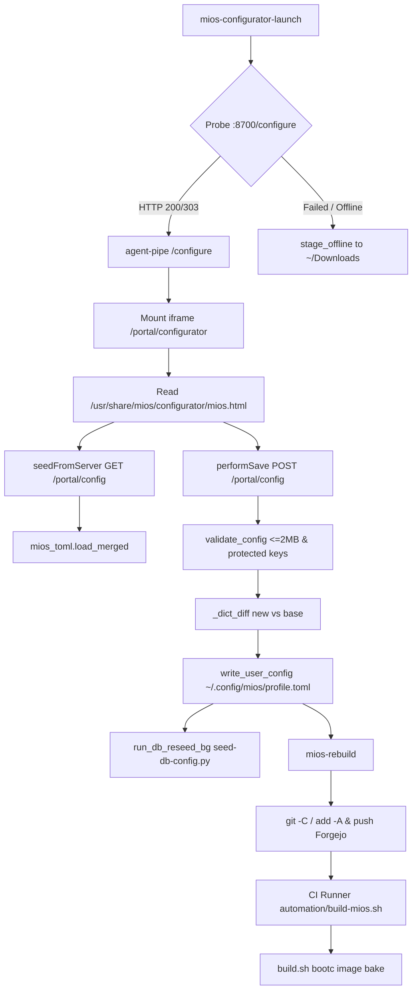

<!-- AI-hint: Comprehensive audit of local settings engine hosting (mios.html) and build-time dependency segregation and combing.
     AI-related: usr/share/mios/configurator/mios.html, usr/libexec/mios/mios-configurator-launch, usr/lib/mios/agent-pipe/mios_pipe/routing/portal.py, automation/91-strip-build-toolchain.sh, Containerfile -->
# Comprehensive Audit: Local Settings Engine (`mios.html`) & Build-Time Dependency Combing

**Audit Date:** 2026-09-23  
**Status:** Complete Technical Findings & Architecture Recommendations  
**Target Subsystems:**
1. System Settings Engine (`mios-configurator-launch`, `agent-pipe` portal router, `mios.html`, `mios-rebuild`).
2. Build-Time Dependency Lifecycle (`Containerfile`, `automation/` scripts, `usr/share/mios/mios.toml`).

---

## Part 1: Local Hosting of `mios.html` as the System Settings Engine

### 1.1 Launcher Architecture: `/usr/libexec/mios/mios-configurator-launch`

The launcher acts as the entry point for opening the operator configuration UI, switching dynamically between the live local agent portal and an offline local file fallback:

- **Service Health Probe (Lines 47–55)**:
  - Resolves `MIOS_PORT_AGENT_PIPE` (default: `8700`).
  - Probes `http://localhost:${MIOS_PORT_AGENT_PIPE}/configure` using:
    ```bash
    CURL_OUT=$(curl -s -o /dev/null -w "%{http_code}" --connect-timeout 2 --max-time 3 "http://localhost:${PORT}/configure" 2>/dev/null || true)
    ```
  - If `CURL_OUT` returns `200` or `303`, it targets:
    `TARGET_URL="http://localhost:${PORT}/configure"`.
- **Fallback Staging `stage_offline()` (Lines 9–45)**:
  - If `agent-pipe` is offline or times out, it invokes `stage_offline()`.
  - Discovers the highest-priority configuration candidate in order:
    1. `~/.config/mios/mios.toml`
    2. `/etc/mios/mios.toml`
    3. `/usr/share/mios/mios.toml`
  - Copies the candidate to `~/Downloads/mios.toml` if it does not already exist.
  - Copies `/usr/share/mios/configurator/mios.html` to `~/Downloads/mios-configurator.html`.
  - Sets `TARGET_URL="file://${STAGED_HTML}"`.
- **Desktop Dispatch (Lines 57–74)**:
  - Launches browser via `/usr/libexec/mios/mios-open-url "$TARGET_URL"`, falling back to `xdg-open` or `gio open`.

---

### 1.2 Router Implementation: `agent-pipe` (`portal.py`)

When `agent-pipe` is running, HTTP endpoints are handled by FastAPI in `/usr/lib/mios/agent-pipe/mios_pipe/routing/portal.py` (facaded via `/usr/lib/mios/agent-pipe/mios_portal.py`):

1. **`GET /configure` (Lines 1551–1555)**:
   - Calls `portal_page_logic(request)` to deliver `/usr/share/mios/portal/index.html`.
   - The portal shell hosts navigation tabs; when the operator selects "Settings / Configurator", an `<iframe>` mounts `/portal/configurator`.
2. **`GET /portal/configurator` (Lines 1264–1283, 1372–1375)**:
   - Auth-gated handler calling `portal_configure_page_logic(request)`.
   - Reads `/usr/share/mios/configurator/mios.html` (or `MIOS_CONFIGURATOR_HTML`).
   - Dynamically injects `_portal_theme_css()` into the `<head>` of the HTML to harmonize CSS variables with the portal theme.
   - Emits `Response(content=html, media_type="text/html; charset=utf-8")` with header `Cache-Control: no-store, must-revalidate`.
3. **`GET /portal/config` (Lines 1410–1429)**:
   - Loads the 3-layer merged configuration via `mios_toml.load_merged()`:
     - Layer 1: `/usr/share/mios/profile.toml` (vendor baseline)
     - Layer 2: `/etc/mios/profile.toml` (host override)
     - Layer 3: `~/.config/mios/profile.toml` (user override)
   - Serializes dictionary back to clean TOML via `mios_pipe.kernel.config:to_toml()`.
   - Returns payload as `text/plain; charset=utf-8`.
4. **`POST /portal/config` (Lines 1430–1478)**:
   - Auth-gated endpoint accepting edited TOML text.
   - Enforces payload validation via `validate_config(body)`:
     - Checks size constraint (`<= 2MB`).
     - Verifies critical sections `[identity]` and `[ports]` are preserved.
   - Computes diff against the base vendor/host layer:
     - `base_cfg = mios_toml.load_merged(skip_user=True)`
     - `delta_cfg = _dict_diff(cfg, base_cfg)`
   - Invokes `write_user_config(delta_cfg)`: atomically writes `delta_cfg` to `~/.config/mios/profile.toml`.
   - Spawns background worker `run_db_reseed_bg()`:
     - Executes `/usr/libexec/mios/seed-db-config.py` with `MIOS_TOML` pointed to the merged configuration, refreshing pgvector/PostgreSQL configuration in real time.

---

### 1.3 Client-Side Logic & Persistence: `mios.html`

The single-file configurator UI (`/usr/share/mios/configurator/mios.html`, 6,003 lines) implements multi-tier execution modes:

- **Embed Detection (Line 4935)**:
  ```javascript
  const MIOS_EMBEDDED = location.protocol !== "file:";
  ```
- **Initialization (`seedFromServer`, Lines 4950–4970)**:
  - If `MIOS_EMBEDDED` is true, calls `fetch('/portal/config')`, parses TOML into client memory, and populates form fields.
  - If `file://`, parses the embedded/staged TOML file.
- **Save Routine (`performSave`, Lines 5228–5265)**:
  - When `MIOS_EMBEDDED`:
    - Sends `POST /portal/config` containing `PENDING_TOML`.
    - Handles status 200 (shows success toast).
    - Handles status 422 (renders validation errors returned by `validate_config()`).
  - When running locally via `file://`:
    - Path 1: Uses the Web File System Access API (`window.showSaveFilePicker`) to write directly to a local file.
    - Path 2: Falls back to creating a data blob and triggering `<a download="mios.toml">`.

---

### 1.4 Pipeline Ingestion: `mios-rebuild`

Once operator edits are written to `/etc/mios/mios.toml` or `~/.config/mios/mios.toml`, the build pipeline ingests them via `/usr/bin/mios-rebuild`:

1. **Law 3 Compliance**: MiOS root filesystem is a git working tree (`.git` IS `/`).
2. **Forgejo Probe (Lines 41–47)**: Asserts the local git forge at `http://localhost:3000/api/v1/version` is online.
3. **Commit & Push (Lines 64–79)**:
   ```bash
   git -C / add -A
   git -C / commit -m "$COMMIT_MSG"
   git -C / push origin HEAD
   ```
4. **CI Ingestion**:
   - Forgejo triggers `mios-forgejo-runner.service`.
   - The runner runs `automation/build-mios.sh` in `podman-MiOS-DEV`.
   - Build scripts call `automation/lib/packages.sh:resolve_mios_toml()`, which reads the committed `~/.config/mios/mios.toml` or `/etc/mios/mios.toml` and applies configuration into the next bootc container build.

---

### 1.5 Air-Gapped & Zero-Network Hosting Verification

- **Asset Self-Containment**:
  - CSS is 100% inline (`<style>` at line 36).
  - JavaScript is 100% inline (`<script>` at lines 7 and 3634).
  - Zero external CDN links (`<link rel="stylesheet">` = 0, `<script src="...">` = 0).
  - Fonts rely on native system stacks (`font-family: -apple-system, BlinkMacSystemFont, "Segoe UI", Roboto, ...`).
  - Icons are inline SVG vectors.
- **Failure Mode of Current Architecture**:
  - If `agent-pipe` is stopped or during early boot before services start, `mios-configurator-launch` falls back to `file://`.
  - Browser sandbox policies block `file://` origins from reading sister files via `fetch()` and prevent background DB re-seeding (`seed-db-config.py`).
- **Solution / Recommendation**:
  - Embed a lightweight loopback HTTP server directly into `miosd` (the Rust daemon at `/usr/libexec/mios/miosd`).
  - `miosd` can serve `GET /configure`, `GET /portal/configurator`, and `GET/POST /portal/config` independently of whether Python or containers are running.



---

## Part 2: Build-Time vs Runtime Dependency Recording and Combing

### 2.1 Multi-Stage Isolation in `Containerfile`

- **Rust Builder Stage (Lines 20–40)**:
  - `FROM docker.io/library/rust:slim AS rust-builder`
  - Installs compilation dependencies (`pkg-config`, `libssl-dev`, `git`, `make`, `protobuf-compiler`).
  - Compiles native Rust crates (`tools/native` and `src/mios-rs`).
  - Copies compiled binaries to `/out`.
- **Target Image Stage (Line 56)**:
  - `COPY --from=rust-builder /out/* /usr/libexec/mios/`
  - **Verdict**: Fully isolated. `cargo`, `rustc`, and development libraries from `rust-builder` are completely excluded from the target image.

---

### 2.2 Toolchain Lifecycle & Combing During Image Bake

1. **Toolchain Installation**:
   - `automation/21-virt.sh` (line 21) calls `install_packages "build-toolchain"`.
   - `[packages.build-toolchain]` in `usr/share/mios/mios.toml` (lines 6386–6400) installs:
     `make`, `gcc`, `gcc-c++`, `cpp`, `cmake`, `cmake-filesystem`, `golang`, `golang-bin`, `selinux-policy-devel`, `binutils`, `pkgconf-pkg-config`.
2. **Toolchain Stripping (`automation/91-strip-build-toolchain.sh`)**:
   - Line 11: `TOOLCHAIN_STR="$(get_packages "build-toolchain")"`
   - Line 19: `$DNF_BIN "${DNF_SETOPT[@]}" remove -y --noautoremove $TOOLCHAIN_STR`
   - Lines 23–28: Removes lingering symlinks for `gcc`, `g++`, `cc`, `cmake`, `make`, `go`.
   - Lines 30–42: Asserts that no compiler/build-system binaries remain in `PATH`.
3. **Bloat Removal (`automation/build.sh`)**:
   - Lines 341–345: Resolves `[packages.bloat]` and runs `$DNF_BIN remove -y --no-autoremove $BLOAT_PACKAGES` (`malcontent-*`, `gnome-tour`, `gnome-initial-setup`, `PackageKit*`).
4. **Cache & Lint Cleanup (`automation/94-cleanup.sh` & `automation/build.sh`)**:
   - Runs `$DNF_BIN clean all`.
   - Purges `/var/cache/dnf`, `/var/cache/libdnf5`, `/var/log/dnf5.log*`, `/var/tmp/*`, `/var/log/*`.
   - Cleans bootc container lint triggers (`/var/cache/ldconfig`, `/var/lib/systemd/random-seed`, `/var/lib/glusterd`, `/var/lib/containers/storage/db.sql`, `/var/lib/flatpak/.changed`).

---

### 2.3 Identified Deficiencies & Uncombed Build Dependencies

The audit identified five significant leaks where build-time packages, dev headers, or build artifacts remain in the deployed image:

| Stage / Script | Build-Time Dependencies Installed | Issue / Mechanism | Consequence |
|---|---|---|---|
| `automation/66-bake-quickshell.sh:12` | `[packages.quickshell-build]`: `qt6-qtbase-devel`, `qt6-qtdeclarative-devel`, `qt6-qtwayland-devel`, `qt6-qtshadertools-devel`, `qt6-qtbase-private-devel`, `pipewire-devel`, `cli11-devel`, `libdrm-devel`, `cpptrace-devel`, `mesa-libgbm-devel`, `polkit-devel`, `pam-devel`, `jemalloc-devel` | **Never uninstalled**. `91-strip-build-toolchain.sh` only removes `build-toolchain`, leaving all 13 Qt6/system dev packages in the image. | Heavy headers in `/usr/include`, bloated RPM DB. |
| `automation/69-bake-lookingglass-client.sh:38-43` | `fontconfig-devel`, `spice-protocol`, `nettle-devel`, `libglvnd-devel`, `libdecor-devel`, `libsamplerate-devel`, `pipewire-devel`, `wayland-devel`, `wayland-protocols-devel`, `libxkbcommon-x11-devel`, `libXi-devel`, `libXinerama-devel`, `libXcursor-devel`, `libXpresent-devel`, `libXScrnSaver-devel`, `libXrandr-devel`, `binutils-devel`, `dejavu-sans-mono-fonts` | **Undeclared raw DNF invocation & never uninstalled**. Bypasses `install_packages "looking-glass-build"` (defined in `mios.toml:6670`). No combing after compile. | 18 uncombed build packages in final image. |
| `automation/37-k3s-selinux.sh:12` | `[packages.k3s-selinux-build]`: `selinux-policy-devel`, `git`, `make` | Installs for building `k3s.pp`. Script cleans `/tmp/k3s-selinux` but does not remove the build package group. | Relies on coincidental toolchain stripping; leaves packages if running in isolated sub-pipelines. |
| `automation/90-generate-sbom.sh:26-27` | `curl ... https://raw.githubusercontent.com/anchore/syft/main/install.sh \| sh -s -- -b /usr/local/bin` | Upstream binary installed directly into `/usr/local/bin/syft` when no RPM exists. | `/usr/local/bin/syft` is never removed after generating SBOM JSON/SPDX manifests. |
| `usr/share/mios/mios.toml:6190-6200` (`[packages.kernel]`) | `kernel-devel`, `kernel-headers`, `glibc-headers`, `glibc-devel` | Shipped in runtime image package set. `automation/68-bake-kvmfr.sh` additionally enables COPR and installs `kernel-devel-$KVER`. | In UKI-signed bootc images without on-host DKMS, ~500MB of C/kernel headers are unnecessarily retained. |

---

## Part 3: Concrete Architectural Recommendations

### Recommendation 1: Unified Post-Bake Combing Script
Refactor `automation/91-strip-build-toolchain.sh` into a comprehensive combing phase that sweeps all build-specific package groups defined in `usr/share/mios/mios.toml`:
```bash
BUILD_GROUPS=(
    "build-toolchain"
    "quickshell-build"
    "looking-glass-build"
    "k3s-selinux-build"
)

for grp in "${BUILD_GROUPS[@]}"; do
    pkgs="$(get_packages "$grp")"
    if [[ -n "${pkgs// /}" ]]; then
        mios_log "Combing build group: $grp"
        $DNF_BIN "${DNF_SETOPT[@]}" remove -y --noautoremove $pkgs 2>&1 || true
    fi
done

# Purge standalone bake-only tools
rm -f /usr/local/bin/syft
```

### Recommendation 2: Eliminate Raw DNF Package Lists in Sub-Scripts
Update `automation/69-bake-lookingglass-client.sh` to consume `install_packages "looking-glass-build"` rather than invoking raw `dnf install` with a hardcoded list of `-devel` packages.

### Recommendation 3: Local Settings Daemon in `miosd`
Implement an embedded HTTP listener inside `src/mios-rs/miosd/src/daemon/mod.rs` binding to loopback (`127.0.0.1:8700` or a dedicated settings port). `miosd` can serve the static `/usr/share/mios/configurator/mios.html` and handle `/portal/config` GET/POST requests directly in Rust. This eliminates reliance on the Python `agent-pipe` container/service for basic host configuration and prevents `mios-configurator-launch` from ever falling back to broken `file://` mode.
