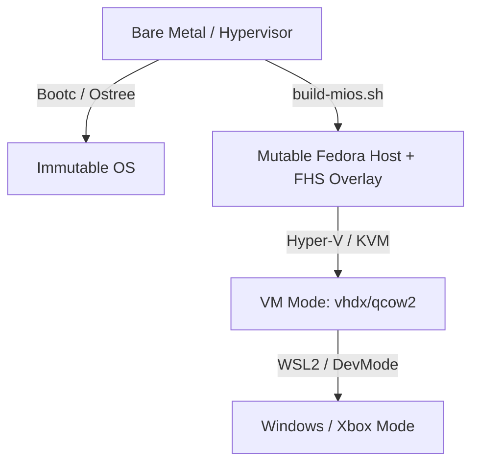

<!-- AI-hint: Defines the MiOS deployment model and execution modes -- the mutable Fedora server leg with FHS overlay via build-mios.sh, the MiOS-Sudo identity configuration, the immutable bootc-install mode, and the virtualized VM/Windows/Xbox modes using MiOS-Cat as the u
     AI-related: mios-admin, mios-agent-pipe, mios-sudo, mios-sys, mios-dev, mios-cat, autounattend.service -->
# MiOS Deployment Model & Execution Modes

MiOS supports multiple deployment models and execution environments depending on hardware capability, security requirements, and virtualization constraints. Whether running as a bare-metal hypervisor, an immutable bootc OS, a nested virtual machine, or a developer container on an Xbox, MiOS maintains consistent configuration and service parity.

---

## 1. The Primary Bare-Metal Leg: Mutable Fedora + FHS Overlay

While the transactional, immutable OCI image is the canonical target, the primary bare-metal deployment model for developers and operators is the **Mutable Fedora Server + FHS Overlay**.

### Mechanics
1. **Host Foundation**: The host runs standard, mutable Fedora Server (or Workstation).
2. **The Overlay**: Rather than baking a full disk image, the source tree's directories (`usr/`, `etc/`, `var/`, `srv/`) are materialized directly onto the host filesystem.
3. **Execution Driver (`build-mios.sh`)**: The overlay is applied and configured by running the primary build driver on the host:
   ```bash
   sudo ./automation/build-mios.sh --overlay
   ```
4. **FHS Compliance**: Files placed in `usr/lib/mios/` and `usr/share/mios/` represent the static, immutable portion of the MiOS platform, while `/etc/mios/` and `/var/lib/mios/` store the dynamic system configurations and agent databases respectively.

### When to Use
- Bare-metal developer workstations requiring maximum hardware access and debuggability.
- Multi-purpose servers where ostree/composefs immutability is blocked by dynamic driver compilation or proprietary kernel module requirements.

---

## 2. The MiOS-Sudo Identity & System Security

To allow the agentic-AI surface to safely inspect and manage host-level systems, MiOS defines the **MiOS-Sudo Identity** model.

### Mechanics
- **Identity Derivation**: The identity is derived from the single-source-of-truth configuration inside `mios.toml` under `[autounattend.service]`:
  - `svc_user` defines the built-in system administrator account (e.g., `Administrator` or `mios-admin`).
  - `svc_description` defines the role metadata associated with this system principal.
- **The MiOS-Sudo Role**: The system agent (`mios-agent-pipe`) runs under a restricted service account, but has targeted, passwordless sudo privileges for system-level controls (e.g., `podman`, `systemctl`, `bootc`) via `/etc/sudoers.d/99-mios-sudo`.
- **Audit Trails**: Sudo executions are mapped explicitly to the agent session and logged in `/var/log/audit/audit.log` for validation.

---

## 3. The Immutable Bootc-Install Mode

The production standard for clustered and high-integrity nodes is the **Immutable Bootc-Install Mode**.

### Mechanics
- **Container as OS**: The OS is packaged, distributed, and versioned as a standard OCI container image (`localhost/mios-sys` or `ghcr.io/mios-dev/mios`).
- **Physical Installation**: Installed directly onto bare metal via the `bootc install` CLI:
   ```bash
   sudo bootc install to-disk /dev/sda --raw
   ```
- ** ostree / composefs Integrity**: The boot partition is read-only, and the rootfs is built using composefs, making `/usr` completely immutable. Day-2 operations are handled atomically via:
   ```bash
   sudo bootc upgrade
   ```

---

## 4. Virtualized & Emulated Environments

MiOS runs in multiple virtualized contexts to support Windows hosts, cloud instances, and console development environments.



### VM Mode (VHDX / QCOW2)
- **Format**: MiOS generates standard virtual disk files:
  - **Hyper-V / Azure**: `.vhdx` with UEFI and secure-boot provisioning.
  - **QEMU / KVM / Proxmox**: `.qcow2` images configured with `qemu-guest-agent`.
- **Use Case**: Running MiOS on enterprise cloud platforms or nested inside Windows Hyper-V.

### Windows & Xbox Mode (Universal MiOS-Cat Launcher)
- **WSL2 tar**: Packaged as a WSL2 distribution root fs. Sourcing `userenv.sh` inside Windows/WSL environments handles hardware forwarding.
- **Xbox DevMode**: MiOS can be launched on Xbox console hardware in Developer Mode. 
- **MiOS-Cat**: The universal launcher agent (`mios-cat`) abstracts target virtualization layers, translating agent commands and service hooks across the Windows/Xbox host boundary seamlessly.

---

## Cross-References
- [ROADMAP](file:///c:/MiOS/ROADMAP.md) - Pipeline releases and deployment target milestones.
- [Architecture Blueprint](file:///c:/MiOS/usr/share/doc/mios/concepts/architecture.md) - Details on FHS compliance and system-sync-env execution.
