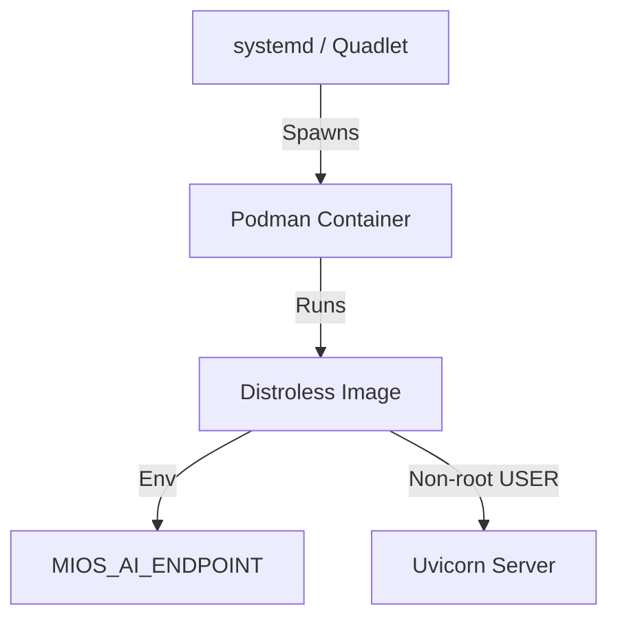

# Hummingbird: Distroless Agent-Pipe Service

This guide explains the architecture, deployment, and security details of the Hummingbird distroless agent-pipe container deployment pattern.

## Overview

Hummingbird packages the core agent-pipe service into a minimal, distroless container image. By eliminating the shell, package manager, and auxiliary OS packages, it reduces the attack surface while maintaining standard interface parity with host-level services.

## Quadlet Invocation

The container is managed natively via systemd Quadlets. The systemd unit file is located at `usr/share/containers/systemd/mios-agent-pipe.container` and automatically configures:
- Image binding: `localhost/mios-agent-pipe:hummingbird`
- Network exposure on port `8640`
- Explicit environment overrides mapping `MIOS_AI_ENDPOINT`

## Security Posture

Hummingbird adheres to the following security design rules:
1. **No-Shell Execution**: Uses the `gcr.io/distroless/python3-debian13` base image containing only Python, system libraries, and SSL certificates.
2. **De-escalated Privileges**: Runs under standard non-root `USER 65534:65534` (nobody:nogroup) with all ambient privileges dropped.
3. **ReadOnly Host Access**: Avoids privileged container escapes. Directory bindings are mapped read-only except for explicitly defined runtime state trees in `/var/lib/mios/`.
4. **Cache Isolation**: All application cache operations (`XDG_CACHE_HOME`) are bound to local, transient tmpfs mounts to prevent metadata MDS storms on shared storage clusters.

## Fail-Safe / Degrade-Open

In the event of network isolation or CephFS mounting failures:
- Logins and mounts degrade gracefully (exit 0) and fall back to local system volumes.
- All offline models run local inference strictly using the tailnet endpoint declared in `MIOS_AI_ENDPOINT`.
