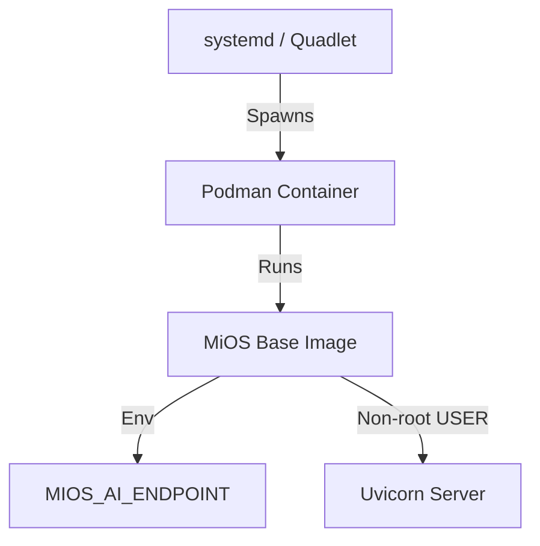

<!-- AI-hint: MiOS architectural documentation: Hummingbird: Distroless Agent-Pipe Service.
     AI-related: mios-agent-pipe, mios-agent-pipe.container -->

# Hummingbird: Native Agent-Pipe Service

Hummingbird packages the agent-pipe service with the native MiOS terminal and combined MCP interface.

## Overview

The final image derives from `localhost/mios-base:latest`. It includes tmux, Bash, MiOS-MCP and its terminal adapter by default. The historical filename remains for compatibility; the image now includes a shell and package manager as required by the global native-interface contract.

```mermaid
graph TD
    Systemd[systemd / Quadlet] -->|Spawns| Podman[Podman Container]
    Podman -->|Runs| Native[MiOS Base Image]
    Native -->|Env| Endpoint[MIOS_AI_ENDPOINT]
    Native -->|Non-root USER| Execution[Uvicorn Server]
```

## Quadlet Invocation

The container is managed natively via systemd Quadlets. The systemd unit file is located at `usr/share/containers/systemd/mios-agent-pipe.container` and automatically configures:
- Image binding: `localhost/mios-agent-pipe:hummingbird`
- Network exposure on the `agent_pipe` port
- Explicit environment overrides mapping `MIOS_AI_ENDPOINT`

## Security Posture

Hummingbird adheres to the following security design rules:
1. **Native Interface**: Uses the common Fedora MiOS base with tmux, MiOS-MCP and the SSOT-derived terminal profile.
2. **De-escalated Privileges**: Runs under standard non-root `USER 65534:65534` (nobody:nogroup) with all ambient privileges dropped.
3. **ReadOnly Host Access**: Avoids privileged container escapes. Directory bindings are mapped read-only except for explicitly defined runtime state trees in `/var/lib/mios/`.
4. **Cache Isolation**: All application cache operations (`XDG_CACHE_HOME`) are bound to local, transient tmpfs mounts to prevent metadata MDS storms on shared storage clusters.

## Fail-Safe / Degrade-Open

In the event of network isolation or CephFS mounting failures:
- Logins and mounts degrade gracefully (exit 0) and fall back to local system volumes.
- All offline models run local inference strictly using the tailnet endpoint declared in `MIOS_AI_ENDPOINT`.
