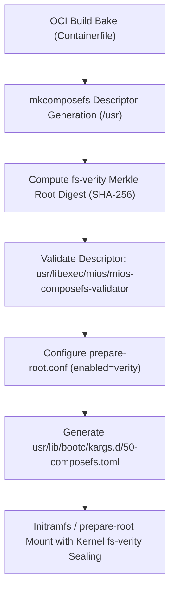
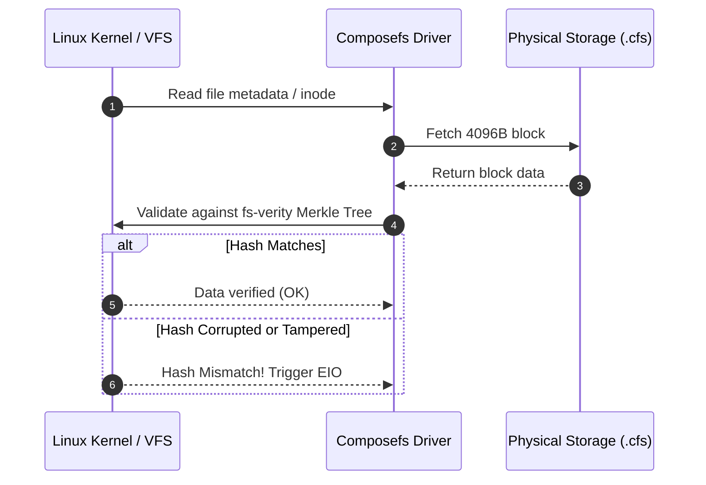

<!-- AI-hint: Chapter 15: Composefs fs-verity Root Filesystem Sealing and Atomic Validation (T-527, AGY-2125). Details kernel-level fs-verity digest verification, prepare-root composefs mount execution, descriptor integrity validation, and bootc kargs drop-in configuration. -->

# Chapter 15: Composefs fs-verity Root Filesystem Sealing and Atomic Validation

> Part V: Deep Security, Cryptography & Hardware of the [MiOS manual](../manual.md).

This chapter documents the architecture, cryptographic foundations, and operational tooling for **Composefs fs-verity Root Filesystem Sealing and Atomic Image Descriptor Validation** (T-527, AGY-2125).



---

### <a name="15_composefs_architecture"></a>15.Composefs Architecture: Immutable Root Sealing Architecture

> Path Reference: `/usr/share/doc/mios/manual.md#15_composefs_architecture`

#### Overview

Composefs separates filesystem metadata from underlying file content:
- **Descriptor Image (`.cfs`)**: An atomic, read-only binary filesystem image containing all directory hierarchies, file modes, permissions, timestamps, extended attributes (xattrs), and pointers to content chunks.
- **Content Store**: Content files are stored content-addressed or in underlying OSTree/OCI storage repositories.
- **Kernel Mount**: The Linux kernel mounts the composefs descriptor as an overlay filesystem atop the backing content store, enforcing strict immutability.

#### Key Security Properties

1. **Kernel-Enforced Read-Only Root**: The `/usr` filesystem tree is mounted read-only and backed by an immutable composefs block descriptor, preventing runtime tampering or unauthorized persistence even under privileged execution.
2. **Deterministic Deduplication**: Multiple system deployments and containers share underlying content blobs while maintaining completely independent, cryptographically sealed directory structures.
3. **Atomic State Transition**: Descriptor images are swapped transactionally across reboots by updating bootloader pointers without modifying underlying storage blocks in place.

---

### <a name="15_fsverity_integrity"></a>15.Fs-Verity Integrity: Cryptographic Merkle Tree Verification

> Path Reference: `/usr/share/doc/mios/manual.md#15_fsverity_integrity`

#### Overview

Linux fs-verity provides kernel-level transparent integrity verification for files. In MiOS, composefs descriptors are sealed using fs-verity digests:
- **Block-Level Merkle Tree**: Descriptors are partitioned into 4096-byte blocks. Each block is hashed using SHA-256, and parent hashes are recursively aggregated into a Merkle root hash.
- **Root Descriptor**: A 256-byte `fsverity_descriptor` struct captures the Merkle root, block size, algorithm ID, and payload size. The final fs-verity digest is the SHA-256 hash of this descriptor.
- **Kernel Interception**: The kernel intercepts every page read from the sealed filesystem. If any bit has been modified, corrupted, or tampered with on physical media, the page read fails immediately with an I/O error (`EIO`), preventing compromised code from reaching execution buffers.



---

### <a name="15_atomic_validator"></a>15.Atomic Validator: Image Descriptor Validation Tooling

> Path Reference: `/usr/share/doc/mios/manual.md#15_atomic_validator`

#### Overview

MiOS provides `usr/libexec/mios/mios-composefs-validator`, a native binary parser and cryptographic verifier for `.cfs` descriptor images.

#### Supported Commands and Options

- `verify <file.cfs> [--digest <sha256>]`:
  Validates header magic, binary structure, and inode tables. If `--digest` is provided, asserts that the file's computed fs-verity or SHA-256 digest exactly matches the expected hash. Rejects corrupt or tampered files with exit code `5` (`EIO`).
- `inspect <file.cfs>`:
  Parses and reports file dimensions, magic header type, format version, fs-verity digest, and SHA-256 checksum. If `composefs-info` is available, dumps inode tables and referenced object hashes.
- `-v, --verbose`: Enables verbose diagnostic output.
- `-h, --help`: Displays CLI usage syntax.

#### Header Magic Recognition

The validator recognizes both standard and specification magic identifiers:
- `0xd078629a`: Standard `libcomposefs` magic (`b'\x9a\x62\x78\xd0'`)
- `0x00736663`: `cfs\0` in little-endian format
- `0x00534643`: `CFS\0` in little-endian format
- `0x66706d63` / `0x636d7066`: `cmpf`

---

### <a name="15_sealing_automation"></a>15.Sealing Automation: Boot Sealing and Drop-In Generation

> Path Reference: `/usr/share/doc/mios/manual.md#15_sealing_automation`

#### Overview

The build pipeline script `automation/93-composefs-seal.sh` automates filesystem sealing during bake:
1. **prepare-root.conf Configuration**:
   Configures `/usr/lib/ostree/prepare-root.conf` and `/etc/ostree/prepare-root.conf`:
   ```ini
   [composefs]
   enabled = verity

   [root]
   transient = false

   [etc]
   transient = false
   ```
2. **Descriptor Generation & Verification**:
   Invokes `mkcomposefs` to render the rootfs descriptor and computes its fs-verity root digest. Runs `mios-composefs-validator` to guarantee structural integrity.
3. **Kernel Command-Line Sealing**:
   Generates `usr/lib/bootc/kargs.d/50-composefs.toml`:
   ```toml
   # AI-hint: Boot-time composefs fs-verity root filesystem sealing (T-527)
   # AI-doc: usr/share/doc/mios/manual/ch15-composefs-sealing.md
   kargs = [
     "ostree.composefs=1",
     "ostree.composefs.digest=<COMPUTED_DIGEST>",
   ]
   match-architectures = ["x86_64"]
   ```

#### Failure Modes and Diagnostics

| Symptom / Error | Root Cause | Remediation |
|---|---|---|
| `EIO: Input/output error` on boot | Physical block tampering or bit-rot in `.cfs` descriptor | Re-deploy via `bootc switch` or boot previous ostree deployment |
| `Invalid magic header (0x...)` | Truncated image or non-composefs format file | Run `mios-composefs-validator inspect` to check header bytes |
| `Descriptor digest mismatch` | Descriptor regenerated without updating `50-composefs.toml` | Re-run `automation/93-composefs-seal.sh` to synchronize digest |

#### Guidelines & Best Practices

1. **Verify Before Deploying**: Always run `mios-composefs-validator verify <image.cfs> --digest <hash>` before committing images into OCI registries.
2. **Preserve Immutability**: Maintain `transient = false` in `prepare-root.conf` to avoid ephemeral writable overlays on production nodes.
3. **Automated Testing**: Execute `tests/test-composefs-seal.sh` in preflight CI to catch corrupt inode tables or regression in tooling.
