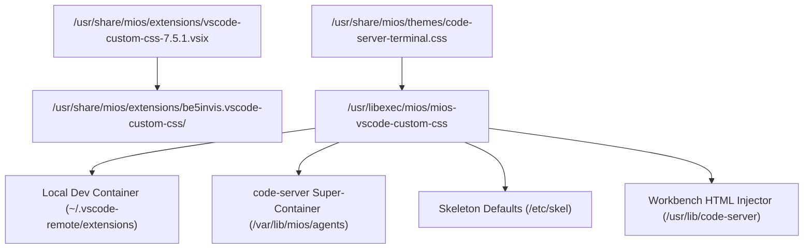

<!-- AI-hint: Chapter 16: IDE Custom CSS and Edge-to-Edge Integrated Terminal. Covers provisioning the vscode-custom-css extension, the edge-to-edge terminal stylesheet, and the mios-vscode-custom-css orchestrator that applies zero-margin CSS across local dev containers, code-server super-containers, and user skeletons. -->

# Chapter 16: IDE Custom CSS & Edge-to-Edge Integrated Terminal

## 1. Overview and Problem Statement

Modern Visual Studio Code and `code-server` installations default to substantial padding, margin offsets, and status boundaries surrounding integrated terminal panels. In compact developer environments, mobile views, multi-split war rooms, and edge displays, these dead margins waste critical vertical and horizontal space.

MiOS resolves this dead space system-wide by provisioning a custom CSS loader extension (`be5invis.vscode-custom-css` / `s-h-a-d-o-w.vscode-custom-css`), a standardized edge-to-edge terminal stylesheet, and automated provisioning tools that apply across all user profiles, dev containers, and super-container instances.

## 2. Architecture & Components



### Component Breakdown

1. **Offline Extension Artifacts**:
   - `usr/share/mios/extensions/vscode-custom-css-7.5.1.vsix`: Offline-capable VSIX package baked into the immutable image.
   - `usr/share/mios/extensions/be5invis.vscode-custom-css/`: Unpacked extension tree ready for instantaneous directory copying or symlinking without network calls.

2. **Edge-to-Edge Terminal Stylesheet**:
   - `usr/share/mios/themes/code-server-terminal.css`: Enforces zero margin, zero padding, and full 100% boundary width across `.terminal-outer-container`, `.terminal-wrapper`, `.terminal-split-pane`, `.xterm-screen`, and canvas offsets.

3. **Multi-Environment Orchestrator**:
   - `usr/libexec/mios/mios-vscode-custom-css`: Command-line manager supporting `install`, `patch`, `unpatch`, and `status`.

4. **Integration Points**:
   - `usr/share/mios/agents/Containerfile`: Bakes extension installation into the `localhost/mios-agents` super-container.
   - `usr/libexec/mios/mios-agents-firstboot.sh`: Automatically seeds extensions and settings into `/var/lib/mios/agents/.local/share/code-server/`.
   - `automation/59-tools.sh`: Ensures system-wide deployment during OS build.
   - `/etc/skel`: Pre-seeds `.local/share/code-server` and `.vscode` for newly provisioned users.

## 3. Configuration Contract

The following configuration is standard across all MiOS IDE configurations (`settings.json`):

```json
{
  "vscode_custom_css.imports": [
    "file:///usr/share/mios/themes/code-server-terminal.css"
  ],
  "vscode_custom_css.policy": true,
  "terminal.integrated.fontSize": 14,
  "terminal.integrated.tabs.enabled": false,
  "terminal.integrated.lineHeight": 1.0,
  "terminal.integrated.letterSpacing": 0,
  "terminal.integrated.shellIntegration.decorationsEnabled": "never"
}
```

## 4. Usage & Verification

To verify or manage the custom CSS subsystem on any MiOS host:

```bash
# Check status of extensions and settings across environments
mios-vscode-custom-css status

# Install and configure all environments
mios-vscode-custom-css install --all

# Patch local code-server or desktop workbench.html directly
mios-vscode-custom-css patch
```
