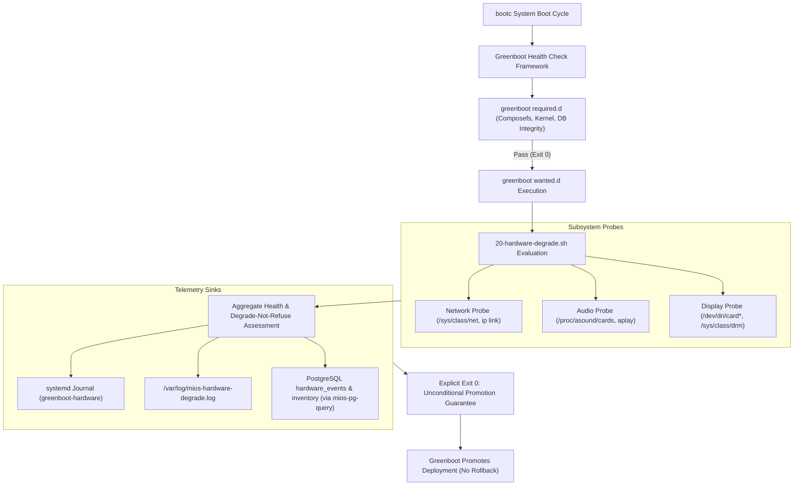

<!-- AI-hint: Chapter 19: Peripheral Hardware Health Evaluator and Non-Fatal Greenboot Degradation Reporter (T-531, AGY-2129). Covers the degrade-not-refuse architectural philosophy, peripheral subsystem probes (network, audio, display), Greenboot wanted.d integration, structured event telemetry, and PostgreSQL hardware inventory persistence. -->

# Chapter 19: Peripheral Hardware Health Evaluator and Non-Fatal Greenboot Degradation Reporter

> Part V: Deep Security, Cryptography & Hardware of the [MiOS manual](../manual.md).

This chapter documents the architecture, probe mechanics, and operational model for the **Peripheral Hardware Health Evaluator and Non-Fatal Greenboot Degradation Reporter** (T-531, AGY-2129), implemented in [`usr/lib/greenboot/check/wanted.d/20-hardware-degrade.sh`](file:///usr/lib/greenboot/check/wanted.d/20-hardware-degrade.sh).



---

### <a name="19_degrade_not_refuse_philosophy"></a>19.Degrade Not Refuse Philosophy: Non-Fatal Health Evaluation

> Path Reference: `/usr/share/doc/mios/manual.md#19_degrade_not_refuse_philosophy`

#### Architectural Principle

In autonomous edge nodes, developer workstations, and headless GPU servers, hardware configurations vary significantly:
- Headless inference nodes frequently operate without connected displays or GPU Direct Rendering Manager (DRM) card endpoints.
- Server blades and rackmount appliances routinely omit ALSA audio soundcards.
- Wireless or auxiliary secondary network controllers may be disconnected, uninitialized, or administratively paused.

Under standard transactional operating systems (such as `bootc` and `ostree`), a failed health check triggers an automated rollback to the previous staging tree. Applying fatal rollback logic to peripheral hardware would create **unwanted boot rollback loops** whenever non-vital hardware is absent or misconfigured.

MiOS implements the **"degrade-not-refuse"** architectural invariant:
1. **Critical Infrastructure vs. Non-Vital Peripherals**:
   - `usr/lib/greenboot/check/required.d/`: Enforces system-vital health checks (Composefs fs-verity root sealing, kernel lockdown, PostgreSQL database storage consistency, Podman container engine). Failure in `required.d` triggers recovery or rollback.
   - `usr/lib/greenboot/check/wanted.d/`: Evaluates advisory services and peripheral hardware subsystems.
2. **Deterministic Promotion Guarantee**:
   The peripheral hardware health evaluator (`20-hardware-degrade.sh`) executes within `wanted.d` and **strictly exits 0** across all execution paths. Even when all probed peripherals (network, audio, display) fail or lack drivers, the script registers the degraded state in system telemetry and allows Greenboot to mark the deployment as healthy and permanently promoted.

---

### <a name="19_peripheral_health_probes"></a>19.Peripheral Health Probes: Subsystem Diagnostic Architecture

> Path Reference: `/usr/share/doc/mios/manual.md#19_peripheral_health_probes`

#### 1. Network Subsystem Probe
The network probe inspects `/sys/class/net/` and `ip link` to evaluate physical and virtual network interfaces:
- **Exclusion of Loopback**: The `lo` virtual loopback interface is filtered out to avoid false positives.
- **Operstate and Carrier Detection**: Evaluates `/sys/class/net/<iface>/operstate` and carrier status. Interfaces in state `up` or `unknown` (virtual bridges, container veth interfaces, Ethernet/Wi-Fi) confirm healthy network connectivity.
- **Degraded Criteria**: If no interfaces exist outside of `lo`, or if all detected interfaces are in `down` state without carrier, the network subsystem is classified as `degraded`.

#### 2. Audio Subsystem Probe
The audio probe examines ALSA and PipeWire sound hardware states:
- **Proc Interface**: Evaluates `/proc/asound/cards` for active soundcard registrations (e.g., `0 [PCH ]: HDA-Intel`).
- **Binary Fallback**: When `/proc/asound/cards` is unpopulated, executes `aplay -l` to check for hardware card enumeration.
- **Degraded Criteria**: If `/proc/asound/cards` is missing, unpopulated, or contains `--- no soundcards ---`, the audio subsystem is marked `degraded`.

#### 3. Display Subsystem Probe
The display probe verifies Direct Rendering Manager (DRM) and Graphics Processing Unit (GPU) initialization:
- **Device Nodes**: Probes `/dev/dri/card*` for active DRM master nodes.
- **Sysfs Fallback**: Inspects `/sys/class/drm/card*` for registered kernel display interfaces.
- **PCI Class Identification**: Probes `/sys/bus/pci/devices/*/class` for PCI display controller classes (`0x030000` VGA controller, `0x030200` 3D controller).
- **Degraded Criteria**: If neither `/dev/dri/card*` nor `/sys/class/drm/card*` nodes exist, the display subsystem is classified as `degraded` (common on headless server nodes).

---

### <a name="19_wanted_d_integration"></a>19.Wanted.d Integration: Lifecycle and Execution Sequencing

> Path Reference: `/usr/share/doc/mios/manual.md#19_wanted_d_integration`

#### Sequencing within Greenboot

During boot, `greenboot-healthcheck.service` executes checks in alphanumeric order across `required.d` followed by `wanted.d`:

```
/usr/lib/greenboot/check/
├── required.d/
│   ├── 10-mios-composefs.sh      # Root integrity verification
│   ├── 20-podman.sh              # Container runtime verification
│   └── 55-mios-db-check.sh       # PostgreSQL & SQLite doctor
└── wanted.d/
    ├── 20-hardware-degrade.sh    # Peripheral health evaluator (T-531)
    ├── 30-nvidia-cdi.sh          # NVIDIA CDI spec generator
    ├── 40-role-target.sh         # Node persona target validator
    └── 70-blade-reachability.sh  # Advisory blade interconnect check
```

`20-hardware-degrade.sh` is prefixed with `20-` to run before specialized workload units (such as `30-nvidia-cdi.sh` and `50-mios-ha-cluster.sh`). This ensures that baseline peripheral telemetry is captured and logged before higher-level microservices launch.

---

### <a name="19_structured_telemetry_and_persistence"></a>19.Structured Telemetry and Persistence: Telemetry Pipeline

> Path Reference: `/usr/share/doc/mios/manual.md#19_structured_telemetry_and_persistence`

#### Structured Event Schema

Every invocation generates a structured JSON payload detailing the state of each subsystem:

```json
{
  "timestamp": "2026-09-24T00:40:52Z",
  "event_type": "hardware_degraded",
  "overall_status": "degraded",
  "degraded_count": 2,
  "policy": "degrade-not-refuse",
  "action": "log_and_promote",
  "subsystems": {
    "network": {
      "status": "healthy",
      "details": "Active network interfaces: eth0 (up)"
    },
    "audio": {
      "status": "degraded",
      "details": "No ALSA or PipeWire soundcards detected (/proc/asound/cards absent or empty)"
    },
    "display": {
      "status": "degraded",
      "details": "No DRM display nodes (/dev/dri/card*) or PCI display controllers found"
    }
  }
}
```

#### Multi-Sink Logging Strategy

1. **Systemd Journal**:
   Dispatched with tag `greenboot-hardware`.
   - Nominal state: Emitted at `info` priority.
   - Degraded state: Emitted at `warning` priority.
   - Full JSON payload: Emitted at `debug` priority.
2. **Persistent Log File (`/var/log/mios-hardware-degrade.log`)**:
   Appends human-readable and machine-parseable log lines:
   ```
   [2026-09-24T00:40:52Z] [DEGRADED] Hardware state DEGRADED [subsystems: audio,display]: non-fatal per degrade-not-refuse policy; Greenboot promotion authorized. | EVENT_JSON: {...}
   ```
   If `/var/log` is read-only or unprivileged execution prevents writing, falls back gracefully to `/tmp/mios-hardware-degrade.log`.
3. **PostgreSQL / pgvector Storage**:
   When loopback database access is available via `/usr/libexec/mios/mios-pg-query` or `psql`, the evaluator records the event into the `hardware_events` table:
   ```sql
   INSERT INTO hardware_events (action, subsystem, sys_path, event_payload)
   VALUES ('greenboot_hardware_health', 'peripherals', 'usr/lib/greenboot/check/wanted.d/20-hardware-degrade.sh', '{"..."}'::jsonb);
   ```
   If the database service is inactive or not yet ready, the operation **fails soft** (timeout 2s) without aborting the script or blocking boot.

---

### <a name="19_cli_operations_and_diagnostics"></a>19.CLI Operations and Diagnostics: CLI Operations & Troubleshooting

> Path Reference: `/usr/share/doc/mios/manual.md#19_cli_operations_and_diagnostics`

#### CLI Flags Reference

| Option | Description |
| :--- | :--- |
| `-v, --verbose` | Enables verbose diagnostic output to stdout, printing probe mechanics and DB status. |
| `--dry-run` | Evaluates hardware and formats JSON without modifying disk logs or PostgreSQL tables. |
| `--mock` | Runs a complete 5-stage simulation verifying that all healthy and degraded scenarios exit 0. |
| `--mock-degrade <subsystem>` | Simulates degradation of a specific subsystem (`network`, `audio`, `display`, or `all`). |
| `--mock-healthy` | Simulates healthy state for all subsystems. |
| `--log-file <path>` | Overrides the target log destination for custom test environments. |
| `-h, --help` | Displays usage summary, options, and environment variables. |

#### Administrative Troubleshooting Commands

```bash
# View live peripheral health evaluation status
/usr/lib/greenboot/check/wanted.d/20-hardware-degrade.sh -v

# Inspect recent journal entries for hardware degradation
journalctl -t greenboot-hardware -n 50 --no-pager

# Review persistent degradation log file
tail -n 20 /var/log/mios-hardware-degrade.log

# Extract the most recent structured JSON payload using jq
tail -n 1 /var/log/mios-hardware-degrade.log | grep -o 'EVENT_JSON: {.*}' | sed 's/EVENT_JSON: //' | jq .

# Run hermetic mock verification suite
/usr/lib/greenboot/check/wanted.d/20-hardware-degrade.sh --mock
```
