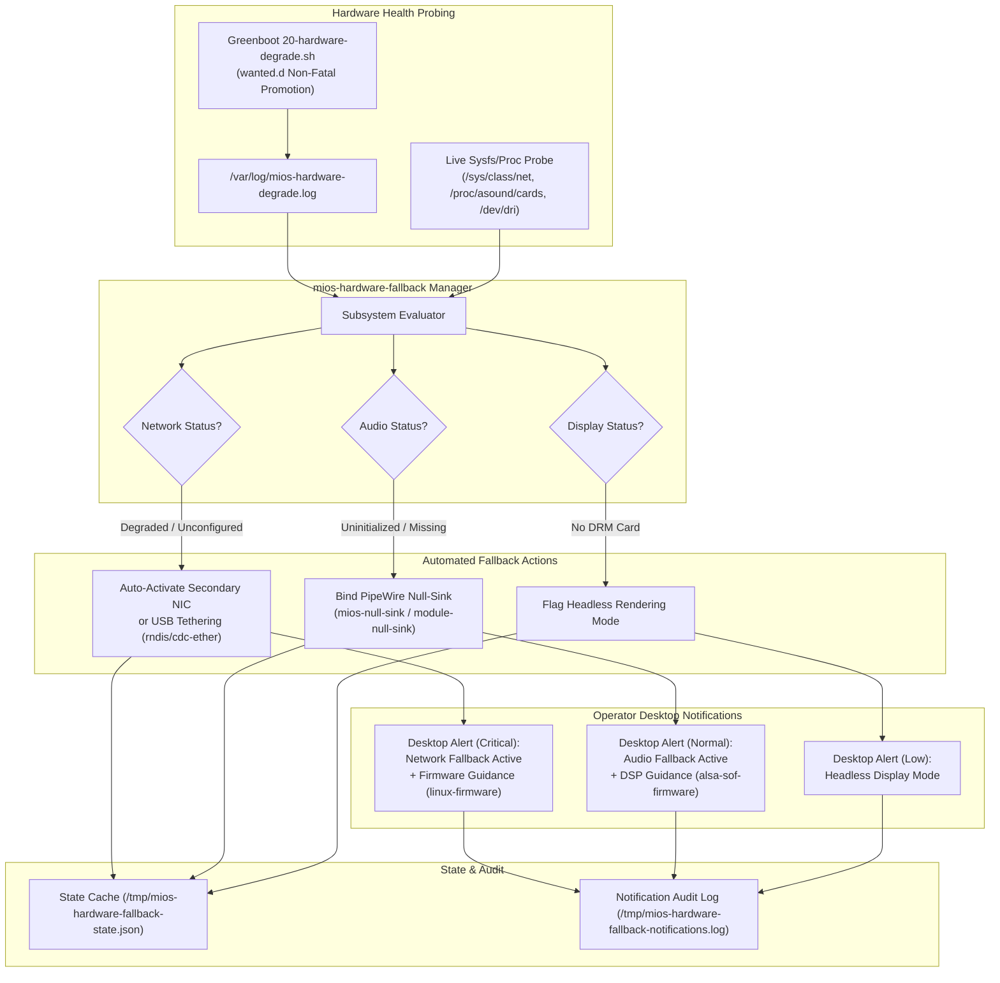
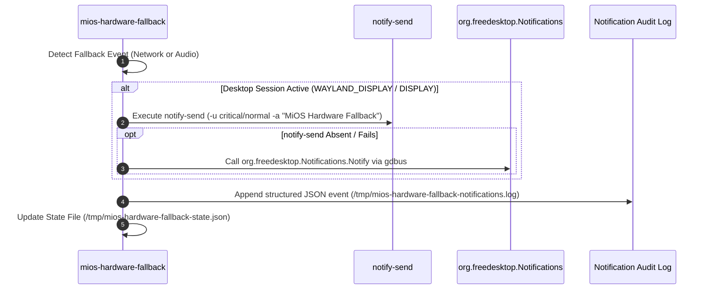

<!-- AI-hint: Chapter 21: Automated Network and Audio Fallback Manager with Operator Desktop Alert Daemon (T-532, AGY-2130). Covers peripheral degradation recovery, secondary NIC and USB tethering auto-failover, dynamic PipeWire null-sink binding, and desktop notifications. -->

# Chapter 21: Automated Network and Audio Fallback Manager with Operator Desktop Alert Daemon

> Part V: Deep Security, Cryptography & Hardware of the [MiOS manual](../manual.md).

This chapter documents the architecture, failover mechanisms, and alerting lifecycle of the **Automated Network and Audio Fallback Manager with Operator Desktop Alert Daemon** (T-532, AGY-2130), implemented in [`usr/libexec/mios/mios-hardware-fallback`](file:///usr/libexec/mios/mios-hardware-fallback) and managed by [`usr/lib/systemd/user/mios-hardware-fallback.service`](file:///usr/lib/systemd/user/mios-hardware-fallback.service).



---

### <a name="21_architecture_overview"></a>21.Architecture Overview: The Resilient Peripheral Fallback Lifecycle

> Path Reference: `/usr/share/doc/mios/manual.md#21_architecture_overview`

#### Architectural Principle

In autonomous edge devices, distributed compute blades, and developer laptops, physical peripherals (such as Wi-Fi chips, ALSA audio codecs, and secondary displays) are prone to intermittent failures, driver initialization delays, missing proprietary firmware blobs, or unplugged physical cables.

While `20-hardware-degrade.sh` under Greenboot guarantees that the system boots cleanly and promotes the image without triggering rollbacks ("degrade-not-refuse"), the user space and desktop session require automated self-healing:
1. **Network Continuity**: Desktop workloads, AI model pull operations, and remote agent telemetry must continue over available alternative links (such as a secondary Gigabit Ethernet port or an operator's smartphone connected via USB tethering).
2. **Audio Stack Immunity**: When an ALSA soundcard is missing, desktop environments and media applications (browsers, speech-to-text engines, Hermes wakeword listening daemons) frequently freeze or deadlock when probing audio sinks. Binding a virtual PipeWire null-sink ensures that media applications continue executing uninterrupted.
3. **Operator Notification**: The operator must be clearly alerted to the degraded state and provided with actionable remediation steps (such as firmware package installation or cable inspection), preventing silent degradation.

---

### <a name="21_network_fallback"></a>21.Network Fallback: Secondary NIC and USB Tethering Auto-Failover

> Path Reference: `/usr/share/doc/mios/manual.md#21_network_fallback`

#### Detection and Discovery

The fallback manager inspects `/var/log/mios-hardware-degrade.log` for a `degraded` network event, or verifies whether any non-loopback interface in `/sys/class/net/` is in the `up` state.

When the primary network interface is absent or disconnected:
1. **Candidate Discovery**: The manager scans `/sys/class/net/` for available alternatives, prioritizing:
   - **USB Tethering / Mobile Hotspots**: Interfaces matching `usb*`, `rndis*`, `cdc-wdm*`, or predictable USB names `enx*`.
   - **Secondary Physical Ethernet**: Secondary onboard controllers (`eth1`, `eno2`, `enp*`, `ens*`).
   - **Bridge / Virtual Interfaces**: Auxiliary bridging connections.
2. **Automated Activation**:
   The manager attempts interface activation using NetworkManager (`nmcli device connect <iface>`) or the native netlink link tool (`ip link set <iface> up`).
3. **State Tracking**:
   The active fallback interface is recorded in the runtime state file:
   ```json
   {
     "network_fallback": {
       "fallback_active": true,
       "chosen_interface": "usb0",
       "command": "nmcli device connect usb0",
       "details": "Primary interface eth0 link down"
     }
   }
   ```

---

### <a name="21_audio_fallback"></a>21.Audio Fallback: Dynamic PipeWire Null-Sink Binding

> Path Reference: `/usr/share/doc/mios/manual.md#21_audio_fallback`

#### The Missing Soundcard Dilemma

When modern Linux audio servers (PipeWire / WirePlumber / PulseAudio) initialize without a hardware soundcard, audio clients querying default sinks encounter `ENOENT` or indefinite timeouts. Communication applications (such as Discord, Zoom, or local AI voice pipelines) may crash or refuse to process input streams.

#### Null-Sink Provisioning Strategy

When `/proc/asound/cards` is absent, empty, or reports no physical soundcards, the fallback manager provisions a virtual null-sink (`mios-null-sink`):
1. **PulseAudio Compatibility Shim**:
   Invokes `pactl load-module module-null-sink sink_name=mios-null-sink sink_properties=device.description="MiOS_Fallback_Null_Sink"`.
2. **Native PipeWire Adapter Creation**:
   Invokes `pw-cli create-node adapter '{ factory.name=support.null-audio-sink node.name=mios-null-sink media.class=Audio/Sink object.linger=true }'`.
3. **User Configuration Drop-In**:
   Writes a persistent PipeWire user configuration snippet to `~/.config/pipewire/pipewire.conf.d/99-fallback-null-sink.conf`:
   ```ini
   context.objects = [
       { factory = adapter
         args = {
             factory.name = support.null-audio-sink
             node.name = "mios-null-sink"
             node.description = "MiOS Fallback Null Sink"
             media.class = Audio/Sink
             object.linger = true
         }
       }
   ]
   ```

This virtual sink acts as a bit-bucket destination for output streams, allowing all client applications to function smoothly while awaiting physical hardware or driver configuration.

---

### <a name="21_desktop_alerts"></a>21.Operator Desktop Alerts: Guidance & Remediation

> Path Reference: `/usr/share/doc/mios/manual.md#21_desktop_alerts`

When fallbacks are triggered, the daemon emits notifications across multiple channels to ensure the operator is informed without disrupting active workflows.

#### Dispatch Architecture



#### Remediation Messages

| Subsystem | Urgency | Notification Title | Remediation Guidance |
|---|---|---|---|
| **Network** | `critical` | *MiOS Hardware Alert: Network Degraded* | Primary network controller is down or unavailable. Activated fallback interface `<iface>`. **Remediation**: Verify physical link, antenna, or install firmware (`linux-firmware`). |
| **Audio** | `normal` | *MiOS Hardware Alert: Audio Degraded* | No physical soundcard detected. Bound PipeWire null-sink `mios-null-sink` to prevent media applications from freezing. **Remediation**: Verify ALSA/SOF audio DSP firmware (`alsa-sof-firmware`). |
| **Display** | `low` | *MiOS Hardware Alert: Display Degraded* | DRM GPU card endpoint not detected; operating in headless mode. **Remediation**: Verify GPU passthrough (VFIO) or kernel DRM drivers. |

---

### <a name="21_systemd_user_service"></a>21.Systemd User Service: `mios-hardware-fallback.service`

> Path Reference: `/usr/share/doc/mios/manual.md#21_systemd_user_service`

The fallback manager integrates into the user graphical session via systemd user services:

```ini
# /usr/lib/systemd/user/mios-hardware-fallback.service
# AI-hint: Automated network and audio fallback manager with operator desktop alert daemon (T-532, AGY-2130).
# AI-doc: usr/share/doc/mios/manual/ch21-hardware-fallback.md
[Unit]
Description='MiOS' Automated Network and Audio Fallback Manager
Documentation=file:///usr/share/doc/mios/manual/ch21-hardware-fallback.md
After=graphical-session.target pipewire.service
PartOf=graphical-session.target

[Service]
Type=simple
ExecStart=/usr/libexec/mios/mios-hardware-fallback evaluate
Restart=on-failure
RestartSec=5s

[Install]
WantedBy=graphical-session.target
```

---

### <a name="21_cli_reference"></a>21.CLI Reference: `mios-hardware-fallback`

> Path Reference: `/usr/share/doc/mios/manual.md#21_cli_reference`

```text
Usage: mios-hardware-fallback [OPTIONS] SUBCOMMAND [ARGS...]

Automated network and audio fallback manager with operator desktop alert daemon.

Subcommands:
  evaluate            Evaluate hardware state and apply fallbacks
  status              Print current active fallback states
  daemon              Run background evaluation loop daemon

Global Options:
  --mock              Run with mock hardware degradation fixtures
  --dry-run           Simulate fallback actions without changing system state
  -v, --verbose       Enable verbose diagnostic logging
  --degrade-log <p>   Path to hardware degradation log (default: /var/log/mios-hardware-degrade.log)
  --state-file <p>    Path to fallback state JSON file (default: /tmp/mios-hardware-fallback-state.json)
  --notif-log <p>     Path to notification recording log (default: /tmp/mios-hardware-fallback-notifications.log)
  --json              Output evaluation or status in JSON format
  -h, --help          Display help and exit
```

#### Typical Administrative Invocations

1. **Perform Single Health Evaluation and Apply Fallbacks**:
   ```bash
   /usr/libexec/mios/mios-hardware-fallback evaluate
   ```
2. **Inspect Current Active Fallbacks in JSON**:
   ```bash
   /usr/libexec/mios/mios-hardware-fallback status --json
   ```
3. **Execute Mock Evaluation to Verify Alerting & Failover**:
   ```bash
   /usr/libexec/mios/mios-hardware-fallback evaluate --mock -v
   ```
4. **Run Background Service Daemon**:
   ```bash
   /usr/libexec/mios/mios-hardware-fallback daemon --interval 15
   ```
