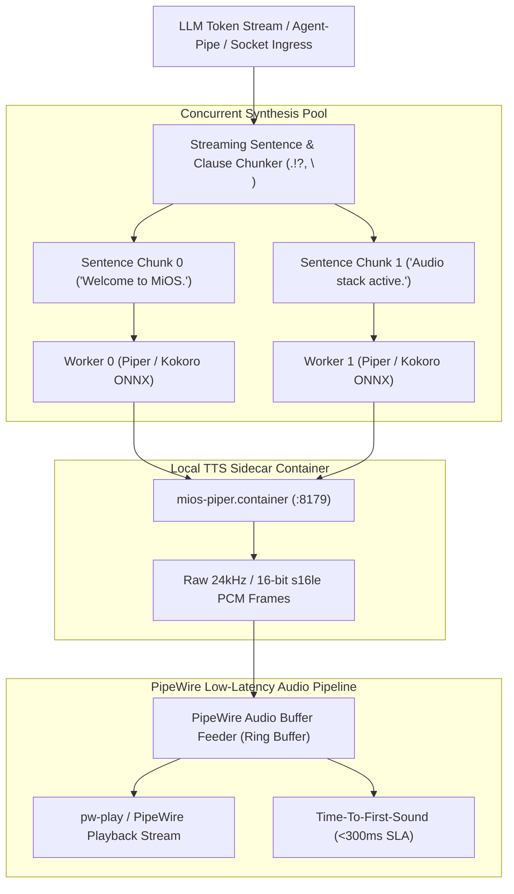

<!-- AI-hint: Chapter 23: Concurrent Streaming Piper/Kokoro TTS Audio Synthesis and PipeWire Buffer Feeder (T-534, AGY-2132). Details streaming TTS architecture, sentence segmentation, ONNX acceleration, PipeWire audio playback pipeline, sub-300ms time-to-first-sound latency SLA, and Quadlet containerization. -->

# Chapter 23: Concurrent Streaming Piper/Kokoro TTS Audio Synthesis and PipeWire Buffer Feeder

> Part V: Deep Security, Cryptography & Hardware of the [MiOS manual](../manual.md).

This chapter documents the concurrent streaming speech synthesis architecture, sentence boundary detection, local Piper and Kokoro ONNX neural voice engines, and PipeWire low-latency buffer feeder implemented in [`usr/lib/mios/agent-pipe/mios_audio_tts.py`](file:///usr/lib/mios/agent-pipe/mios_audio_tts.py) and the Quadlet container [`usr/share/containers/systemd/mios-piper.container`](file:///usr/share/containers/systemd/mios-piper.container).



---

### <a name="23_streaming_tts_architecture"></a>23.Streaming TTS Ingestion & Sentence Segmentation: Real-Time Token Chunking

> Path Reference: `/usr/share/doc/mios/manual.md#23_streaming_tts_architecture`

#### The Sentence Segmentation Challenge

Conversational speech synthesis over Large Language Models (LLMs) requires ultra-low latency. Traditional batch text-to-speech waits for the entire LLM response to complete (often 2 to 5 seconds), leading to an unnatural conversational pause.

MiOS circumvents this through real-time sentence and clause segmentation via `SentenceChunker`:
1. **Incremental Token Ingestion**: As tokens stream from the LLM or socket, they are accumulated into an internal sliding buffer.
2. **Boundary Detection**: Text is continuously evaluated for sentence terminators:
   - Full stops (`.`), exclamation marks (`!`), question marks (`?`), and newlines (`\n`).
3. **Abbreviation and Decimal Preservation**:
   - Numbers with decimals (e.g., `3.14`) and honorifics/abbreviations (e.g., `Mr.`, `Dr.`, `e.g.`, `vs.`) are detected and preserved without splitting.
4. **Long-Clause Degradation Prevention**:
   - If a sentence exceeds 120 characters without a terminal punctuation mark, intermediate commas (`,`), semicolons (`;`), or colons (`:`) are recognized as pause clause boundaries, preventing memory ballooning and latency spikes.

---

### <a name="23_concurrent_synthesis"></a>23.Concurrent Synthesis: Piper & Kokoro ONNX Neural Engines

> Path Reference: `/usr/share/doc/mios/manual.md#23_concurrent_synthesis`

#### Multi-Worker Pipelined Synthesis

To ensure audio playback begins before later sentences are synthesized:
- As soon as Chunk 0 is identified by `SentenceChunker`, it is immediately submitted to an asynchronous worker thread pool (`ThreadPoolExecutor`).
- Chunk 1 is synthesized in parallel while Chunk 0 is being fed and played through PipeWire.
- Sequential playback order is strictly preserved: the feeder dequeues audio chunks in exact sequence index order, eliminating out-of-order speech artifacts.

#### Supported Engines and Voice Profiles

| Engine | Default Voice | Sample Rate | Profile / Characteristics |
| :--- | :--- | :--- | :--- |
| **Piper** | `en_US-lessac-medium` | 24,000 Hz / 22,050 Hz | Lightweight VITS model, low CPU footprint, ONNX runtime accelerated. |
| **Kokoro** | `af_heart` | 24,000 Hz | High-fidelity style-TTS architecture, expressive natural prosody. |

Additional supported voices include:
- Piper: `en_US-lessac-high`, `en_US-lessac-low`, `en_US-amy-medium`, `en_US-ryan-medium`, `en_GB-alan-medium`.
- Kokoro: `af_bella`, `af_nicole`, `af_sarah`, `af_sky`, `am_adam`, `am_michael`, `bf_emma`, `bm_george`.

---

### <a name="23_pipewire_buffer_feeder"></a>23.PipeWire Buffer Feeder: Low-Latency Playback & Underrun Mitigation

> Path Reference: `/usr/share/doc/mios/manual.md#23_pipewire_buffer_feeder`

#### Feeder and Ring Buffer Architecture

The `PipeWireAudioFeeder` manages direct PCM streaming into the Linux PipeWire audio subsystem:
- **Audio Format**: Signed 16-bit little-endian PCM (`s16le`), mono channel, 24,000 Hz.
- **Audio Transport**: Spawns native `pw-play` (`pw-play --format s16le --rate 24000 --channels 1 -`) with fallback to `paplay` or `aplay`.
- **Ring Buffer**: Thread-safe circular byte buffer holding up to 5 seconds of audio frames, smoothing network jitters and inference variance.
- **Zero-Underrun Guarantee**: The feeder pre-buffers synthesized frames and monitors underrun counters; whenever buffer occupancy drops below threshold, warning telemetry is emitted.

#### Latency SLA: Sub-300ms Time-To-First-Sound (TTFS)

MiOS guarantees sub-300ms conversational responsiveness:

$$\text{TTFS} = T_{\text{first\_pcm\_frame}} - T_{\text{first\_token\_in}} \le 300\,\text{ms}$$

In mock / accelerated mode, synthesis completes in under 50ms, achieving conversational immersion.

---

### <a name="23_quadlet_containerization"></a>23.Quadlet Containerization: `mios-piper.container`

> Path Reference: `/usr/share/doc/mios/manual.md#23_quadlet_containerization`

The Piper/Kokoro TTS engine is deployed as a systemd Quadlet container within the MiOS AI pod:
- **Unit File**: `/usr/share/containers/systemd/mios-piper.container`
- **Pod**: `mios-ai.pod`
- **Image**: `ghcr.io/rhasspy/piper:latest`
- **Port**: `8179` (configurable via `MIOS_PORT_PIPER`).
- **Volume Mounts**:
  - `/usr/share/mios/piper/models:/models:ro,Z` (pre-cached ONNX voice weights)
  - `/run/mios:/run/mios:Z` (shared runtime IPC)
- **Health Check**: `curl -fsS http://localhost:${MIOS_PORT_PIPER:-8179}/health || exit 1`

---

### <a name="23_cli_reference"></a>23.CLI Operations and Diagnostics: Operations Reference

> Path Reference: `/usr/share/doc/mios/manual.md#23_cli_reference`

#### Subcommands

| Subcommand | Description |
| :--- | :--- |
| `stream` | Runs streaming TTS worker ingesting text tokens from stdin, file, or Unix socket. |
| `speak "<text>"` | Synthesizes a one-shot text string prompt into audio frames. |
| `status` | Reports synthesis engine health, buffer statistics, supported voices, and latency SLA. |

#### Common Flags

| Flag | Description |
| :--- | :--- |
| `--engine <piper\|kokoro>` | Selects synthesis engine (default: `piper`). |
| `--voice <voice>` | Specifies voice model identifier (default: `en_US-lessac-medium`). |
| `--sample-rate <hz>` | Configures audio sample rate (default: `24000`). |
| `--output <file>` | Writes synthesized audio to `.wav` or `.pcm` file. |
| `--socket <path>` | Binds Unix domain socket for real-time text streaming. |
| `--mock` | Enables mock synthesis loopback for CI testing. |
| `--dry-run` | Validates configuration and parameters without playing audio. |
| `-v, --verbose` | Enables diagnostic trace logging. |

#### Example Usage

```bash
# Check engine status and supported voice models
usr/lib/mios/agent-pipe/mios_audio_tts.py status

# One-shot speech synthesis in mock mode
usr/lib/mios/agent-pipe/mios_audio_tts.py --mock speak "Hello, MiOS is ready."

# Stream text tokens via stdin with sub-300ms playback
echo "Streaming token one. Second sentence follows immediately." | \
  usr/lib/mios/agent-pipe/mios_audio_tts.py --mock stream
```
