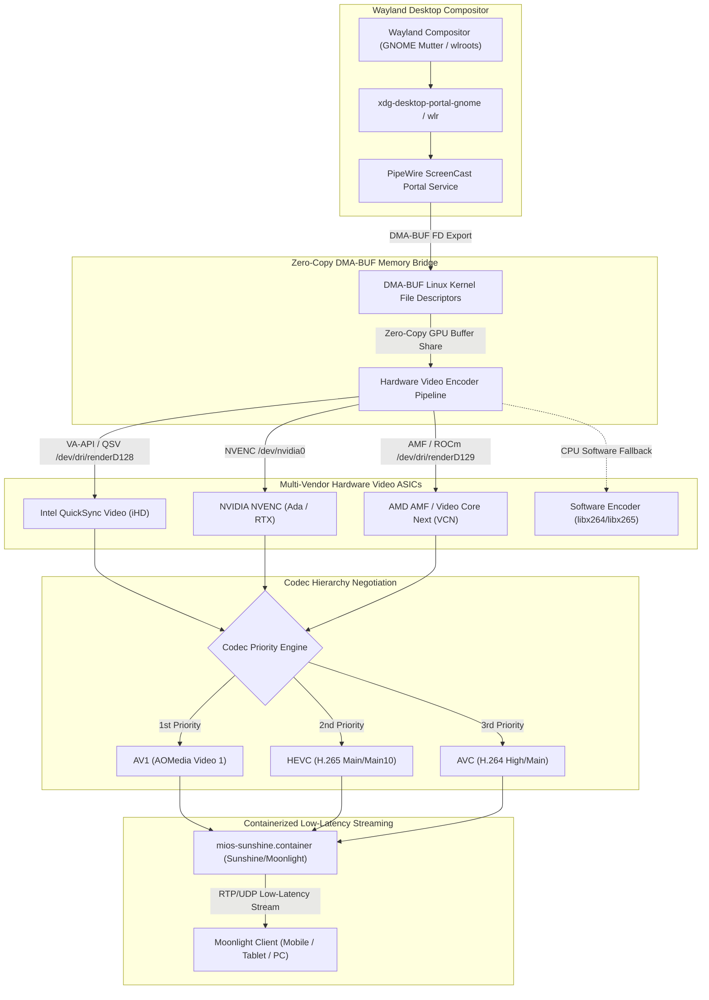

<!-- AI-hint: Chapter 24: Multi-Vendor Hardware Video Encoder Discovery and DMA-BUF Capture Bridge (T-535, AGY-2133). Details hardware ASIC probing (QuickSync, NVENC, AMF), AV1 > HEVC > AVC codec priority hierarchy, Wayland PipeWire DMA-BUF zero-copy architecture, and Sunshine streaming host containerization. -->

# Chapter 24: Multi-Vendor Hardware Video Encoder Discovery and DMA-BUF Capture Bridge

> Part V: Deep Security, Cryptography & Hardware of the [MiOS manual](../manual.md).

This chapter documents the architecture, multi-vendor GPU encoder discovery, zero-copy DMA-BUF capture pipeline, and low-latency Sunshine/Moonlight streaming host integration implemented in [`usr/libexec/mios/mios-video-encoder-probe`](file:///usr/libexec/mios/mios-video-encoder-probe) and the Quadlet container [`usr/share/containers/systemd/mios-sunshine.container`](file:///usr/share/containers/systemd/mios-sunshine.container).



---

### <a name="24_hardware_encoder_discovery"></a>24.Multi-Vendor Hardware Video Encoder Discovery

> Path Reference: `/usr/share/doc/mios/manual.md#24_hardware_encoder_discovery`

MiOS implements automated detection of hardware video encoding capabilities across all major workstation GPU vendors without requiring manual driver or device configuration:

#### 1. Intel QuickSync Video (QSV / VA-API)
- **Device Node Discovery**: Scans `/dev/dri/renderD[0-9]*` and validates the PCI vendor identifier at `/sys/class/drm/renderD*/device/vendor` matching `0x8086`.
- **Driver Transport**: Inspects the VA-API driver (`Intel iHD` driver for Gen Graphics or legacy `i965`).
- **Profile Querying**: Executes `vainfo --display drm --device /dev/dri/renderD*` and parses supported slice-encoding entrypoints (`VAEntrypointEncSlice` and `VAEntrypointEncSliceLP`).
- **Supported Codecs**: Detects `VAProfileAV1Profile0` (AV1), `VAProfileHEVCMain` / `VAProfileHEVCMain10` (HEVC/H.265), and `VAProfileH264High` / `VAProfileH264Main` (AVC/H.264).

#### 2. NVIDIA NVENC
- **Device Node Discovery**: Detects character nodes `/dev/nvidia0`, `/dev/nvidiactl`, or Microsoft DirectX Graphics (`/dev/dxg` in WSL2 environments).
- **GPU Architecture Querying**: Queries `nvidia-smi --query-gpu=name,driver_version,compute_cap` or NVML interfaces.
- **Generation Detection**:
  - *Ada Lovelace & Blackwell* (RTX 40-series, RTX 50-series, L4, L40): Supports dual hardware AV1, HEVC, and AVC encoders.
  - *Ampere, Turing & Pascal* (RTX 30-series, RTX 20-series, GTX 16-series, GTX 10-series): Supports HEVC and AVC encoders.
  - *Kepler & Maxwell*: Baseline AVC encoding.

#### 3. AMD AMF / Video Core Next (VCN)
- **Device Node Discovery**: Scans `/dev/dri/renderD[0-9]*` and verifies PCI vendor identifier `0x1002`.
- **Driver Transport**: Interrogates the Mesa Gallium driver (`radeonsi`) and AMD Advanced Media Framework (AMF) or ROCm acceleration.
- **VCN Encoding Detection**: Parses `vainfo` for `VAEntrypointEncSlice` entries across RDNA2/RDNA3 architectures, identifying VCN 3.0/4.0 encode blocks for AV1, HEVC, and AVC.

---

### <a name="24_codec_priority_hierarchy"></a>24.Codec Priority Hierarchy: AV1 > HEVC > AVC

> Path Reference: `/usr/share/doc/mios/manual.md#24_codec_priority_hierarchy`

Video compression efficiency directly impacts both network bandwidth utilization and frame delivery latency in remote workstation streaming. `mios-video-encoder-probe` enforces a strict resolution hierarchy:

$$\text{AV1} \succ \text{HEVC (H.265)} \succ \text{AVC (H.264)}$$

| Codec | Relative Efficiency | Bitrate Target (4K60) | Minimum GPU Hardware Generation |
| :--- | :--- | :--- | :--- |
| **AV1** | **Baseline (100%)** | 18 - 25 Mbps | Intel Arc (Alchemist+), NVIDIA RTX 40-series+, AMD RX 7000+ (RDNA3+) |
| **HEVC (H.265)** | **+30% Bandwidth** | 25 - 35 Mbps | Intel Skylake+, NVIDIA GTX 960+ / Pascal+, AMD Polaris+ / RDNA1+ |
| **AVC (H.264)** | **+70% Bandwidth** | 45 - 60 Mbps | Universal hardware compatibility on any GPU manufactured after 2012 |

When multiple encoders or codecs are detected, the probe automatically selects the highest available tier to maximize quality and minimize streaming latency.

---

### <a name="24_dmabuf_zero_copy_architecture"></a>24.Wayland PipeWire DMA-BUF Zero-Copy Capture Pipeline

> Path Reference: `/usr/share/doc/mios/manual.md#24_dmabuf_zero_copy_architecture`

Traditional desktop streaming captures frames by copying pixels from GPU VRAM to host system RAM, and then re-uploading them to the hardware encoder. In 4K at 60 FPS, this creates massive memory bus bottlenecks:

$$\text{Throughput} = 3840 \times 2160 \times 4 \text{ bytes} \times 60 \text{ Hz} \approx 1.99 \text{ GB/s}$$

MiOS eliminates this overhead via kernel Direct Memory Access Buffers (DMA-BUF):

1. **Wayland Compositor Frame Surface**: The compositor renders desktop frames directly into GPU VRAM backed by a DRM framebuffer object.
2. **PipeWire ScreenCast Negotiation**: Through the XDG Desktop Portal (`xdg-desktop-portal`), PipeWire requests a ScreenCast session with DMA-BUF modifier negotiation (`SPA_POD_CHOICE`).
3. **File Descriptor Handshake**: Instead of copying pixel memory, PipeWire passes an open DMA-BUF file descriptor (`dma_buf_fd`) over a Unix domain socket.
4. **Hardware ASIC Ingestion**: The Sunshine capture bridge imports the file descriptor directly into the hardware encoder (VA-API / NVENC / AMF).
5. **Zero-Copy Encoding**: Hardware encoding occurs in-place within GPU memory, achieving sub-4ms capture-to-encode latency with 0% CPU memory copy overhead.

---

### <a name="24_sunshine_streaming_container"></a>24.Sunshine Streaming Containerization & CDI Configuration

> Path Reference: `/usr/share/doc/mios/manual.md#24_sunshine_streaming_container`

The Sunshine streaming service is managed as an unprivileged, declarative Quadlet container unit:
[`usr/share/containers/systemd/mios-sunshine.container`](file:///usr/share/containers/systemd/mios-sunshine.container).

#### Key Quadlet Configuration Directives:
- **CDI Device Access**: `AddDevice=/dev/dri` and `AddDevice=nvidia.com/gpu=all` ensure access to both DRM render nodes and NVIDIA character devices.
- **Input Injection**: `AddDevice=/dev/uinput` provides virtual mouse, keyboard, and gamepad simulation for remote Moonlight controllers.
- **Linux Capabilities**:
  - `CAP_SYS_ADMIN`: Required for zero-copy DMA-BUF memory descriptor import across namespaces.
  - `CAP_NET_ADMIN`: Optimizes low-latency UDP socket buffering and pacing.
  - `CAP_SYS_NICE`: Grants real-time process scheduling (`SCHED_RR` / `SCHED_FIFO`) for the video encoding thread.
- **Network Mode**: `Network=host` eliminates container bridge NAT latency and provides seamless Moonlight discovery over ports 47984-48010.

---

### <a name="24_cli_modes_and_telemetry"></a>24.CLI Modes, Telemetry & Fallback Governance

> Path Reference: `/usr/share/doc/mios/manual.md#24_cli_modes_and_telemetry`

The probe CLI [`usr/libexec/mios/mios-video-encoder-probe`](file:///usr/libexec/mios/mios-video-encoder-probe) provides three primary subcommands:

1. **`probe [--json]`**:
   Discovers available GPU hardware ASICs and outputs the structured capability matrix.
   ```bash
   mios-video-encoder-probe probe --json
   ```
2. **`configure [--output <path>]`**:
   Generates optimal Sunshine/Moonlight streaming configuration files (`sunshine.conf` or `sunshine.json`), writing to `/var/lib/mios/sunshine/sunshine.json` or `/etc/sunshine/sunshine.conf` with fallback to stdout.
   ```bash
   mios-video-encoder-probe configure --output /etc/sunshine/sunshine.conf
   ```
3. **`status`**:
   Renders human-readable summary of detected hardware ASICs, supported codecs, and active capture pipelines.
   ```bash
   mios-video-encoder-probe status
   ```

#### Software Fallback Governance
In virtualized or GPU-less environments without physical video encoding ASICs (e.g. headless hypervisors, cloud devcontainers), the probe engages software fallback:
- **Encoder**: Reverts to CPU software encoding (`libx264` / `libx265`).
- **Capture Bridge**: Switches from DMA-BUF zero-copy to PipeWire shared-memory (`pipewire-shm`) frame transport.
- **System Stability**: Prevents container crash loops while clearly logging fallback diagnostics in system telemetry.
