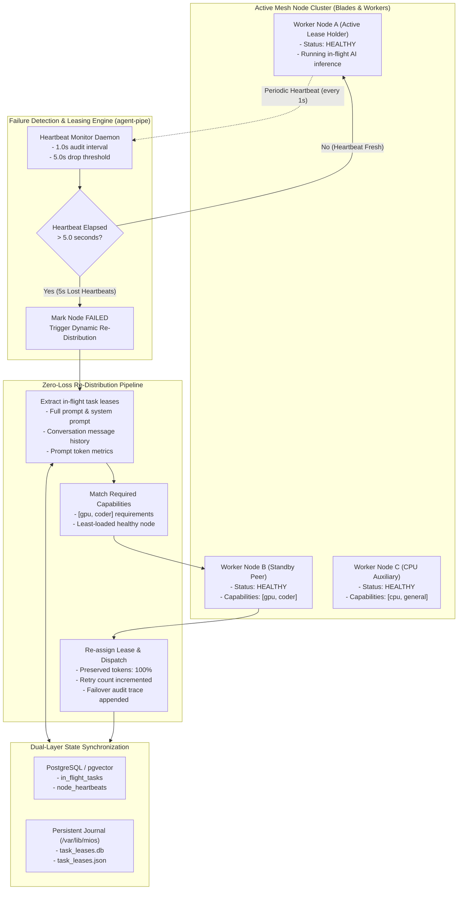
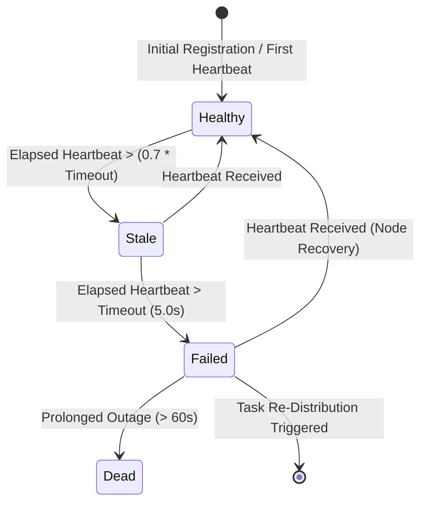
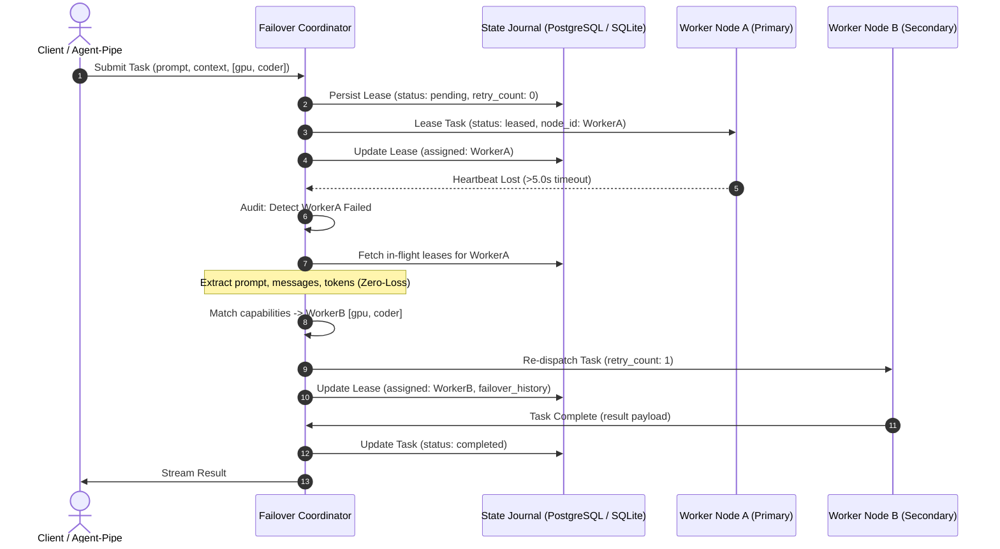

<!-- AI-hint: Chapter 27: Automated Node Failure Detection and Zero-Loss Dynamic Task Re-Distribution Engine (T-538, AGY-2136). Details mesh heartbeat auditing, in-flight task leasing protocols, zero-loss prompt recovery, and PostgreSQL/SQLite state synchronization across the agent plane. -->

# Chapter 27: Automated Node Failure Detection and Zero-Loss Dynamic Task Re-Distribution Engine

> Part IV: Cluster, Distributed Services & Storage of the [MiOS manual](../manual.md).

This chapter documents the architecture, leasing protocols, failure detection mechanics, and zero-loss dynamic task re-distribution engine implemented in [`usr/lib/mios/agent-pipe/mios_task_failover.py`](file:///usr/lib/mios/agent-pipe/mios_task_failover.py).



---

### <a name="27_failover_architecture"></a>27.Architectural Overview: Node Resilience in the MiOS Agent Plane

> Path Reference: `/usr/share/doc/mios/manual.md#27_failover_architecture`

In a multi-blade or federated MiOS cluster, AI reasoning workloads, multi-turn tool loops, and code generation tasks execute across distributed worker nodes. Node failures (such as hardware panics, network partition, or out-of-memory kernel termination) must never cause prompt truncation, dropped user conversations, or silent request loss.

The **MiOS Task Failover Engine** ([`usr/lib/mios/agent-pipe/mios_task_failover.py`](file:///usr/lib/mios/agent-pipe/mios_task_failover.py)) implements an automated, zero-loss task recovery protocol that guarantees:
1. **Sub-5-Second Failure Detection**: Node crashes and network partitions are detected within a configurable threshold (default: 5.0 seconds of lost heartbeats).
2. **Zero-Loss Context Preservation**: In-flight tasks leased to a failed node retain 100% of their conversation messages, system prompts, token budgets, and session identifiers.
3. **Capability-Aware Re-Distribution**: Tasks requiring specific hardware or model traits (e.g. `gpu`, `coder`, `vllm`, `large-context`) are dynamically re-routed only to surviving healthy nodes that satisfy those exact capabilities.
4. **Resilient State Synchronization**: Dual-layer storage guarantees state continuity across cluster restarts via PostgreSQL / pgvector (`in_flight_tasks`) and persistent local SQLite/JSON journals in `/var/lib/mios/agent-pipe/`.

---

### <a name="27_failure_detection_mechanics"></a>27.Failure Detection Mechanics: Heartbeat Auditing and State Transitions

> Path Reference: `/usr/share/doc/mios/manual.md#27_failure_detection_mechanics`

Worker and blade nodes report liveness to the cluster coordinator via periodic heartbeats. The monitor daemon continuously audits the heartbeat registry:



#### Node Health States

- **`healthy`**: The node has transmitted a valid heartbeat within the last $(0.7 \times \text{threshold})$ seconds (e.g. within 3.5s). It is eligible to receive newly leased tasks.
- **`stale`**: The node's heartbeat is between 3.5s and 5.0s old. New task leases are paused to prevent overloading a degraded node, but existing leases continue running.
- **`failed`**: The node has exceeded the 5.0s timeout threshold. The monitor marks the node as `failed` and immediately initiates zero-loss task re-distribution.
- **`dead`**: The node has been unreachable for an extended interval without recovery. Its resources are pruned from active scheduling pools.

#### Prevention of False Positives

To avoid premature task churn from transient network blips:
- Nodes emit heartbeats every 1.0 second, providing at least 4 missed cycles before a failure is declared.
- Heartbeats are lightweight HTTP/Unix-domain socket payloads containing node ID, active task count, and monotonic timestamps.
- If a failed node recovers and emits a fresh heartbeat, its status returns to `healthy` automatically without disrupting tasks already safely migrated to surviving peers.

---

### <a name="27_task_leasing_protocol"></a>27.Task Leasing Protocols: In-Flight Execution Leases

> Path Reference: `/usr/share/doc/mios/manual.md#27_task_leasing_protocol`

Every AI execution initiated by `agent-pipe` is wrapped in an explicit `TaskLease` prior to dispatch.



#### Task Lease Structure

The task lease data record ([`TaskLease`](file:///usr/lib/mios/agent-pipe/mios_task_failover.py#L75-L125)) encapsulates all data needed for idempotent replay:

| Field | Type | Description |
| :--- | :--- | :--- |
| `task_id` | `TEXT` | Unique UUID or deterministic task identifier |
| `node_id` | `TEXT` | ID of the node currently executing the task |
| `session_id` | `TEXT` | Agent conversation session identifier |
| `prompt` | `TEXT` | The exact prompt text submitted by the user or agent |
| `messages` | `JSONB` | Full conversational context array (`role`, `content`, `tool_calls`) |
| `capabilities_required` | `TEXT[]` | Required node capabilities (e.g. `["gpu", "coder"]`) |
| `status` | `TEXT` | State: `pending`, `leased`, `re-queued`, `completed`, `exhausted` |
| `retry_count` | `INTEGER` | Number of failover retries executed (default ceiling: 3) |
| `prompt_tokens` | `INTEGER` | Pre-calculated token count preserved across failover |
| `failover_history` | `JSONB` | Audit trace: source node, target node, timestamp, reason |
| `lease_timestamp` | `REAL` | Epoch timestamp of lease grant |
| `lease_expiry` | `REAL` | Epoch timestamp of lease expiration |

---

### <a name="27_zero_loss_recovery"></a>27.Zero-Loss Prompt Recovery: Dynamic Task Re-Distribution

> Path Reference: `/usr/share/doc/mios/manual.md#27_zero_loss_recovery`

When a node drop is confirmed:
1. **Extraction**: The engine queries all tasks currently in `leased` status where `node_id == failed_node_id`.
2. **Context Integrity Audit**: The complete user prompt, multi-turn messages array, and token metrics are extracted intact from the journal. No tokens are truncated or summarized.
3. **Retry Bound Enforcement**: If `retry_count >= max_retries` (default: 3), the task transitions to `exhausted` to prevent infinite thrashing during deterministic crashes (e.g., poisoned prompts inducing GPU driver faults).
4. **Capability Matching**: The candidate pool is filtered for healthy nodes whose capabilities form a superset of `capabilities_required`.
5. **Load-Aware Selection**: Among qualified nodes, the engine selects the candidate with the lowest active task count (`min(active_tasks)`).
6. **Audit Recording**: An immutable transition entry is appended to `failover_history`:
   ```json
   {
     "from_node": "blade-1",
     "to_node": "blade-2",
     "timestamp": 1790214910.22,
     "tokens_preserved": 52,
     "retry_count": 1,
     "reason": "node_heartbeat_timeout"
   }
   ```
7. **Re-Dispatch**: The task is leased to the target node and dispatches via standard OpenAI-compatible endpoints.

#### Cluster Capacity Exhaustion (Graceful Degradation)

If all nodes capable of handling the task are down or unresponsive:
- The engine marks the task as `re-queued` or `exhausted`.
- The engine returns an explicit `exhausted` status code rather than crashing or assigning to dead nodes.
- When new or recovered healthy nodes report heartbeats, pending tasks in `re-queued` status are seamlessly picked up.

---

### <a name="27_state_synchronization"></a>27.State Synchronization: PostgreSQL & Local SQLite Journaling

> Path Reference: `/usr/share/doc/mios/manual.md#27_state_synchronization`

#### Architectural Invariant 1: Persistent `/var`

Under Architectural Invariant 1, `/var` is guaranteed persistent across bootc upgrades and node reboots. The failover engine utilizes `/var/lib/mios/agent-pipe/task_leases.db` (SQLite) and `/var/lib/mios/agent-pipe/task_leases.json` as the local durable journal.

#### PostgreSQL / pgvector Schema

In federated cluster deployments with `mios-pgvector` running on port 8600:
```sql
CREATE TABLE IF NOT EXISTS in_flight_tasks (
    task_id TEXT PRIMARY KEY,
    node_id TEXT,
    session_id TEXT,
    prompt TEXT NOT NULL,
    messages JSONB NOT NULL DEFAULT '[]',
    capabilities_required TEXT[] NOT NULL DEFAULT '{"general"}',
    status TEXT NOT NULL,
    retry_count INT DEFAULT 0,
    max_retries INT DEFAULT 3,
    prompt_tokens INT DEFAULT 0,
    failover_history JSONB NOT NULL DEFAULT '[]',
    lease_timestamp DOUBLE PRECISION NOT NULL DEFAULT 0.0,
    lease_expiry DOUBLE PRECISION NOT NULL DEFAULT 0.0,
    created_at DOUBLE PRECISION NOT NULL,
    updated_at DOUBLE PRECISION NOT NULL
);

CREATE TABLE IF NOT EXISTS node_heartbeats (
    node_id TEXT PRIMARY KEY,
    endpoint TEXT NOT NULL,
    capabilities TEXT[] NOT NULL DEFAULT '{"general"}',
    last_heartbeat DOUBLE PRECISION NOT NULL,
    status TEXT NOT NULL,
    timeout_threshold_sec DOUBLE PRECISION DEFAULT 5.0,
    active_tasks INT DEFAULT 0,
    metadata JSONB NOT NULL DEFAULT '{}',
    updated_at DOUBLE PRECISION NOT NULL
);
```

#### Dual-Layer Resilience

If the central PostgreSQL cluster is temporarily partitioning or starting up:
- The local SQLite engine in `/var/lib/mios/agent-pipe/task_leases.db` acts as an autonomous write-ahead journal.
- An atomic temporary write (`task_leases.json.tmp` -> `task_leases.json`) ensures that diagnostic tools can inspect cluster state without database connection locks.

---

### <a name="27_cli_and_operation"></a>27.Operational Tooling and CLI Usage

> Path Reference: `/usr/share/doc/mios/manual.md#27_cli_and_operation`

The CLI tool [`mios_task_failover.py`](file:///usr/lib/mios/agent-pipe/mios_task_failover.py) provides subcommands for monitoring, testing, and synthetic failure simulation.

#### Status Inspection

```bash
# Query active node health and in-flight task lease status
python3 /usr/lib/mios/agent-pipe/mios_task_failover.py status

# Inspect simulated cluster status in mock mode
python3 /usr/lib/mios/agent-pipe/mios_task_failover.py --mock status
```

#### Heartbeat Monitor Daemon

```bash
# Run monitor daemon continuously (polls every 1.0s, 5.0s timeout threshold)
python3 /usr/lib/mios/agent-pipe/mios_task_failover.py monitor --interval 1.0

# Run a single evaluation audit pass (ideal for cron or systemd health checks)
python3 /usr/lib/mios/agent-pipe/mios_task_failover.py monitor --once
```

#### Synthetic Failure Simulation

```bash
# Synthetically fail blade-1 and verify seamless zero-loss re-distribution
python3 /usr/lib/mios/agent-pipe/mios_task_failover.py --mock simulate-failure blade-1
```

Example output:
```json
{
  "failed_node": "blade-1",
  "tasks_reassigned_count": 1,
  "tasks_exhausted_count": 0,
  "reassigned": [
    {
      "task_id": "task-mock-001",
      "target_node": "blade-2",
      "preserved_prompt_length": 72,
      "preserved_tokens": 52,
      "retry_count": 1,
      "status": "leased"
    }
  ],
  "exhausted": [],
  "surviving_healthy_nodes": [
    "blade-2",
    "blade-3"
  ]
}
```

---

### <a name="27_verification_matrix"></a>27.Verification Matrix

> Path Reference: `/usr/share/doc/mios/manual.md#27_verification_matrix`

The automated verification suite [`tests/test-task-failover.py`](file:///tests/test-task-failover.py) validates the resilience engine against positive and negative controls:

| Test Identifier | Control Type | Verification Target |
| :--- | :--- | :--- |
| **Test 1: CLI and Help Verification** | Conformance | Confirms argument parsing, subcommands, and flags (`--mock`, `--dry-run`, `-v`, `-h`). |
| **Test 2: Heartbeat Timeout Detection** | Positive Control | Validates that a node with expired heartbeats (>5.0s) transitions to `failed`. |
| **Test 3: Zero-Loss Task Re-Distribution** | Positive Control | Confirms that pending prompt text, message context, and tokens are 100% preserved upon migration to secondary node. |
| **Test 4: False-Positive Protection** | Negative Control | Confirms that healthy nodes with active heartbeats are never prematurely failed. |
| **Test 5: Graceful Cluster Exhaustion** | Negative Control | Confirms that when all capable nodes fail, tasks enter `re-queued`/`exhausted` without crashing or dropping data. |
| **Test 6: End-to-End Mock Lifecycle** | Integration | Executes complete register -> lease -> fail -> re-distribute -> status lifecycle with `--mock`. |

