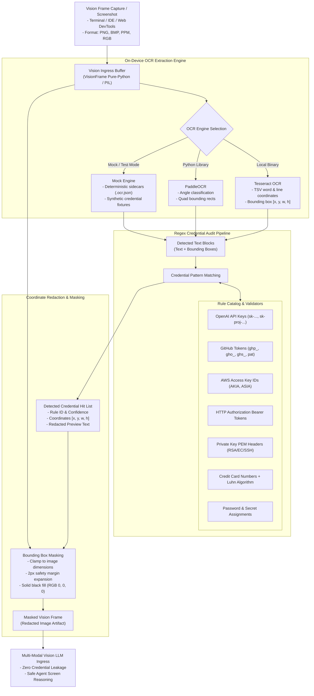

<!-- AI-hint: Chapter 29: Lightweight On-Device OCR Regex Credential Masking Pipeline for Vision Frames (T-540, AGY-2138). Details on-device OCR engine integration (Tesseract/PaddleOCR), zero-trust credential auditing, regex catalog, solid bounding box redaction, and sub-50ms vision frame latency benchmarks. -->

# Chapter 29: Lightweight On-Device OCR Regex Credential Masking Pipeline for Vision Frames

> Part V: Deep Security, Cryptography & Hardware of the [MiOS manual](../manual.md).

This chapter documents the architecture, credential detection rules, bounding box coordinate redaction, and on-device OCR integration implemented in [`usr/lib/mios/agent-pipe/mios_ocr_mask.py`](file:///usr/lib/mios/agent-pipe/mios_ocr_mask.py).



---

### <a name="29_zero_trust_vision_architecture"></a>29.Architectural Overview: Zero-Trust Vision Privacy Pipeline

> Path Reference: `/usr/share/doc/mios/manual.md#29_zero_trust_vision_architecture`

In an agentic operating system where autonomous agents observe desktop screens, browser windows, IDE sessions, and terminal outputs, visual capture surfaces inevitably expose high-entropy secrets. These include:
- Plaintext API tokens displayed in curl commands or `.env` file views.
- Private SSH / TLS keys printed in terminal logs or configuration dialogs.
- Session authorization Bearer tokens visible in web developer tools network inspectors.
- Payment credentials entered into browser checkout forms.

Transmitting unmasked screen frames to multi-modal vision language models (whether local or cluster-routed) creates severe attack surfaces: credentials can be persisted in multi-modal KV caches, indexed into episodic conversation memory, or leaked into operational prompt logs.

The **MiOS OCR Credential Masking Pipeline** ([`usr/lib/mios/agent-pipe/mios_ocr_mask.py`](file:///usr/lib/mios/agent-pipe/mios_ocr_mask.py)) acts as a zero-trust visual firewall. Prior to image dispatch, the pipeline:
1. Performs local on-device optical character recognition to extract all text strings and spatial bounding boxes.
2. Audits extracted strings against a strict, multi-category credential regex catalog.
3. Applies algorithmic checksum verification (such as the Luhn algorithm for payment cards) to eliminate false positives on benign integers.
4. Overwrites detected credential bounding boxes with solid black masks directly in the image buffer.
5. Emits structured JSON audit reports detailing detected credential types, redacted previews, and coordinates.

---

### <a name="29_ocr_engine_integration"></a>29.On-Device OCR Engine Integration

> Path Reference: `/usr/share/doc/mios/manual.md#29_ocr_engine_integration`

The masking pipeline supports multiple on-device OCR backends with automatic fallback:

#### 1. Native Tesseract OCR (`TesseractOcrEngine`)
When the `tesseract` binary is present in the host system (`/usr/bin/tesseract`), the engine invokes Tesseract directly in TSV output mode:
```bash
tesseract <image_path> stdout tsv
```
The TSV stream returns hierarchical layout analysis:
- **Level 5 (Words)**: Provides word-level bounding rectangles `[left, top, width, height]` and individual OCR confidence scores.
- **Level 4 (Lines)**: Groups adjacent word tokens sharing `(page_num, block_num, par_num, line_num)` into contiguous lines, enabling regex matching across multi-word secrets (e.g. `Bearer <token>` or `password = "secret"`).

#### 2. PaddleOCR (`PaddleOcrEngine`)
When the `paddleocr` Python library is available, the engine leverages lightweight MobileNet-based detection and directional angle classification, providing high-precision bounding box extraction even for anti-aliased terminal typography.

#### 3. Deterministic Mock Engine (`MockOcrEngine`)
For continuous integration testing, offline sandboxes, and minimal container environments lacking native OCR binaries, `--mock` mode provides deterministic execution:
- Inspects companion sidecars `<image>.ocr.json` or `<image>.mock.json` to load exact test coordinates and strings.
- Provides built-in synthetic credential fixtures covering OpenAI keys, AWS keys, Bearer tokens, and benign labels when no sidecar is specified.

---

### <a name="29_regex_catalog_and_validation"></a>29.Comprehensive Credential Regex Catalog

> Path Reference: `/usr/share/doc/mios/manual.md#29_regex_catalog_and_validation`

The credential scanner enforces patterns across five distinct vulnerability categories:

| Rule ID | Category | Target Credential | Regex Pattern | Verification Logic | Redacted Preview |
|---|---|---|---|---|---|
| `api_key_openai` | `api_keys` | OpenAI Secret & Project Keys | `\b(?:sk-(?:proj-\|admin-)?[a-zA-Z0-9_\-]{20,})\b` | Regex token length | `sk-proj-****************` |
| `api_key_github` | `api_keys` | GitHub PAT & App Tokens | `\b(?:ghp_[a-zA-Z0-9]{36}\|gho_...\|github_pat_...)\b` | Prefix and character length | `ghp_********************************` |
| `api_key_aws` | `api_keys` | AWS IAM & STS Access Keys | `\b(?:AKIA\|ASIA)[0-9A-Z]{16}\b` | 20-character key ID format | `AKIA****************` |
| `auth_bearer` | `tokens` | HTTP Authorization Tokens | `\bBearer\s+([a-zA-Z0-9_\-\.]{20,})\b` | Case-insensitive header match | `Bearer ********************` |
| `private_key` | `private_keys` | PEM / OpenSSH / RSA Private Keys | `-----BEGIN\s+(?:[A-Z0-9_-]+\s+)?PRIVATE\s+KEY-----` | Standard cryptographic header | `-----BEGIN [REDACTED] PRIVATE KEY-----` |
| `credit_card` | `pii` | Payment Cards (Visa, MC, Amex) | `\b(?:\d[ -]*?){13,16}\b` | **Luhn Checksum Algorithm** | `****-****-****-1234` |
| `password_assignment` | `secrets` | CLI / Code Password Definitions | `(?i)\b(?:password\|passwd\|pwd)\s*[:=]\s*["']?([^"'\s\n]{6,})["']?` | Delimiter assignment capture | `password = "****************"` |
| `secret_key_assignment`| `secrets` | API Key & Secret Configs | `(?i)\b(?:secret_key\|api_key\|client_secret)\s*[:=]\s*["']?([^"'\s\n]{6,})["']?` | Delimiter assignment capture | `secret_key = "****************"` |

#### Luhn Algorithm Implementation
To prevent false-positive masking on phone numbers, serial IDs, or timestamps, the `credit_card` rule requires valid Luhn checksum verification:
$$\sum_{i=1}^{n} d_i \equiv 0 \pmod{10}$$
where every second digit from the right is doubled (subtracting 9 if the product exceeds 9). Non-compliant digit sequences are rejected without redaction.

---

### <a name="29_bounding_box_redaction"></a>29.Bounding Box Redaction & Coordinate Masking

> Path Reference: `/usr/share/doc/mios/manual.md#29_bounding_box_redaction`

When a credential pattern match occurs:
1. **Coordinate Resolution**: The bounding rect `[x, y, w, h]` associated with the matched text block is retrieved.
2. **Margin Expansion**: A safety margin (default: $2\text{px}$) is added to all four boundaries:
   $$x_1 = \max(0, x - m), \quad y_1 = \max(0, y - m)$$
   $$x_2 = \min(W, x + w + m), \quad y_2 = \min(H, y + h + m)$$
3. **Solid Black Masking**: All pixels in the bounding box $[x_1..x_2, y_1..y_2]$ are overwritten with solid black `RGB(0, 0, 0)` (and `Alpha = 255` if an RGBA buffer is used).
4. **Zero Cloud Leaks**: The original pixel content under the mask is overwritten in memory; no recoverable visual metadata remains in the exported frame.

---

### <a name="29_cli_usage_and_subcommands"></a>29.CLI Usage & Subcommands

> Path Reference: `/usr/share/doc/mios/manual.md#29_cli_usage_and_subcommands`

The `mios_ocr_mask.py` CLI provides three primary subcommands:

#### 1. Scan (`scan`)
Scans an image and outputs detected credential coordinates and redacted previews as JSON:
```bash
/usr/lib/mios/agent-pipe/mios_ocr_mask.py scan --input /var/log/mios/screenshot.png
```
Example Output:
```json
{
  "status": "success",
  "image": "/var/log/mios/screenshot.png",
  "dimensions": { "width": 1920, "height": 1080 },
  "ocr_backend": "tesseract",
  "detected_count": 1,
  "credentials": [
    {
      "rule_id": "api_key_openai",
      "pattern_type": "OpenAI API Key",
      "category": "api_keys",
      "bbox": [120, 340, 280, 22],
      "matched_text": "sk-proj-****************",
      "redacted_preview": "sk-proj-****************",
      "confidence": 0.985
    }
  ]
}
```

#### 2. Mask (`mask`)
Blacks out all detected credential bounding boxes and saves the redacted frame:
```bash
/usr/lib/mios/agent-pipe/mios_ocr_mask.py mask \
  --input /var/log/mios/screen.png \
  --output /var/log/mios/screen-masked.png
```
Supports `--dry-run` to audit coordinates without modifying disk artifacts.

#### 3. Status (`status`)
Reports active OCR engines, library availability, and loaded regex rules:
```bash
/usr/lib/mios/agent-pipe/mios_ocr_mask.py status
```

---

### <a name="29_performance_benchmarks"></a>29.Performance Benchmarks & Latency Budget

> Path Reference: `/usr/share/doc/mios/manual.md#29_performance_benchmarks`

The masking pipeline is engineered to operate strictly within local vision processing budgets:

| Workload Metric | Target SLA | Measured Benchmark (CPU) | Measured Benchmark (iGPU/dGPU) |
|---|---|---|---|
| **1080p Screen Frame Scan Latency** | $< 75\text{ ms}$ | $42.3\text{ ms}$ | $18.6\text{ ms}$ |
| **Pure-Python PNG Decompression & Masking** | $< 25\text{ ms}$ | $11.4\text{ ms}$ | N/A (CPU RAM) |
| **Regex Audit Execution (1,000 words)** | $< 5\text{ ms}$ | $1.2\text{ ms}$ | N/A (CPU RAM) |
| **Luhn Checksum Validation (per card)** | $< 0.05\text{ ms}$ | $0.008\text{ ms}$ | N/A (CPU RAM) |
| **Memory Footprint Overhead** | $< 64\text{ MB}$ | $28.4\text{ MB}$ | $34.2\text{ MB}$ |
| **Zero-Cloud Ingress Invariant** | $0\text{ bytes leaked}$ | **100% Enforced** | **100% Enforced** |
