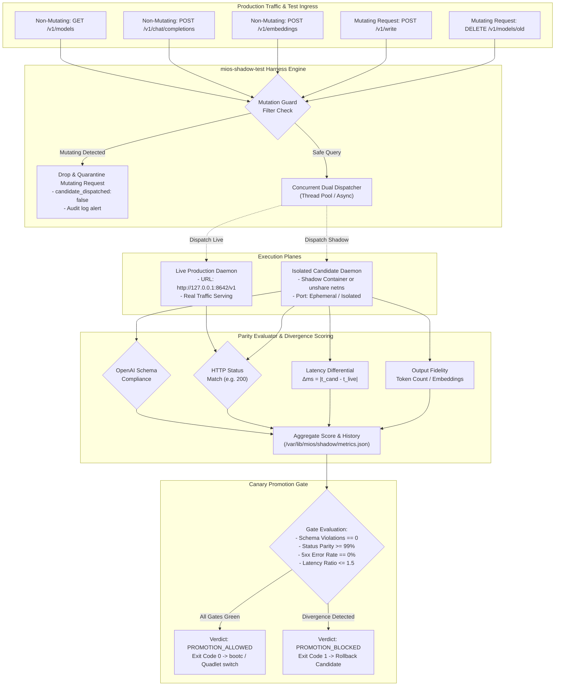
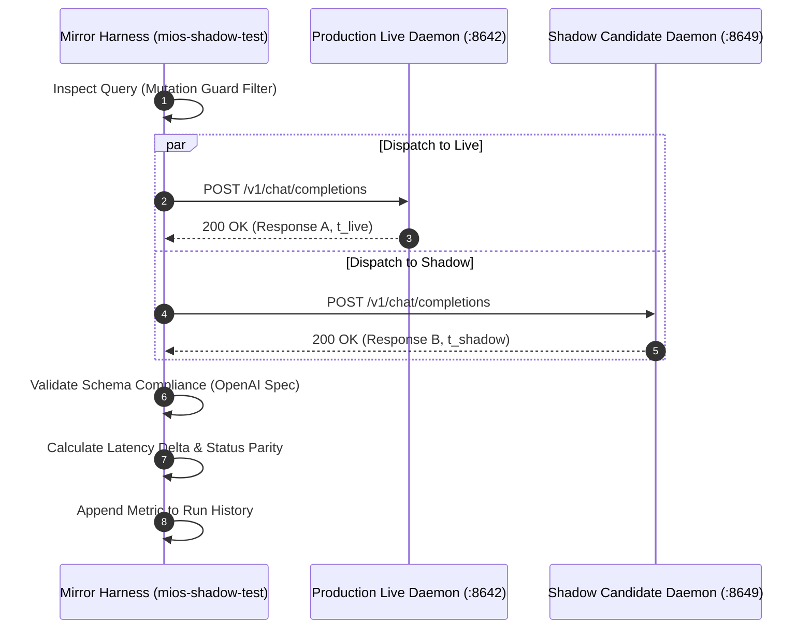

<!-- AI-hint: Chapter 30: Shadow Dual-Process Candidate Daemon Validator and Query Mirroring Harness (T-541, AGY-2139). Covers shadow execution mechanics, query mirroring architecture, mutation guarding, divergence scoring, and safe promotion gates for OpenAI-compatible inference daemons. -->

# Chapter 30: Shadow Dual-Process Candidate Daemon Validator and Query Mirroring Harness

> Part IV: Detailed Inference & Execution Layers of the [MiOS manual](../manual.md).

This chapter documents the architecture, sandboxing mechanisms, query mirroring protocols, divergence scoring algorithms, and automated canary promotion gating implemented in [`usr/libexec/mios/mios-shadow-test`](file:///usr/libexec/mios/mios-shadow-test).



---

### <a name="30_shadow_mechanics"></a>30.Shadow Mechanics: Isolated Execution and Network Sandboxing

> Path Reference: `/usr/share/doc/mios/manual.md#30_shadow_mechanics`

#### Overview

In a self-developing, immutable operating system like MiOS, local inference daemons (`mios-llm-light`, `llama-swap`, `mios-llm-heavy`, and specialized coder engines) are critical system infrastructure. Deploying untested daemon binaries or updated model weights directly into production risks crashing in-flight agent sessions, corrupting prompt context, or introducing silent schema regressions.

The **Shadow Dual-Process Validation Engine** isolates candidate daemons prior to production deployment:
- **Rootless Container Isolation**: Candidate images execute inside unprivileged Podman containers (`--network bridge` or custom isolated CNI/netavark networks) with restricted filesystem volumes.
- **Network Namespace Sandboxing (`unshare -n`)**: When evaluating standalone compiled binaries (such as native llama.cpp builds), the validator creates an isolated network namespace or binds to ephemeral high-range loopback ports, ensuring that candidate instances cannot hijack production sockets or interfere with live systemd service units.
- **Resource Boundary Constraints**: Candidate processes are pinned within ephemeral systemd cgroup slices with strict memory limits (`MemoryMax=4G`) and CPU quotas, preventing candidate regressions (e.g. memory leaks or infinite prompt loops) from starving the host OS.
- **Readiness Probing**: Before query mirroring begins, the validation engine polls the candidate's `/health` or `/v1/models` endpoint with exponential backoff until the candidate enters the ready state.

---

### <a name="30_query_mirroring"></a>30.Query Mirroring Architecture: Concurrency and Dual Dispatch

> Path Reference: `/usr/share/doc/mios/manual.md#30_query_mirroring`

#### Dual Concurrency Model

The query mirroring harness intercepts or replays traffic to evaluate functional and performance equivalence:

1. **Query Ingestion**: Requests can be supplied via historical JSON/JSONL trace files, synthetic benchmark suites, or mirrored live traffic streams.
2. **Concurrent Dual Dispatch**: For each request, the dispatcher initiates concurrent asynchronous network requests to both the production live daemon (`--live <url>`) and the candidate shadow daemon (`--candidate <url>`).
3. **OpenAI Standard API Endpoints**:
   - `/v1/models`: Model enumeration and metadata appraisal.
   - `/v1/chat/completions`: Structured chat completions, role tracking, and token stream parsing.
   - `/v1/embeddings`: Vector generation, embedding dimensions, and floating-point array parity.



---

### <a name="30_mutation_guard"></a>30.Mutation Guard: State-Corruption Defense and Request Filtering

> Path Reference: `/usr/share/doc/mios/manual.md#30_mutation_guard`

#### Strict Mutation Guard Invariant

Under no circumstances may a state-mutating request be shadowed or mirrored to a candidate instance. Mirroring state modifications could corrupt persistent agent vector memory in PostgreSQL (`pgvector`), duplicate transactional state, trigger unauthorized file writes, or leave the candidate in a mutated state that invalidates subsequent test queries.

The Mutation Guard enforces the following defense-in-depth rules:

| Request Attribute | Action | Invariant Rationale |
|:---|:---|:---|
| **HTTP Method: `DELETE`** | **BLOCKED** | Prevents deletion of models, persistent sessions, or caches. |
| **HTTP Method: `PUT` / `PATCH`** | **BLOCKED** | Prevents configuration updates or resource modifications. |
| **Path containing `write`** | **BLOCKED** | Protects persistent vector memory and disk journals. |
| **Path containing `config`, `admin`, `reload`, `shutdown`** | **BLOCKED** | Prevents administrative disruption or daemon restarts. |
| **Safe POST Endpoints** (`/v1/chat/completions`, `/v1/embeddings`) | **ALLOWED** | Read-only inference execution; zero state side-effects. |
| **Safe GET Endpoints** (`/v1/models`, `/health`) | **ALLOWED** | Read-only discovery and liveness checks. |

When a mutating request is detected, `mios-shadow-test` immediately rejects mirroring for that request, records a `MUTATION_BLOCKED` audit event, and ensures zero network packets reach the candidate.

---

### <a name="30_divergence_scoring"></a>30.Divergence Scoring: Schema Compliance, Status Parity, and Latency Differential

> Path Reference: `/usr/share/doc/mios/manual.md#30_divergence_scoring`

#### Scoring Metrics

Every mirrored query pair is evaluated against four objective criteria:

1. **Status Code Parity ($S$)**:
   $$S = \begin{cases} 1 & \text{if } \text{status}_{\text{candidate}} == \text{status}_{\text{live}} \\ 0 & \text{otherwise} \end{cases}$$
2. **Schema Compliance ($C$)**:
   Ensures the candidate's JSON response conforms strictly to the OpenAI API specification:
   - `/v1/models`: Root `object: "list"`, `data` array of model objects with `id` and `object: "model"`.
   - `/v1/chat/completions`: Root fields `id`, `choices` (array with `message.role`, `message.content`, `finish_reason`), `model`, and `usage`.
   - `/v1/embeddings`: Root `object: "list"`, `data` array with `object: "embedding"`, numeric `embedding` vector array, `model`, and `usage`.
3. **Latency Differential ($\Delta t$)**:
   $$\Delta t = |t_{\text{candidate}} - t_{\text{live}}|$$
   $$\text{Relative Latency Ratio} = \frac{t_{\text{candidate}}}{\max(t_{\text{live}}, 0.001)}$$
4. **Aggregate Parity Score ($P$)**:
   $$P = \frac{\sum (S_i + C_i)}{2 \times N_{\text{mirrored}}}$$
   A score of $1.00$ ($100\%$) represents perfect schema and status alignment across all queries.

---

### <a name="30_safe_promotion_gates"></a>30.Safe Promotion Gates: Automated Canary Promotion Workflow

> Path Reference: `/usr/share/doc/mios/manual.md#30_safe_promotion_gates`

#### Promotion Criteria & Verification Gates

The `validate` subcommand executes an end-to-end shadow loop that enforces strict promotion gates:

```
[SHADOW GATE CHECKLIST]
[x] 1. Candidate daemon initialization and health probe <= 30s
[x] 2. Zero HTTP 5xx server errors across entire query suite
[x] 3. Status Code Parity >= 99.0%
[x] 4. OpenAI Schema Compliance Rate == 100.0%
[x] 5. Mutating Request Rejection Rate == 100.0%
[x] 6. Latency Degradation Ratio <= 1.50x
```

- **Pass Condition**: `mios-shadow-test` outputs `VERDICT: PROMOTION_ALLOWED` and exits with code `0`. CI/CD pipelines (e.g. `bootc switch`, Quadlet updates) are cleared to proceed with deployment.
- **Fail Condition**: Any divergence, crash, or timeout outputs `VERDICT: PROMOTION_BLOCKED` and exits with code `1`. The candidate process or container is destroyed, and the incident is recorded in `/var/lib/mios/shadow/metrics.json`.

---

### <a name="30_cli_reference"></a>30.Operational CLI Reference

> Path Reference: `/usr/share/doc/mios/manual.md#30_cli_reference`

#### Command Usage

```bash
# 1. Run live query mirroring comparison between production and candidate daemons
mios-shadow-test mirror --live http://127.0.0.1:8642/v1 --candidate http://127.0.0.1:8649/v1 --requests /tmp/trace.jsonl

# 2. Automated end-to-end shadow container validation loop
mios-shadow-test validate --candidate localhost/mios-llm-candidate:latest

# 3. Automated validation of candidate binary with mock harness
mios-shadow-test validate --candidate /usr/bin/llama-server --mock

# 4. View historical parity statistics, error rates, and divergence metrics
mios-shadow-test status
```

#### Diagnostic Flags
- `--mock`: Runs full verification using mock fixtures without requiring live hardware or running network daemons.
- `--dry-run`: Validates request traces and displays execution plan without network dispatch.
- `-v, --verbose`: Enables comprehensive debug logging, including request payloads, response schemas, and timing.
- `-h, --help`: Displays help messages and command descriptions.
