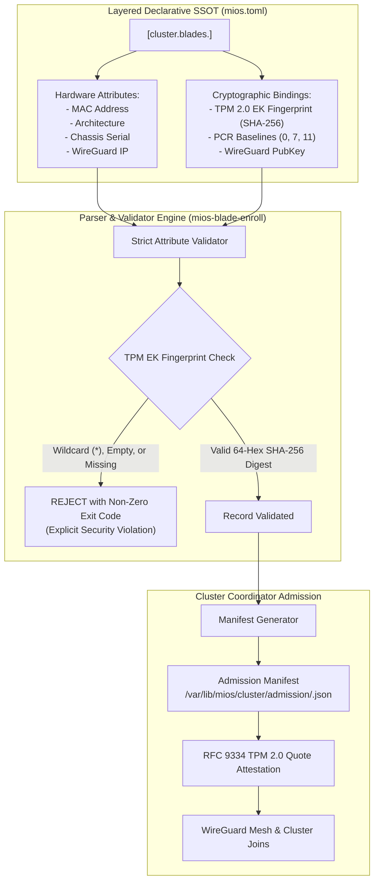
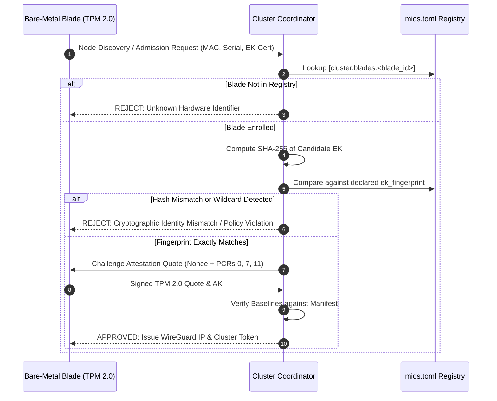

<!-- AI-hint: Chapter 74: Declarative SSOT Blade Pre-Enrollment Registry and TPM EK Fingerprint Parser (T-529, AGY-2127). Details TPM 2.0 Endorsement Key validation, SSOT schema for [cluster.blades], zero-touch admission workflow, and cryptographic rejection of wildcard/unverified keys. -->

# Chapter 74: Declarative SSOT Blade Pre-Enrollment Registry and TPM EK Fingerprint Parser

> Part VIII: Substrate Daemons, Resilient Clustering & Hardware Acceleration of the [MiOS manual](../manual.md).

This chapter documents the architecture, cryptographic verification principles, Single Source of Truth (SSOT) schema, and operational tooling for the **Declarative SSOT Blade Pre-Enrollment Registry and TPM EK Fingerprint Parser** (T-529, AGY-2127).



---

### <a name="74_tpm_ek_cryptography"></a>74.TPM EK Cryptography: TPM 2.0 Endorsement Key Foundations

> Path Reference: `/usr/share/doc/mios/manual.md#74_tpm_ek_cryptography`

#### Overview

In a MiOS bare-metal blade cluster, every physical node contains a discrete or firmware TPM 2.0 cryptoprocessor. The foundation of hardware identity and remote attestation is the **Endorsement Key (EK)**:
- **Silicon-Fused Identity**: The EK is an asymmetric key pair (typically RSA-2048 or ECC NIST P-256) provisioned into non-volatile TPM storage by the silicon manufacturer during fabrication.
- **Endorsement Certificate (EK-Cert)**: Manufacturers sign an X.509 certificate binding the EK public key to the TPM's model and manufacturer certificate authority.
- **EK Fingerprint**: The SHA-256 hash digest (256-bit, rendered as 64 lowercase hexadecimal characters) of the TPM 2.0 EK public key structure or EK-Cert DER payload.



#### Cryptographic Rejection of Wildcard and Unverified Keys

> [!CAUTION]
> **Strict Security Invariant (Zero-Trust Hardware Admission)**: Under no circumstances will MiOS permit blade admission when the TPM EK certificate or fingerprint is missing, empty, or configured with wildcards (`*`). Any blade declaration containing wildcard or unverifiable credentials must be rejected immediately during parsing and enrollment evaluation.

Allowing wildcard credentials in hardware pre-enrollment exposes the cluster to:
1. **Rogue Hardware Injection**: An unauthenticated device on the physical network claiming a valid MAC address could join the cluster and access sensitive distributed storage (e.g. CephFS).
2. **Attestation Bypass**: Without binding to a unique physical TPM EK, remote attestation quotes cannot be cryptographically proven to originate from genuine hardware.

---

### <a name="74_ssot_schema"></a>74.SSOT Schema: Declarative Blade Specification in `mios.toml`

> Path Reference: `/usr/share/doc/mios/manual.md#74_ssot_schema`

#### TOML Configuration Structure

Blade declarations reside under the `[cluster.blades]` section of `mios.toml`. For backward compatibility, fallback sections `[blades]` and `[blade]` are supported for entries with matching hardware schemas.

Each blade declaration defines mandatory physical attributes and cryptographic baselines:

```toml
# AI-hint: Declarative pre-enrollment registry for bare-metal cluster blades (T-529).
# AI-doc: usr/share/doc/mios/manual/ch74-blade-pre-enrollment.md

[cluster.blades.blade-compute-01]
architecture     = "x86_64"                          # Allowed: "x86_64", "aarch64"
mac              = "52:54:00:ab:cd:01"               # Standard XX:XX:XX:XX:XX:XX
serial           = "MIOS-SRV-2026-0001"              # Chassis serial number
wireguard_ip     = "10.42.0.11/24"                   # Assigned mesh/overlay IP
wireguard_pubkey = "3cE4Wl5k5yQeM/9p2h+o0+o5k/3j1w4h8y1m8x0n4u8="  # Base64 32-byte key
ek_fingerprint   = "e3b0c44298fc1c149afbf4c8996fb92427ae41e4649b934ca495991b7852b855" # SHA-256
roles            = ["compute", "worker"]

[cluster.blades.blade-compute-01.pcr_baselines]
0  = "0000000000000000000000000000000000000000000000000000000000000000" # Core firmware
7  = "7777777777777777777777777777777777777777777777777777777777777777" # Secure Boot state
11 = "aaaaaaaaaaaaaaaaaaaaaaaaaaaaaaaaaaaaaaaaaaaaaaaaaaaaaaaaaaaaaaaa" # OS root / unified kernel
```

#### Field Specifications and Validation Constraints

| Field | Type | Mandatory | Validation Constraint | Description |
|---|---|---|---|---|
| `blade_id` (table key) | string | Yes | `^[A-Za-z0-9_-]+$` | Unique identifier for cluster member node |
| `architecture` | string | Yes | `"x86_64"` or `"aarch64"` | Host CPU architecture |
| `mac` | string | Yes | `^([0-9A-Fa-f]{2}[:-]){5}([0-9A-Fa-f]{2})$` | Primary interface MAC address |
| `serial` | string | Yes | Non-empty string, no `*` | Hardware chassis/motherboard serial number |
| `wireguard_ip` | string | Yes | Valid IPv4/IPv6 address or CIDR | Mesh networking IP assigned to blade |
| `wireguard_pubkey` | string | Optional | Base64-encoded 32-byte public key | Pre-shared WireGuard identity |
| `ek_fingerprint` | string | **Yes** | Exactly 64 hex characters (SHA-256) | TPM 2.0 Endorsement Key fingerprint (**NO WILDCARDS**) |
| `roles` | list | Optional | List of role strings | Node capability labels (e.g. `["worker"]`) |
| `pcr_baselines` | table | Optional | 64-hex SHA-256 hashes for PCR 0, 7, 11 | Golden measurement baselines for attestation |

---

### <a name="74_admission_workflow"></a>74.Admission Workflow: Zero-Touch Coordinator Policies

> Path Reference: `/usr/share/doc/mios/manual.md#74_admission_workflow`

#### Declarative Hardware Admission Manifests

When blades are validated by the cluster enrollment tooling, declarative JSON admission policies are emitted to `/var/lib/mios/cluster/admission/<blade_id>.json`:

```json
{
  "$schema": "https://mios.dev/schemas/blade-admission-v1.json",
  "schema_version": "1.0",
  "policy_type": "tpm2-rats-hardware-admission",
  "blade_id": "blade-compute-01",
  "status": "pre-enrolled",
  "admission_verdict": "APPROVED",
  "hardware": {
    "architecture": "x86_64",
    "mac_address": "52:54:00:ab:cd:01",
    "chassis_serial": "MIOS-SRV-2026-0001"
  },
  "networking": {
    "wireguard_ip": "10.42.0.11/24",
    "wireguard_pubkey": "3cE4Wl5k5yQeM/9p2h+o0+o5k/3j1w4h8y1m8x0n4u8="
  },
  "security": {
    "tpm_ek_fingerprint": "e3b0c44298fc1c149afbf4c8996fb92427ae41e4649b934ca495991b7852b855",
    "allowed_pcr_baselines": {
      "0": "0000000000000000000000000000000000000000000000000000000000000000",
      "7": "7777777777777777777777777777777777777777777777777777777777777777",
      "11": "aaaaaaaaaaaaaaaaaaaaaaaaaaaaaaaaaaaaaaaaaaaaaaaaaaaaaaaaaaaaaaaa"
    },
    "rat_profile": "rfc9334-tpm2-quote"
  },
  "authorized_roles": [
    "compute",
    "worker"
  ],
  "created_at": "2026-09-24T00:48:31.479446+00:00",
  "zero_touch_eligible": true
}
```

The cluster coordinator consumes these manifests during network bootstrap, enabling automatic admission upon successful TPM 2.0 quote attestation.

---

### <a name="74_cli_tooling"></a>74.CLI Tooling: `mios-blade-enroll` Operations

> Path Reference: `/usr/share/doc/mios/manual.md#74_cli_tooling`

The executable utility `/usr/libexec/mios/mios-blade-enroll` provides administrative and pipeline interfaces for registry validation, cryptographic verification, and manifest rendering.

#### Command Reference

```text
Usage: mios-blade-enroll [OPTIONS] SUBCOMMAND [ARGS...]

Declarative SSOT blade pre-enrollment registry and TPM EK fingerprint parser (T-529, AGY-2127).

Subcommands:
  parse                     Parse and validate declared blades from config
  verify-ek <id> <cert/fp>  Verify TPM EK certificate or fingerprint against declared registry
  manifest <id>             Generate hardware admission policy for a specific blade
  manifest-all              Generate admission policies for all declared blades
  status                    Display enrolled blades and validation state

Global Options:
  --config, -c <path>       Path to mios.toml or test configuration file
  --mock                    Enable synthetic mock blade fixtures for testing
  --dry-run                 Simulate actions without writing manifests or modifying disk
  -v, --verbose             Enable detailed diagnostic logging
  -h, --help                Show CLI syntax and help message
```

#### Common Invocations

1. **Verify Pre-Enrollment Registry Syntax**:
   ```bash
   /usr/libexec/mios/mios-blade-enroll parse --config /etc/mios/mios.toml
   ```
2. **Display Enrolled Blade Status**:
   ```bash
   /usr/libexec/mios/mios-blade-enroll status
   ```
3. **Verify Incoming Blade TPM EK Fingerprint**:
   ```bash
   /usr/libexec/mios/mios-blade-enroll verify-ek blade-compute-01 /tmp/blade-ek-cert.der
   ```
4. **Generate Admission Manifest for Coordinator**:
   ```bash
   /usr/libexec/mios/mios-blade-enroll manifest blade-compute-01 --output /var/lib/mios/cluster/admission/blade-compute-01.json
   ```
5. **Render All Admission Policies**:
   ```bash
   /usr/libexec/mios/mios-blade-enroll manifest-all --dir /var/lib/mios/cluster/admission
   ```

---

### <a name="74_troubleshooting"></a>74.Troubleshooting: Diagnostics and Failure Remediation

> Path Reference: `/usr/share/doc/mios/manual.md#74_troubleshooting`

| Failure Symptom | Cause | Resolution |
|---|---|---|
| `[ERROR] Validation failed: Blade '...': Wildcard ('*') TPM EK certificates or fingerprints are strictly forbidden` | Configuration contains `ek_fingerprint = "*"` | Obtain the actual SHA-256 fingerprint from the physical TPM (`tpm2_readpublic` or manufacturer certificate) and update `mios.toml`. |
| `[ERROR] Validation failed: Blade '...': Missing required TPM EK fingerprint/certificate` | `ek_fingerprint` field omitted from declaration | Ensure all blade entries define a valid 64-hex character `ek_fingerprint`. |
| `[ERROR] Validation failed: Invalid MAC address format '...'` | MAC address does not match standard 6-byte hexadecimal format | Correct MAC formatting (e.g. `52:54:00:ab:cd:01`). |
| `[FAIL] TPM EK fingerprint mismatch for blade '...'` | Node presented an EK fingerprint different from registered baseline | Verify hardware serial and confirm physical chassis identity before re-registering. |
