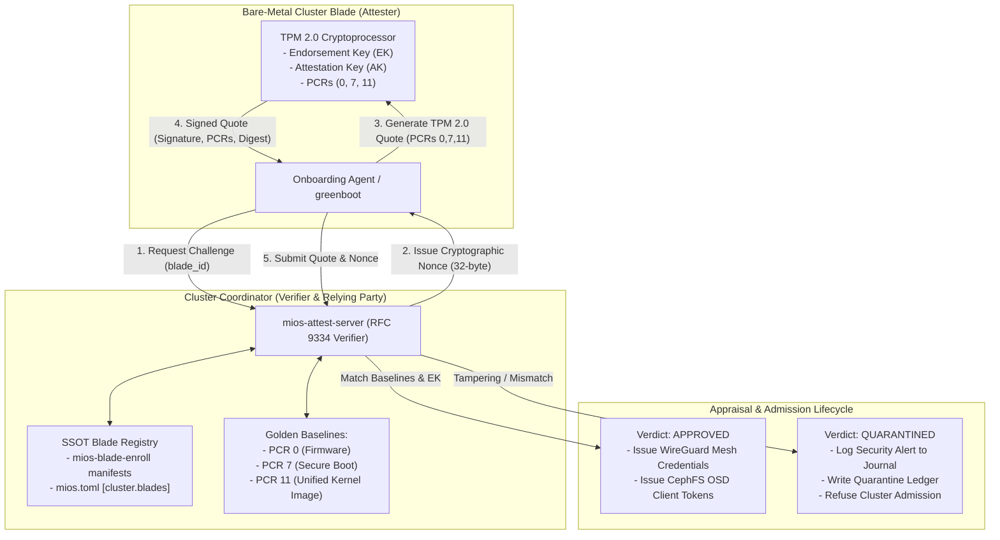
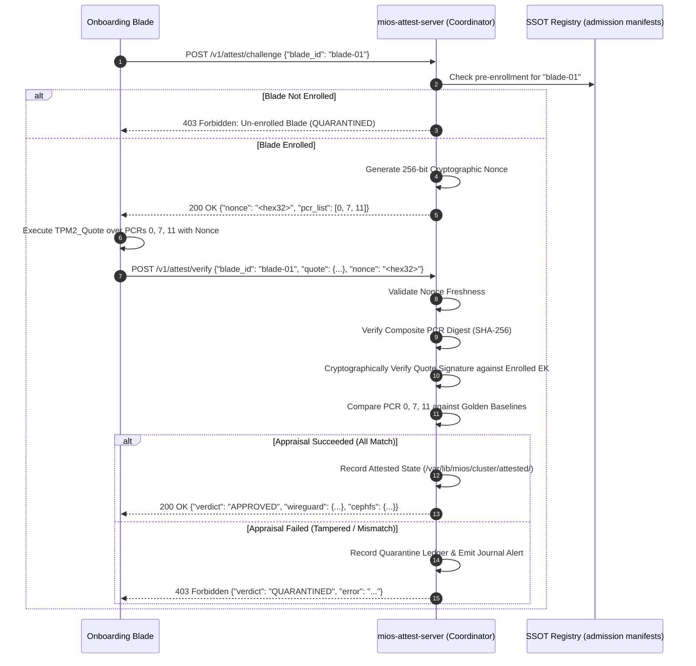

<!-- AI-hint: Chapter 76: Automated RFC 9334 RATS Remote TPM 2.0 Quote Verifier and Zero-Touch Cluster Onboarding (T-530, AGY-2128). Details cryptographic challenge-response nonces, composite PCR digest appraisal over PCRs (0, 7, 11), golden baselines, and WireGuard/CephFS credential issuance. -->

# Chapter 76: Automated RFC 9334 RATS Remote TPM 2.0 Quote Verifier and Zero-Touch Cluster Onboarding

> Part VIII: Substrate Daemons, Resilient Clustering & Hardware Acceleration of the [MiOS manual](../manual.md).

This chapter documents the architecture, cryptographic verification engine, lifecycle workflows, and operational tooling for the **Automated RFC 9334 RATS Remote TPM 2.0 Quote Verifier and Zero-Touch Cluster Onboarding Daemon** (T-530, AGY-2128).



---

### <a name="76_rats_architecture"></a>76.RATS Architecture: RFC 9334 Remote Attestation Framework

> Path Reference: `/usr/share/doc/mios/manual.md#76_rats_architecture`

#### Overview

MiOS implements the **IETF RFC 9334 Remote ATtestation ProcedureS (RATS)** architecture for zero-touch cluster expansion:
- **Attester (Connecting Blade)**: The bare-metal node possessing a hardware TPM 2.0 chip with an Endorsement Key (EK) and Attestation Key (AK).
- **Verifier (`mios-attest-server`)**: The cluster coordinator service that issues cryptographic nonces, evaluates evidence (TPM 2.0 Quotes), and checks measurements against reference values.
- **Relying Party**: The MiOS cluster control plane (WireGuard mesh network, CephFS storage plane, Kubernetes control plane) that relies on the attestation verdict for network and storage admission.
- **Endorsement / Reference Values**: Golden PCR baselines and pre-enrolled blade EK public key fingerprints maintained in the Single Source of Truth (`mios.toml` `[cluster.blades]` and `/var/lib/mios/cluster/admission/` manifests).

---

### <a name="76_attestation_lifecycle"></a>76.Attestation Lifecycle: Challenge-Response and Quote Appraisal

> Path Reference: `/usr/share/doc/mios/manual.md#76_attestation_lifecycle`

The attestation exchange follows strict security invariants to prevent replay attacks, identity spoofing, and compromised code execution:



#### Key Verification Invariants

1. **Replay Attack Defense**: Nonces are cryptographically random 256-bit values issued per attestation session. Quotes submitted with expired, missing, or mismatched nonces are instantly rejected with an alert.
2. **Composite Digest Integrity**: The verifier independently recalculates the composite SHA-256 digest across PCRs in ascending numerical order (`0, 7, 11`). Any tampering with individual PCR values is immediately detected.
3. **Silicon Identity Binding**: The quote signature is verified against the blade's pre-enrolled Endorsement Key fingerprint. Rogue blades or nodes with substitute TPMs cannot forge valid quote signatures.
4. **Golden Baseline Matching**:
   - **PCR 0 (Firmware/BIOS)**: Ensures UEFI firmware, microcode revisions, and boot block integrity have not been modified.
   - **PCR 7 (Secure Boot)**: Confirms Secure Boot policy, PK/KEK/db certificates, and validation enforcement are intact.
   - **PCR 11 (Unified Kernel Image / UKI)**: Measures the exact kernel binary, initramfs, command line, and composefs fs-verity root digest.

---

### <a name="76_credential_issuance"></a>76.Credential Issuance: Zero-Touch Cluster Onboarding

> Path Reference: `/usr/share/doc/mios/manual.md#76_credential_issuance`

Upon receiving an `APPROVED` appraisal verdict, `mios-attest-server` automatically issues cluster credentials to the onboarding blade:

#### 1. WireGuard Mesh Credentials
- **Mesh IP**: Assigned IP from cluster subnet (e.g. `10.42.0.101/24`).
- **Endpoint**: Coordinator wireguard endpoint (`10.42.0.1:51820`).
- **Preshared Key (PSK)**: Ephemeral 256-bit cryptographic PSK for post-quantum WireGuard security.
- **Server PubKey**: Public key of the coordinator WireGuard gateway.

#### 2. CephFS OSD Client Tokens
- **Client Identifier**: `client.blade-<blade_id>`
- **Keyring**: Cryptographic auth token permitting access to the Ceph storage pool.
- **Capabilities**: Scoped capabilities: `mon 'allow r' osd 'allow rw pool=mios-pool' mds 'allow rw'`.
- **FSID & Mon Hosts**: Cluster identifier and initial monitor endpoint list.

---

### <a name="76_quarantine_handling"></a>76.Quarantine Handling: Security Violations and Admission Barring

> Path Reference: `/usr/share/doc/mios/manual.md#76_quarantine_handling`

When an attestation appraisal fails for any reason (tampered quote, altered PCR digest, mismatched nonce, or un-enrolled blade identity):
1. **Admission Refusal**: The daemon returns HTTP status `403 Forbidden` with verdict `QUARANTINED`.
2. **Systemd Journal Alert**: Emits high-priority security violation alert:
   `[SECURITY VIOLATION] Blade '<blade_id>' quarantined: <reason> (Admission REFUSED)`
3. **Quarantine Ledger**: Records incident details to `/var/lib/mios/cluster/quarantine/<blade_id>.json`:
   ```json
   {
     "blade_id": "blade-mock-01",
     "verdict": "QUARANTINED",
     "reason": "PCR 11 (Unified Kernel Image) baseline mismatch: actual='...', baseline='...'",
     "quarantined_at": "2026-09-24T01:45:00Z",
     "action": "CLUSTER_ADMISSION_REFUSED"
   }
   ```
4. **Isolation**: Quarantined blades are forbidden from joining the WireGuard mesh or receiving storage credentials until explicitly investigated and re-enrolled.

---

### <a name="76_daemon_reference"></a>76.Daemon Reference: mios-attest-server CLI & Systemd Service

> Path Reference: `/usr/share/doc/mios/manual.md#76_daemon_reference`

#### Command-Line Syntax

```bash
# Run the attestation verifier daemon
mios-attest-server serve [--host 0.0.0.0] [--port 8443] [--config /etc/mios/mios.toml]

# One-shot CLI appraisal of a quote file against expected nonce
mios-attest-server verify-quote <blade_id> <quote_file> <nonce> [--config <path>]

# Display enrolled, attested, and quarantined nodes
mios-attest-server status [--mock]

# Generate synthetic quote fixture for testing
mios-attest-server generate-quote <blade_id> <nonce> [--output <file>] [--tamper <tamper_type>]
```

#### Systemd Unit: `usr/lib/systemd/system/mios-attest.service`

```ini
[Unit]
Description=MiOS RFC 9334 RATS Remote TPM 2.0 Quote Verifier and Zero-Touch Cluster Onboarding Daemon
Documentation=file:///usr/share/doc/mios/manual/ch76-remote-attestation.md
After=network.target

[Service]
Type=simple
ExecStart=/usr/libexec/mios/mios-attest-server serve
Restart=always
RestartSec=5s
StandardOutput=journal
StandardError=journal

[Install]
WantedBy=multi-user.target
```

#### Diagnostic Commands

```bash
# Check service status
systemctl status mios-attest.service

# View attestation logs and security alerts
journalctl -u mios-attest.service -f

# Verify cluster node status
mios-attest-server status
```
