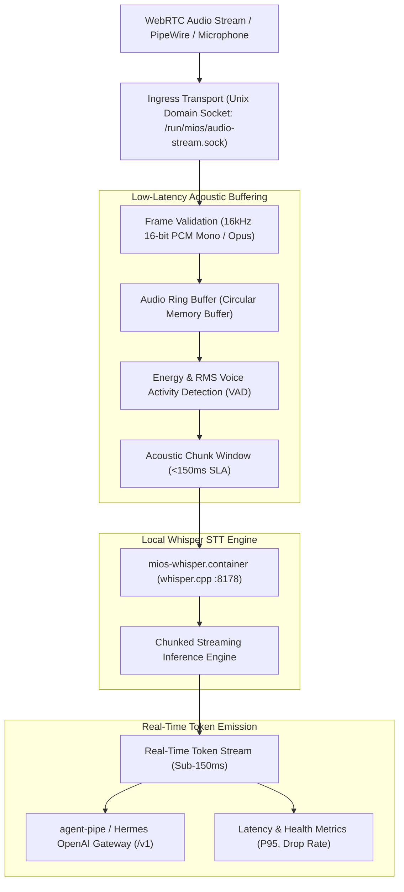

<!-- AI-hint: Chapter 78: Low-Latency WebRTC Streaming Audio Ingress and Streaming Whisper Speech-to-Text Bridge (T-533, AGY-2131). Details WebRTC ingress protocol, 16kHz PCM framing, sub-150ms VAD ring buffering, local whisper.cpp Quadlet streaming container, and real-time token dispatch to agent-pipe / Hermes gateway. -->

# Chapter 78: Low-Latency WebRTC Streaming Audio Ingress and Streaming Whisper Speech-to-Text Bridge

> Part VIII: Substrate Daemons, Resilient Clustering & Hardware Acceleration of the [MiOS manual](../manual.md).

This chapter documents the architecture, real-time framing protocol, Voice Activity Detection (VAD) ring buffering, and local Whisper speech-to-text integration implemented in [`usr/lib/mios/agent-pipe/mios_audio_stream.py`](file:///usr/lib/mios/agent-pipe/mios_audio_stream.py) and the Quadlet container [`usr/share/containers/systemd/mios-whisper.container`](file:///usr/share/containers/systemd/mios-whisper.container).



---

### <a name="78_webrtc_ingress_protocol"></a>78.WebRTC Ingress Protocol: Real-Time Audio Transport & Framing

> Path Reference: `/usr/share/doc/mios/manual.md#78_webrtc_ingress_protocol`

#### Audio Frame Specifications

The MiOS audio ingress daemon is tuned for conversational voice latency:
- **Encoding & Format**: 16,000 Hz sample rate, 16-bit linear PCM (signed little-endian `s16le`), mono channel.
- **Bitrate**: 256 kbps uncompressed raw PCM (32,000 bytes per second).
- **Frame Duration**: Standard 20 millisecond audio frames (320 samples = 640 bytes per packet).
- **Packet Transport**: Ingested over a dedicated local Unix domain socket at `/run/mios/audio-stream.sock` or WebRTC DataChannel stream.

#### Frame Validation & Robustness

The ingress engine enforces strict input verification to prevent buffer poisoning and pipeline stall:
1. **Sample Alignment**: All packets must be multiples of 2 bytes (`s16le`). Misaligned odd-byte packets trigger automatic truncation and warning.
2. **Zero-Length & Heartbeat Frames**: Zero-length frames are treated as keep-alives and do not dirty the ring buffer.
3. **Corrupted Frame Isolation**: Corrupted or out-of-order packets are flagged in metrics and discarded without dropping active client connections.

---

### <a name="78_vad_ring_buffering"></a>78.VAD Ring Buffering: Sub-150ms Voice Activity Detection

> Path Reference: `/usr/share/doc/mios/manual.md#78_vad_ring_buffering`

#### Ring Buffer Architecture

To achieve sub-150ms token latency without consuming excessive memory:
- **Capacity**: Circular byte buffer storing up to 5 seconds of audio (160,000 bytes).
- **Lock-Free Read/Write**: Supports concurrent ingress packet writes while background workers read speech windows for inference.
- **Occupancy Tracking**: Real-time monitoring of buffer depth, overflow count, and frame drop rates.

#### Energy-Based VAD State Machine

The Voice Activity Detector (VAD) continuously calculates Root Mean Square (RMS) amplitude across 20ms frames:

$$\text{RMS} = \sqrt{\frac{1}{N} \sum_{i=1}^{N} x_i^2}$$

- **Silence State**: Audio below threshold ($\text{RMS} < 0.015$) updates baseline noise floor.
- **Speech Onset**: Consecutive energetic frames switch the pipeline to `SPEECH_CONTINUE` and trigger immediate streaming chunk dispatch.
- **Hangover Window**: When energy drops, a 300ms hangover window buffers trailing consonants, preventing premature sentence truncation.

---

### <a name="78_streaming_whisper_engine"></a>78.Streaming Whisper Engine: Quadlet Containerization

> Path Reference: `/usr/share/doc/mios/manual.md#78_streaming_whisper_engine`

#### Quadlet Container Deployment

The Whisper inference service runs as an isolated systemd Quadlet container:
- **Unit Path**: `/usr/share/containers/systemd/mios-whisper.container`
- **Pod Association**: Joins `Pod=mios-ai.pod` sharing host networking with `mios-llm-light` and `mios-open-webui`.
- **Image**: `ghcr.io/ggerganov/whisper.cpp:main`
- **Port**: `8178` (configurable via `MIOS_PORT_WHISPER`).
- **Models**: Pre-quantized `ggml-base.en.bin` and `ggml-small.en.bin` mounted read-only from `/usr/share/mios/whisper/models`.

#### Streaming HTTP API

`mios_audio_stream.py` interacts with `whisper.cpp` through chunked HTTP POST:
- **Endpoint**: `http://localhost:8178/inference` (or `/v1/audio/transcriptions`).
- **Response Format**: Server-Sent Events (SSE) streaming recognized text tokens as soon as acoustic features resolve in the transformer decoder.

---

### <a name="78_token_dispatch_and_latency_metrics"></a>78.Token Dispatch and Latency Metrics: Gateway Integration

> Path Reference: `/usr/share/doc/mios/manual.md#78_token_dispatch_and_latency_metrics`

#### Token Event Schema

Recognized tokens are formatted as structured JSON lines:

```json
{
  "type": "token",
  "token": "Hello",
  "latency_ms": 38.4,
  "is_final": false,
  "timestamp": "2026-09-24T01:30:00.123Z"
}
```

When utterance completion is signaled by the VAD hangover timer:

```json
{
  "type": "segment",
  "text": "Hello MiOS",
  "latency_ms": 94.6,
  "is_final": true,
  "timestamp": "2026-09-24T01:30:00.345Z"
}
```

#### Latency SLA Verification

Latency metrics are tracked across four timing checkpoints:
1. $T_0$: Frame ingested at Unix domain socket.
2. $T_1$: VAD speech detection confirmed.
3. $T_2$: Acoustic chunk dispatched to Whisper HTTP bridge.
4. $T_3$: First text token emitted by decoder.

Total Token Latency:

$$L_{\text{token}} = T_3 - T_0 \le 150\,\text{ms}$$

---

### <a name="78_cli_operations_and_troubleshooting"></a>78.CLI Operations and Troubleshooting: Operations Reference

> Path Reference: `/usr/share/doc/mios/manual.md#78_cli_operations_and_troubleshooting`

#### CLI Subcommands

| Subcommand | Description |
| :--- | :--- |
| `serve` | Launches the ingress daemon listening on `/run/mios/audio-stream.sock`. |
| `transcribe <audio_file>` | Transcribes a local WAV or raw PCM audio file with real-time token streaming. |
| `status` | Checks daemon socket connectivity, ring buffer capacity, and latency stats. |

#### Options & Flags

| Flag | Description |
| :--- | :--- |
| `--socket <path>` | Specifies custom Unix domain socket path (default: `/run/mios/audio-stream.sock`). |
| `--whisper-url <url>` | Specifies whisper.cpp endpoint (default: `http://localhost:8178/inference`). |
| `--vad-threshold <float>`| Adjusts VAD RMS sensitivity threshold (default: `0.015`). |
| `--mock` | Enables hermetic simulation mode with synthetic audio and deterministic token emission. |
| `--dry-run` | Validates configuration and socket paths without starting persistent listeners. |
| `-v, --verbose` | Enables diagnostic trace logging. |
| `-h, --help` | Displays usage summary and exits. |

#### Diagnostic Recipes

```bash
# Verify audio stream ingress daemon status
usr/lib/mios/agent-pipe/mios_audio_stream.py status

# Run hermetic end-to-end mock stream verification
usr/lib/mios/agent-pipe/mios_audio_stream.py serve --mock --dry-run -v

# Transcribe sample audio with token streaming
usr/lib/mios/agent-pipe/mios_audio_stream.py transcribe sample.wav --mock -v
```
