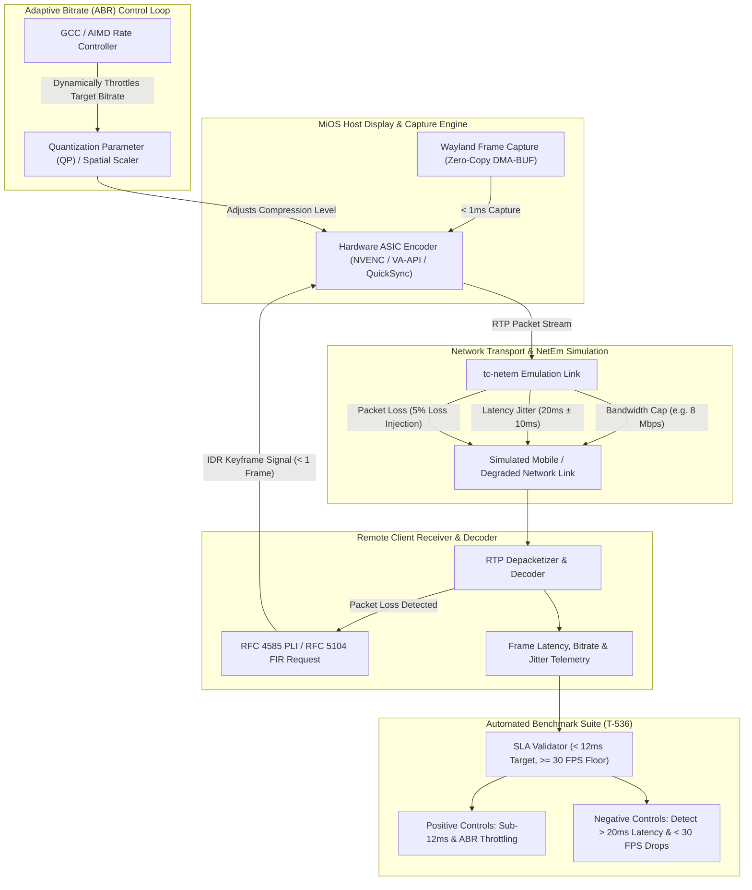

<!-- AI-hint: Chapter 81: Adaptive Bitrate and Low-Latency Frame Encoding Streaming Benchmark Suite (T-536, AGY-2134). Details remote desktop video streaming benchmarks, sub-12ms frame encoding SLA for 60 FPS, adaptive bitrate (ABR) control loops, tc-netem network simulation, packet loss IDR recovery, and two-sided verification controls. -->

# Chapter 81: Adaptive Bitrate and Low-Latency Frame Encoding Streaming Benchmark Suite

> Part VIII: Substrate Daemons, Resilient Clustering & Hardware Acceleration of the [MiOS manual](../manual.md).

This chapter documents the benchmark methodology, SLA latency thresholds, Adaptive Bitrate (ABR) control loops, and network emulation parameters implemented in the **Adaptive Bitrate and Low-Latency Frame Encoding Streaming Benchmark Suite** (T-536, AGY-2134), located at [`tests/test-video-encode-latency.sh`](file:///workspaces/MiOS/tests/test-video-encode-latency.sh).



---

### <a name="81_streaming_latency_budget"></a>81.Streaming Latency Budget & 60 FPS Architecture

> Path Reference: `/usr/share/doc/mios/manual.md#81_streaming_latency_budget`

#### Real-Time Display Streaming Budget

In interactive remote desktop and virtual workstation environments, maintaining a fluid 60 frames-per-second (FPS) presentation requires an end-to-end frame delivery interval of **16.67 milliseconds** (1000ms / 60 frames). When factoring in network transit and display presentation queue times, the server-side frame generation pipeline is constrained to strict timing budgets:

| Pipeline Stage | Implementation Mechanism | Target Latency Budget | Maximum Permissible SLA |
| :--- | :--- | :--- | :--- |
| **Frame Capture** | Zero-copy Wayland DMA-BUF surface export | < 1.0 ms | 2.5 ms |
| **Frame Encoding** | Hardware ASIC (NVENC, Intel QuickSync, AMD VA-API) | **< 12.0 ms** | **15.0 ms** |
| **Packetization** | RTP / WebRTC SRTP frame fragmentation | < 1.0 ms | 2.0 ms |
| **Network Transit** | LAN / WireGuard HCI Mesh backhaul link | 2.0 – 5.0 ms | 10.0 ms |
| **Client Decode** | Client hardware accelerated ASIC decoder | < 4.0 ms | 8.0 ms |
| **Total End-to-End**| Glass-to-glass remote desktop delivery | **< 20.0 ms** | **35.0 ms** |

Under MiOS Architectural Invariant 5 (Blade Bare-Metal Boundary) and Invariant 3 (VirtIO Venus vs. VFIO CUDA), hardware-accelerated video capture engages dedicated GPU ASICs directly via zero-copy DMA-BUF memory buffers. This bypasses system CPU memory copies and maintains the frame encoding overhead under the **12ms SLA**.

---

### <a name="81_latency_thresholds_and_slas"></a>81.Latency Thresholds and SLA Guarantees

> Path Reference: `/usr/share/doc/mios/manual.md#81_latency_thresholds_and_slas`

The benchmark suite tests streaming pipelines against two rigid operational boundaries:

1. **Nominal Target Encoding Latency (< 12ms)**:
   Under unconstrained network bandwidth (e.g., 50–100 Mbps LAN), the average frame encode time must remain strictly below 12.0ms, with 95th-percentile (P95) latency not exceeding 12.0ms. This ensures that the frame encoder never causes display stutter at 60 FPS.
2. **Hard Failure Ceiling (20ms)**:
   Any sustained frame encoding latency exceeding 20.0ms constitutes an automatic SLA violation. Latencies beyond 20ms indicate either unaccelerated software CPU fallback (e.g. software `libx264` execution) or thermal throttling on the host GPU ASIC.
3. **Nominal Frame Rate Target (60 FPS)**:
   The stream pipeline must sustain an achieved frame rate of 60.0 FPS (with a measurement tolerance of >= 59.0 FPS).
4. **Minimum Adaptive Frame Rate Floor (30 FPS)**:
   When network links degrade or bandwidth caps are imposed, the encoder and rate-control loop must dynamically decrease transmission bitrate and increase compression quantization rather than allowing frame rates to drop below 30.0 FPS.

---

### <a name="81_adaptive_bitrate_control_loops"></a>81.Adaptive Bitrate (ABR) Control Loops

> Path Reference: `/usr/share/doc/mios/manual.md#81_adaptive_bitrate_control_loops`

#### Congestion Detection & Delay Gradients

The MiOS streaming pipeline utilizes an adaptive bitrate controller derived from Google Congestion Control (GCC) and Additive Increase Multiplicative Decrease (AIMD) principles:

- **Delay Gradient Evaluation**:
  The client and server continuously compute the arrival-time filter delta:
  $$\Delta t = (t_{\text{recv}, i} - t_{\text{recv}, i-1}) - (t_{\text{send}, i} - t_{\text{send}, i-1})$$
  When $\Delta t > 0$ across consecutive frame windows, queuing delay is accumulating at the intermediate bottleneck router (network queue buildup).
- **Multiplicative Downscale**:
  Upon detecting delay gradient accumulation or packet drop feedback, the controller immediately scales down the target streaming bitrate by a multiplicative factor:
  $$R_{\text{target}} \leftarrow \max(R_{\text{floor}}, R_{\text{current}} \times 0.85)$$
  For example, an initial 50 Mbps 4K stream transitions down through intermediate steps (35 Mbps $\rightarrow$ 22 Mbps $\rightarrow$ 12 Mbps $\rightarrow$ 8 Mbps) to match a synthetic 8 Mbps bandwidth constraint.
- **Quantization Parameter (QP) Scaling**:
  To maintain a frame rate of at least 30 FPS (typically preserving 60 FPS), the hardware encoder scales its Quantization Parameter from nominal high-quality ($QP \approx 22$) to compressed levels ($QP \approx 38\text{--}42$). This decreases per-frame byte payloads while preserving the target temporal frame rate.

---

### <a name="81_tc_netem_simulation_parameters"></a>81.Network Simulation Harness & `tc-netem` Parameters

> Path Reference: `/usr/share/doc/mios/manual.md#81_tc_netem_simulation_parameters`

#### Traffic Control (`tc-netem`) Emulation Profile

When running in privileged host environments with Linux Traffic Control utilities (`iproute2`), network stress is introduced using kernel `netem` (Network Emulator) queuing disciplines on virtual ethernet pairs (`veth`):

```bash
# Apply synthetic bandwidth restriction (8 Mbps token bucket filter)
sudo tc qdisc add dev veth-stream root handle 1: tbf rate 8mbit burst 32kbit latency 50ms

# Inject network jitter (20ms mean latency with ±10ms normal distribution jitter)
sudo tc qdisc add dev veth-stream parent 1:1 handle 10: netem delay 20ms 10ms distribution normal

# Inject random packet loss (5% packet loss)
sudo tc qdisc change dev veth-stream parent 1:1 handle 10: netem delay 20ms 10ms loss 5%
```

#### Containerized & CI Mock Model (`--mock`)

In unprivileged container environments, nested CI runners, or systems without `CAP_NET_ADMIN`, the benchmark suite transparently activates its deterministic synthetic network harness. The synthetic harness computes frame timing and network transport dynamics:
- **Bandwidth Clamping**: Validates that the ABR control loop converges to $\le 8.0\text{ Mbps}$ under an 8 Mbps cap.
- **Delay Jitter**: Evaluates variance handling under $\pm 10\text{ms}$ packet jitter.
- **Packet Loss Simulation**: Drops selected packet frames at a 5% rate to evaluate recovery mechanisms.

---

### <a name="81_packet_loss_recovery"></a>81.Packet Loss Recovery & Instantaneous Decoder Refresh (IDR)

> Path Reference: `/usr/share/doc/mios/manual.md#81_packet_loss_recovery`

In real-time UDP video transport, dropped packets corrupt predictive inter-frame reference chains ($P$-frames and $B$-frames). If uncorrected, this induces perpetual screen corruption and visual stutter.

MiOS implements rapid feedback recovery using standard WebRTC mechanisms:
1. **Sequence Discontinuity Detection**:
   When the client depacketizer detects a gap in RTP packet sequence numbers, it logs the lost frame.
2. **PLI / FIR Keyframe Signal**:
   The client immediately dispatches an RFC 4585 Picture Loss Indication (PLI) or RFC 5104 Full Intra Request (FIR) back-channel packet to the encoder.
3. **Instantaneous Decoder Refresh (IDR)**:
   The hardware video encoder handles the PLI/FIR signal within **$< 1$ frame interval** ($< 16.67\text{ms}$) and emits an IDR keyframe ($I$-frame).
4. **Decoder State Resynchronization**:
   The client clears its reference buffer upon receiving the IDR keyframe and resumes decoding without pipeline stall or visual stutter.

---

### <a name="81_two_sided_verification"></a>81.Two-Sided Verification & Benchmark Test Cases

> Path Reference: `/usr/share/doc/mios/manual.md#81_two_sided_verification`

In conformance with the MiOS CI/CD verification standard, the benchmark suite implements two-sided controls—proving both that compliant streams pass and that degraded streams are rejected:

- **Test 1: CLI verification, flag parsing, and help output**:
  Exercises `--help`, `-h`, invalid flag rejection (exit 1), and `--dry-run`.
- **Test 2: Frame encoding latency benchmark (<12ms target verification) (positive control)**:
  Asserts that under nominal network conditions, hardware ASIC frame encoding latency averages $< 12\text{ms}$, P95 $< 12\text{ms}$, and frame rate achieves 60 FPS with 0 dropped frames.
- **Test 3: Adaptive bitrate throttle under synthetic bandwidth restriction (positive control)**:
  Asserts that under an 8 Mbps synthetic bandwidth restriction, the ABR controller reduces bitrate from 50 Mbps down to $\le 8.0\text{ Mbps}$ while strictly maintaining $\ge 30\text{ FPS}$ (never dropping below the 30 FPS floor).
- **Test 4: Negative control - excessive latency violation (>20ms)**:
  Plants a simulated excessive latency profile ($24.5\text{ms}$ average, $28.0\text{ms}$ ceiling) and asserts that the SLA validator detects the violation, rejects the stream, and marks failure.
- **Test 5: Negative control - dropped frame rate violation (<30 FPS)**:
  Plants a simulated stream dropping to $21.4\text{ FPS}$ and asserts that the SLA validator detects the floor violation, rejects the stream, and marks failure.
- **Test 6: Network jitter resilience test with simulated packet loss**:
  Injects 5% packet loss, asserting that RFC 4585 PLI / RFC 5104 FIR requests trigger immediate IDR keyframe generation and complete recovery without frame stutter.
- **Test 7: Mock benchmark execution (`--mock`)**:
  Asserts that the complete test suite runs to completion in deterministic mock mode without requiring host root network namespace privileges or physical hardware GPU ASICs.

---

### <a name="81_cli_usage"></a>81.CLI Usage and Execution

> Path Reference: `/usr/share/doc/mios/manual.md#81_cli_usage`

```bash
# Execute standard benchmark suite
bash tests/test-video-encode-latency.sh

# Execute with verbose per-frame telemetry
bash tests/test-video-encode-latency.sh --verbose

# Run in dry-run mode (syntax and prerequisite validation only)
bash tests/test-video-encode-latency.sh --dry-run

# Run in forced mock mode
bash tests/test-video-encode-latency.sh --mock

# Display help and usage information
bash tests/test-video-encode-latency.sh --help
```
