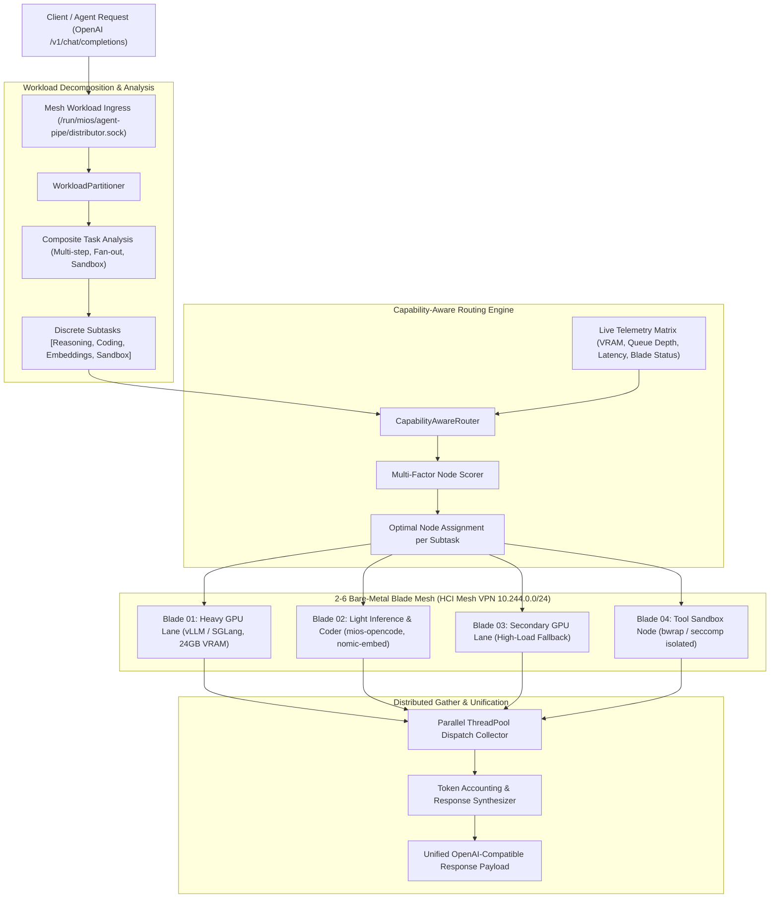

<!-- AI-hint: Chapter 82: Multi-Node Dynamic AI Workload Partitioning and Capability-Aware Task Routing (T-537, AGY-2135). Details 2-6 bare-metal Blade mesh topology discovery, capability matrix scoring, subtask workflow decomposition, parallel dispatch over WireGuard HCI mesh, and OpenAI-compatible response gathering. -->

# Chapter 82: Multi-Node Dynamic AI Workload Partitioning and Capability-Aware Task Routing

> Part VIII: Substrate Daemons, Resilient Clustering & Hardware Acceleration of the [MiOS manual](../manual.md).

This chapter documents the multi-node AI workload partitioner, dynamic capability-aware task router, and distributed response gathering fabric implemented in [`usr/lib/mios/agent-pipe/mios_mesh_distributor.py`](file:///usr/lib/mios/agent-pipe/mios_mesh_distributor.py).



---

### <a name="82_mesh_topology_discovery"></a>82.1 Bare-Metal Blade Mesh Topology & Hardware Boundaries

> Path Reference: `/usr/share/doc/mios/manual.md#82_mesh_topology_discovery`

#### The 2-6 Bare-Metal Blade Architecture

MiOS cluster topology is founded on a 2 to 6 bare-metal Blade mesh interconnected via a dedicated WireGuard HCI mesh VPN overlay (defaulting to the subnet `10.244.0.0/24`). Each Blade operates under strict architectural laws:

1. **Hardware Ownership vs. Guest Obfuscation**: The physical Blade owns bare-metal NICs, wireless radios, TPM 2.0 modules, boot chains, and discrete GPUs (dGPUs). Guest containers and microVMs operate in an obfuscated user space with zero direct access to raw host devices.
2. **GPU Passthrough Protocol (venus vs. CUDA)**: VirtIO `venus` provides Vulkan graphics transport only. CUDA execution (required by heavy inference engines such as vLLM and SGLang) mandates dedicated whole-device VFIO hardware passthrough (`vfio-pci`) on a driver-free host. Mediated vGPU fractioning is prohibited without physical host-side PF drivers.
3. **No Hosted Node is an Access Point**: Radio and network-facing roles live strictly on the physical Blade. Guest layers (such as k3s or Pacemaker) are restricted from claiming hardware network roles.

#### Node Topology Discovery Mechanism

The mesh distributor discovers topology using a three-tier cascade:
- **Runtime Cluster Registry**: Reads `/run/mios/cluster/nodes.json`, which is continuously refreshed by the MiOS cluster coordinator (`mios-clusterhealth` / Raft daemon).
- **Explicit CLI / Environment Specification**: Operators and test harnesses can supply a custom topology file or inline JSON via `--nodes <path_or_json>`.
- **Mock Simulation Mode**: The `--mock` flag simulates a representative 4-node heterogeneous Blade cluster for local verification and CI/CD pipelines without requiring live hardware.

```json
{
  "total_nodes": 4,
  "nodes": [
    {
      "node_id": "blade-01",
      "hostname": "blade-01.mesh.local",
      "mesh_ip": "10.244.0.1",
      "is_blade": true,
      "status": "online",
      "roles": ["heavy_reasoning", "coding", "tool_sandbox"],
      "metrics": {
        "latency_ms": 8.5,
        "active_queue_depth": 1,
        "gpu_vram_used_mb": 4096,
        "gpu_vram_total_mb": 24576,
        "cpu_load_pct": 22.4
      }
    }
  ]
}
```

---

### <a name="82_inference_role_taxonomy"></a>82.2 Inference Role Taxonomy & Capability Matrix

> Path Reference: `/usr/share/doc/mios/manual.md#82_inference_role_taxonomy`

Each node in the mesh advertises a discrete set of supported capabilities according to its hardware profile and running container Quadlets:

| Capability Role | Primary Backing Engine | Hardware Profile | Representative Workloads |
| :--- | :--- | :--- | :--- |
| `heavy_reasoning` | vLLM / SGLang (`mios-heavy`, :8000/:8001) | Dedicated dGPU (VFIO whole-device, $\ge$16GB VRAM) | Multi-turn planning, formal verification, complex mathematical reasoning, architectural proofs. |
| `coding` | `mios-opencode` (:8642) | High-speed CPU / Mid-tier GPU | Function generation, syntax refactoring, AST transformations, bug remediation. |
| `embeddings` | `nomic-embed-text` (:8642/:11434) | CPU / iGPU / NPU | Vector indexing, pgvector semantic search, chunk embeddings, cosine similarity ranking. |
| `tool_sandbox` | `bwrap` / `seccomp` (:8088) | Isolated kernel cgroups / namespace | Shell script execution, unit test verification, sandboxed compilation, security probes. |
| `light_chat` | `llama.cpp` / `llama-swap` (`mios-llm-light`, :8642) | Integrated graphics / CPU | Low-latency summaries, conversational turns, intent classification. |

---

### <a name="82_capability_routing_algorithm"></a>82.3 Dynamic Telemetry Scoring & Routing Algorithm

> Path Reference: `/usr/share/doc/mios/manual.md#82_capability_routing_algorithm`

When a subtask requires role $R$, candidate nodes $\mathcal{C} = \{N \in \text{Nodes} \mid R \in N.\text{roles} \land N.\text{status} \neq \text{offline}\}$ are scored dynamically:

$$\text{Score}(N, R) = \text{Base} - P_{\text{queue}}(N) - P_{\text{latency}}(N) - P_{\text{vram}}(N, R) - P_{\text{cpu}}(N) - P_{\text{status}}(N) + B_{\text{blade}}(N, R)$$

#### Penalty and Bonus Breakdown

1. **Base Score**: Initialized to $100.0$.
2. **Queue Depth Penalty ($P_{\text{queue}}$)**:
   $$P_{\text{queue}}(N) = N.\text{active\_queue\_depth} \times 12.0$$
   Aggressively penalizes congested nodes to prevent pipeline convoy effects.
3. **Latency Penalty ($P_{\text{latency}}$)**:
   $$P_{\text{latency}}(N) = \min(30.0, N.\text{latency\_ms} \times 0.5)$$
   Prefers geographically or network-adjacent nodes within the WireGuard mesh.
4. **GPU VRAM Saturation Penalty ($P_{\text{vram}}$)**:
   $$P_{\text{vram}}(N, R) = \begin{cases} \left(\frac{N.\text{gpu\_vram\_used\_mb}}{N.\text{gpu\_vram\_total\_mb}}\right) \times 40.0 & \text{if } R = \text{heavy\_reasoning} \land N.\text{gpu\_vram\_total\_mb} > 0 \\ 60.0 & \text{if } R = \text{heavy\_reasoning} \land N.\text{gpu\_vram\_total\_mb} = 0 \\ 0.0 & \text{otherwise} \end{cases}$$
5. **Node Degradation Penalty ($P_{\text{status}}$)**:
   $$P_{\text{status}}(N) = \begin{cases} 30.0 & \text{if } N.\text{status} = \text{degraded} \\ 0.0 & \text{if } N.\text{status} = \text{online} \end{cases}$$
6. **Blade Affinity Bonus ($B_{\text{blade}}$)**:
   $$B_{\text{blade}}(N, R) = \begin{cases} +10.0 & \text{if } N.\text{is\_blade} \\ -25.0 & \text{if } \neg N.\text{is\_blade} \land R = \text{heavy\_reasoning} \end{cases}$$
   Enforces the architectural invariant that hardware dGPU workloads favor bare-metal Blades.

The candidate node yielding the highest non-negative score is selected for dispatch. If $\mathcal{C} = \emptyset$, a `NoCapableNodeError` is raised immediately.

---

### <a name="82_subtask_fanout_gather"></a>82.4 Subtask Workflow Decomposition & Fan-out/Gather

> Path Reference: `/usr/share/doc/mios/manual.md#82_subtask_fanout_gather`

#### Composite Workflow Analysis

The `WorkloadPartitioner` decomposes complex queries into atomic, role-specific subtasks. For example, given the multi-clause directive:
> *"Search vector embeddings for authentication mechanisms, implement a token verification class in Python, and execute unit tests in a secure sandbox."*

The partitioner detects three discrete execution requirements:
1. **Subtask 1 (`embeddings`)**: Query vector index via `nomic-embed-text` on `blade-02`.
2. **Subtask 2 (`coding`)**: Synthesize Python implementation code via `mios-opencode` on `blade-02`.
3. **Subtask 3 (`tool_sandbox`)**: Execute test suite inside Bubblewrap sandbox on `blade-01` or `blade-04`.

#### Asynchronous Parallel Dispatch & Gathering

Subtasks without sequential dependencies are dispatched concurrently using a thread pool. Responses are gathered, token usage metrics are aggregated, and results are unified into a single OpenAI-compatible `/v1/chat/completions` response structure:

```json
{
  "id": "chatcmpl-mesh-bf8684b4d6a3",
  "object": "chat.completion",
  "created": 1790214904,
  "model": "mios-mesh-distributor",
  "choices": [
    {
      "index": 0,
      "message": {
        "role": "assistant",
        "content": "[blade-01 / vLLM heavy] Proof completed...\n\n[blade-02 / mios-opencode] Code synthesis complete..."
      },
      "finish_reason": "stop"
    }
  ],
  "usage": {
    "prompt_tokens": 76,
    "completion_tokens": 60,
    "total_tokens": 136
  },
  "mesh_routing": {
    "partitioned": true,
    "subtask_count": 2,
    "dispatches": [
      {
        "subtask_id": "comp-1-d14dd9",
        "role": "heavy_reasoning",
        "node_id": "blade-01",
        "node_ip": "10.244.0.1",
        "latency_ms": 8.5,
        "status": "success"
      },
      {
        "subtask_id": "comp-2-888aec",
        "role": "coding",
        "node_id": "blade-02",
        "node_ip": "10.244.0.2",
        "latency_ms": 12.0,
        "status": "success"
      }
    ]
  }
}
```

---

### <a name="82_cli_daemon_interface"></a>82.5 CLI & Programmatic Integration

> Path Reference: `/usr/share/doc/mios/manual.md#82_cli_daemon_interface`

#### Command-Line Operations

The distributor provides direct CLI inspection and dry-run routing:

```bash
# Display cluster topology, health telemetry, and known roles
/usr/lib/mios/agent-pipe/mios_mesh_distributor.py status --mock

# Inspect capability routing decision and score breakdown
/usr/lib/mios/agent-pipe/mios_mesh_distributor.py route --mock --dry-run \
  --prompt "Perform formal verification of UKI signing chain and compile test binary."

# Execute simulated composite workload dispatch
/usr/lib/mios/agent-pipe/mios_mesh_distributor.py route --mock \
  --prompt "Search vector embeddings and refactor security module."
```

#### Programmatic Python Library Interface

```python
from mios_mesh_distributor import MeshTopology, MeshDistributor

# Initialize topology in mock or live cluster mode
topology = MeshTopology()
topology.discover(mock=True)

# Instantiate distributor facade
distributor = MeshDistributor(topology=topology)

# Dispatch workflow with dynamic partitioning
response = distributor.dispatch_workload(
    prompt="Perform deep architectural reasoning and write python implementation.",
    mock=True,
)

print(f"Merged output: {response['choices'][0]['message']['content']}")
print(f"Routing dispatches: {response['mesh_routing']['dispatches']}")
```
