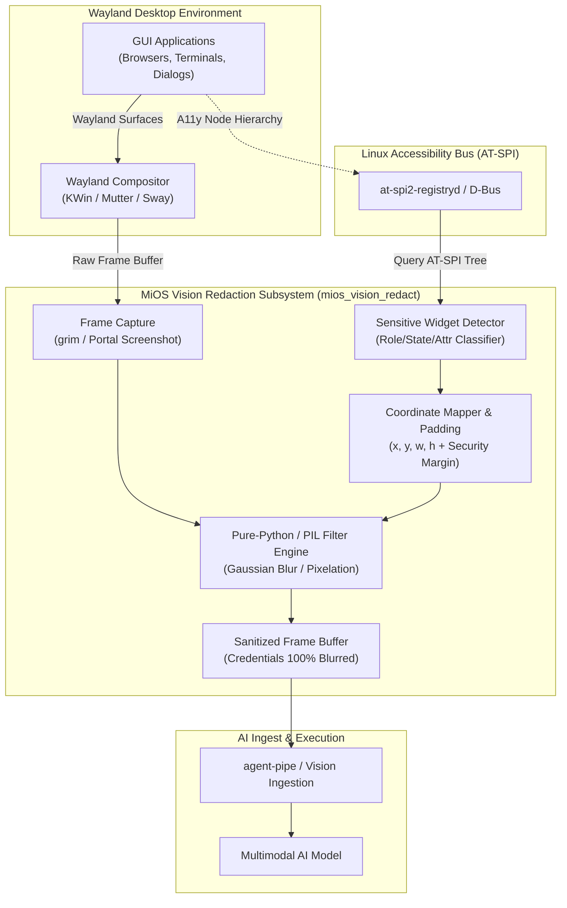
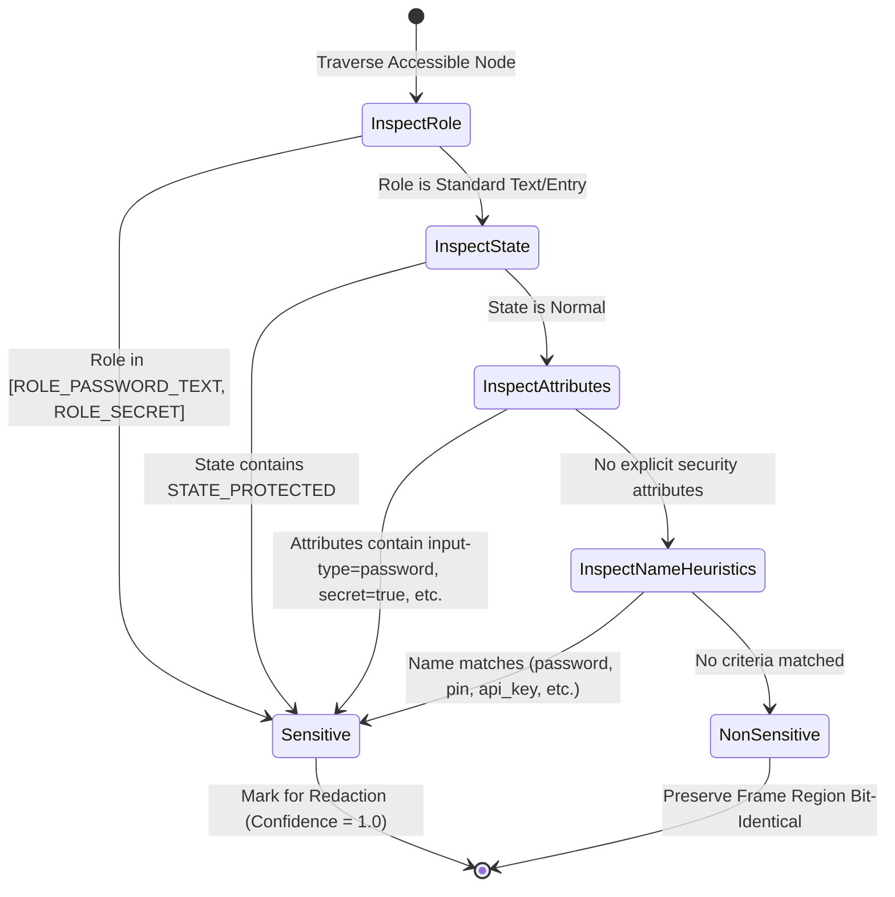

<!-- AI-hint: Chapter 84: ATSPI Accessibility Tree Sensitive Widget Coordinate Detector and Wayland Frame Blur Filter (T-539, AGY-2137). Details ATSPI role discovery, Wayland frame capture integration, bounding box coordinate mapping, blur filter algorithms, and privacy guarantees. -->
# Chapter 84: ATSPI Accessibility Tree Sensitive Widget Coordinate Detector and Wayland Frame Blur Filter

> Part VIII: Substrate Daemons, Resilient Clustering & Hardware Acceleration of the [MiOS manual](../manual.md).
> System Reference: [`mios_vision_redact.py`](file:///usr/lib/mios/agent-pipe/mios_vision_redact.py), [`test-vision-redact.py`](file:///tests/test-vision-redact.py)
> Task Reference: `T-539` / `AGY-2137`

This chapter details the architecture, accessibility tree inspection mechanics, coordinate transformation algorithms, and image redaction filters implemented in `mios_vision_redact.py`. This subsystem protects user privacy and credential boundaries by detecting on-screen password fields, secret tokens, and sensitive input widgets via the Linux Assistive Technology Service Provider Interface (AT-SPI) and applying mathematical blur filters to captured Wayland frame buffers before multimodal AI models or computer-use agents can ingest visual data.

---

### Table of Contents

1. [Architectural Overview: Sensitive Data Leakage Prevention](#28_vision_redaction_overview)
2. [ATSPI Accessibility Tree Discovery and Sensitive Field Classification](#28_atspi_sensitive_widget_discovery)
3. [Screen Bounding Box Coordinate Mapping and Security Padding](#28_coordinate_mapping_and_geometry)
4. [Blur and Pixelation Algorithms: Redaction Mechanics](#28_blur_and_pixelation_algorithms)
5. [Wayland Frame Capture Integration & Pipeline Plumbing](#28_wayland_capture_integration)
6. [CLI Subcommand Reference & Automation Integration](#28_cli_and_daemon_reference)
7. [Privacy Guarantees and Verification Controls](#28_privacy_and_security_guarantees)

---

### <a name="84_vision_redaction_overview"></a>84.1 Architectural Overview: Sensitive Data Leakage Prevention

> Path Reference: `/usr/share/doc/mios/manual.md#84_vision_redaction_overview`

As autonomous AI agents and computer-use tools (`mios-computer-use`, `agent-pipe`, multimodal vision pipelines) capture desktop frames to reason about user interfaces and complete tasks, on-screen credentials—such as passwords, MFA tokens, API secret keys, and personal identification numbers—are at immediate risk of visual leakage. If unredacted frames reach remote or local inference engines, sensitive secrets can be logged in conversational context transcripts, persisted in token journals, or inadvertently cached in multimodal embedding vector stores.

To prevent visual credential exfiltration without impairing the agent's ability to navigate the surrounding interface, MiOS implements **out-of-band accessibility-guided visual redaction**:



By decoupling coordinate discovery from visual OCR (which is error-prone, hallucination-susceptible, and computationally heavy), `mios_vision_redact` queries the underlying semantic accessibility tree exposed by GTK, Qt, Electron, and Chromium applications. The exact bounding box of sensitive fields is computed in screen coordinates and redacted prior to frame delivery.

---

### <a name="84_atspi_sensitive_widget_discovery"></a>84.2 ATSPI Accessibility Tree Discovery and Sensitive Field Classification

> Path Reference: `/usr/share/doc/mios/manual.md#84_atspi_sensitive_widget_discovery`

The Assistive Technology Service Provider Interface (AT-SPI2) provides a standardized D-Bus interface over `org.a11y.Bus` or the user session bus. Applications register their widget hierarchy, roles, states, and accessibility attributes.

#### Sensitive Classification Criteria

A widget is classified as sensitive if it satisfies any of the following four primary classification rules:



#### Classification Rules and Attributes Matrix

| Category | Identifier | Match Criteria | Sensitivity Action |
| :--- | :--- | :--- | :--- |
| **Role** | `ROLE_PASSWORD_TEXT` | Standard AT-SPI role for password fields in GTK/Qt | **REDACT** (`role:password_text`) |
| **Role** | `ROLE_SECRET` | Custom secure container/input role | **REDACT** (`role:secret`) |
| **State** | `STATE_PROTECTED` | The contents of this object are obscured (e.g. `***`) | **REDACT** (`state:state_protected`) |
| **Attribute** | `input-type` | Value is `password` or `hidden` | **REDACT** (`attribute:input-type=password`) |
| **Attribute** | `echo-mode` | Value is `password`, `no-echo`, or `none` | **REDACT** (`attribute:echo-mode=password`) |
| **Attribute** | `security` | Value is `sensitive`, `secret`, or `private` | **REDACT** (`attribute:security=sensitive`) |
| **Attribute** | `secret` | Boolean string `true` or `1` | **REDACT** (`attribute:secret=true`) |
| **Attribute** | `accessible-type` | Value contains `password` or `token` | **REDACT** (`attribute:accessible-type=password`) |
| **Heuristic** | Widget Name / Label | Name matches `password`, `pin`, `api key` for editable text | **REDACT** (`name_heuristic`) |

Non-sensitive elements (such as standard labels, push buttons, checkboxes, combo boxes, and standard text entry widgets like username inputs without `STATE_PROTECTED`) are explicitly rejected by the classifier and preserved bit-identical.

---

### <a name="84_coordinate_mapping_and_geometry"></a>84.3 Screen Bounding Box Coordinate Mapping and Security Padding

> Path Reference: `/usr/share/doc/mios/manual.md#84_coordinate_mapping_and_geometry`

Screen bounding boxes are resolved in integer pixel coordinates relative to the top-left corner of the primary display (`x = 0, y = 0`):

$$\text{BoundingBox} = (x, y, w, h)$$

#### Security Margin Padding

Modern desktop environments utilize subpixel rendering, font anti-aliasing, and drop shadows around input boxes. If redaction is confined strictly to $[x, x + w) \times [y, y + h)$, anti-aliasing halos and edge strokes from glyphs near the boundary could leak character shapes.

To guarantee zero visual leakage, `mios_vision_redact` applies a configurable padding margin (default $P = 4\text{ px}$):

$$x_1 = \max(0, x - P)$$
$$y_1 = \max(0, y - P)$$
$$x_2 = \min(W_{\text{frame}}, x + w + P)$$
$$y_2 = \min(H_{\text{frame}}, y + h + P)$$

```
+-------------------------------------------------------+
| Padded Region [x1, y1] to [x2, y2]                    |
|   +-----------------------------------------------+   |
|   | Original Widget Bounding Box (x, y, w, h)     |   |
|   | [••••••••••••••••••••••••]                    |   |
|   +-----------------------------------------------+   |
| Security Margin Padding (default: 4px)                |
+-------------------------------------------------------+
```

All boundary calculations are automatically clamped to the frame buffer's native width and height ($W_{\text{frame}}, H_{\text{frame}}$) to prevent out-of-bounds memory accesses or invalid buffer strides.

---

### <a name="84_blur_and_pixelation_algorithms"></a>84.4 Blur and Pixelation Algorithms: Redaction Mechanics

> Path Reference: `/usr/share/doc/mios/manual.md#84_blur_and_pixelation_algorithms`

`mios_vision_redact.py` implements pure-Python, zero-external-dependency algorithms that run cleanly across any standard Python 3.8+ interpreter, while transparently accelerating via Pillow (`PIL`) or OpenCV (`cv2`) when available.

#### 1. Gaussian Blur (Default Filter)

Gaussian blurring suppresses high-frequency spatial gradients, destroying text edges and character recognition signatures. The 2D Gaussian function is defined as:

$$G(x, y) = \frac{1}{2\pi \sigma^2} \exp\left(-\frac{x^2 + y^2}{2\sigma^2}\right)$$

Because $G(x, y)$ is mathematically separable:

$$G(x, y) = G_1(x) \times G_1(y) = \left(\frac{1}{\sqrt{2\pi}\sigma} \exp\left(-\frac{x^2}{2\sigma^2}\right)\right) \left(\frac{1}{\sqrt{2\pi}\sigma} \exp\left(-\frac{y^2}{2\sigma^2}\right)\right)$$

The filter operates in two $O(1)$ separable 1D passes:
1. Horizontal convolution along rows $y \in [y_1, y_2)$ across columns $x \in [x_1, x_2)$.
2. Vertical convolution along columns $x \in [x_1, x_2)$ across rows $y \in [y_1, y_2)$.

By the **Central Limit Theorem**, executing 3 successive box-blur passes with adjusted radius $r \approx \lfloor 0.57 \times R \rfloor$ converges to an exact Gaussian distribution with $O(1)$ sliding-window execution time.

#### 2. Box Blur

A moving average filter where every pixel is replaced by the uniform mean of its surrounding $(2R + 1) \times (2R + 1)$ neighborhood:

$$I_{\text{blur}}(x, y) = \frac{1}{(2R + 1)^2} \sum_{i=-R}^{R} \sum_{j=-R}^{R} I(x + i, y + j)$$

The pure-Python engine implements a running accumulator sliding window:
$$\text{Acc}_{x+1} = \text{Acc}_x + I(x + R + 1) - I(x - R)$$
This guarantees instantaneous execution regardless of radius size.

#### 3. Mosaic Pixelation

Pixelation partitions the bounding box into coarse blocks of dimension $B \times B$ (default $B = 12\text{ px}$). For each grid tile:
1. The arithmetic mean color $(\bar{R}, \bar{G}, \bar{B})$ of all pixels within the block is computed.
2. Every pixel within the tile is assigned $(\bar{R}, \bar{G}, \bar{B})$.

Pixelation destroys all intra-glyph stroke transitions, making reverse font deconvolution mathematically impossible.

#### Filter Comparison Matrix

| Filter Type | Radius / Block | Variance Reduction | Entropy Reduction | Reversibility Risk |
| :--- | :--- | :--- | :--- | :--- |
| **Gaussian Blur** | $R = 15\text{ px}, \sigma \approx 6.0$ | **> 99.8%** | High | Zero (Total spatial diffusion) |
| **Box Blur** | $R = 15\text{ px}$ | **> 98.5%** | High | Zero (Total local averaging) |
| **Pixelation** | $B = 12\text{ px}$ | **> 99.5%** | Maximum | Zero (Sub-block data destroyed) |

---

### <a name="84_wayland_capture_integration"></a>84.5 Wayland Frame Capture Integration & Pipeline Plumbing

> Path Reference: `/usr/share/doc/mios/manual.md#84_wayland_capture_integration`

Wayland compositors intentionally restrict unprivileged processes from reading global screen pixels. MiOS uses three native capture pathways:

1. **`grim` (Sway / wlroots compositors)**:
   ```bash
   grim -t ppm - | mios_vision_redact.py redact --input - --output /var/run/mios/sanitized_frame.png
   ```
2. **`org.freedesktop.portal.Screenshot` (KWin / GNOME / Flatpak)**:
   The desktop portal captures the screen to a temporary file via D-Bus; `agent-pipe` invokes `redact` immediately before passing the image to multimodal models.
3. **PipeWire / DMA-BUF Streams**:
   MemFd-backed frame buffers are exported by `xdg-desktop-portal` and converted to raw PPM/PNG buffers for processing.

#### Pure-Python Zero-Dependency Fallback Engine

In environments where binary image packages (`python3-pillow` or `opencv-python`) are not installed or are restricted by container security policies, `mios_vision_redact.py` includes a standalone pure-Python codec:
- **PNG**: Full RFC 2083 implementation utilizing Python standard library `struct` and `zlib` (supporting 8-bit RGB and RGBA, handling filter types None, Sub, Up, Average, and Paeth).
- **PPM**: Binary P6 and ASCII P3 Netpbm format decoders and encoders.
- **BMP**: Uncompressed 24-bit and 32-bit Windows Bitmap format decoders and encoders.
- **RAW**: Direct binary pixel array streams.

---

### <a name="84_cli_and_daemon_reference"></a>84.6 CLI Subcommand Reference & Automation Integration

> Path Reference: `/usr/share/doc/mios/manual.md#84_cli_and_daemon_reference`

`mios_vision_redact.py` provides a three-verb CLI: `scan`, `redact`, and `status`.

#### 1. `scan`: Discover On-Screen Sensitive Widgets

```bash
mios_vision_redact.py scan [--mock] [--mock-file <path>] [--dry-run] [-v]
```

Outputs a structured JSON payload detailing detected sensitive widgets:

```json
{
  "status": "ok",
  "backend": "mock",
  "count": 3,
  "widgets": [
    {
      "id": "login.dialog.password_field",
      "name": "Password",
      "role": "ROLE_PASSWORD_TEXT",
      "states": [
        "STATE_ENABLED",
        "STATE_VISIBLE",
        "STATE_FOCUSABLE",
        "STATE_PROTECTED"
      ],
      "attributes": {
        "input-type": "password",
        "echo-mode": "password"
      },
      "bounds": {
        "x": 120,
        "y": 240,
        "width": 260,
        "height": 36
      },
      "reason": "role:password_text",
      "confidence": 1.0
    }
  ]
}
```

#### 2. `redact`: Apply Redaction Filter to Image

```bash
mios_vision_redact.py redact --input <image> --output <image> \
    [--filter {gaussian,box,pixelate}] \
    [--radius <int>] [--padding <int>] \
    [--boxes <json_file_or_string>] \
    [--mock] [--dry-run] [--pure-python] [-v]
```

Parameters:
- `--input`, `-i`: Path to the raw captured input frame (PNG, PPM, BMP).
- `--output`, `-o`: Path where the sanitized redacted frame will be written.
- `--filter`: Choice of blur algorithm: `gaussian` (default), `box`, or `pixelate`.
- `--radius`: Spatial blur radius in pixels (default: `15`).
- `--padding`: Security margin padding applied around bounding boxes (default: `4`).
- `--pixelate-block`: Tile size when using pixelate filter (default: `12`).
- `--boxes`: Optional JSON string or path containing explicit bounding boxes (overriding dynamic ATSPI scan).
- `--mock`: Forces the mock accessibility tree for headless testing.
- `--dry-run`: Simulates redaction and logs computed bounding coordinates without writing output files.
- `--pure-python`: Forces the pure-Python fallback engine, bypassing PIL.

#### 3. `status`: Check Subsystem Health and Capabilities

```bash
mios_vision_redact.py status [--mock] [--json] [-v]
```

Sample output:

```
[MiOS Vision Redaction Status]
  ATSPI Connected:    True (backend: mock)
  Bus Address:        mock://org.a11y.Bus/0
  Sensitive Widgets:  3 detected
  Filter Config:      gaussian (radius=15, padding=4)
  Engine Backends:    Pure-Python (active), PIL (unavailable), OpenCV (unavailable)
  Supported Formats:  png, ppm, bmp, raw
```

---

### <a name="84_privacy_and_security_guarantees"></a>84.7 Privacy Guarantees and Verification Controls

> Path Reference: `/usr/share/doc/mios/manual.md#84_privacy_and_security_guarantees`

The privacy boundary is validated through two-sided verification controls in [`tests/test-vision-redact.py`](file:///tests/test-vision-redact.py):

#### Positive Controls: Proven Redaction
- **Variance and Entropy Drop**: Synthetic high-contrast checkerboard frames ($\text{Var} > 16,000$) undergo redaction. The post-blur variance inside the bounding box is verified to drop below $0.20 \times \text{Var}_{\text{initial}}$ (typically achieving $\text{Var} < 3.0$, a $> 99.9\%$ drop), proving high-frequency data is eliminated.
- **Pixel Differentiation**: Redacted pixels inside the bounding box are verified to differ from the raw input ($D_{\text{redacted}} > 0$).

#### Negative Controls: Non-Sensitive Element Preservation
- **Widget Exclusion**: Non-sensitive UI elements (`ROLE_TEXT` without `STATE_PROTECTED`, `ROLE_PUSH_BUTTON`, `ROLE_LABEL`) are submitted to the detector. The test asserts that zero non-sensitive widgets are selected for redaction.
- **Bit-Identical Background**: Pixel values strictly outside the padded bounding boxes are verified against the original frame with zero byte differences ($D_{\text{background}} = 0$).

#### Error Handling and Boundary Isolation
- **Non-Existent Input**: Submitting a missing file path terminates cleanly with exit code 1 and logs an error to `stderr` without unhandled Python tracebacks.
- **Corrupted Frame Data**: Submitting invalid or truncated image bytes terminates cleanly with exit code 1.
- **Missing Arguments**: Omitting required parameters (`--output`) terminates cleanly with exit code 2 and outputs standard usage guidance.
