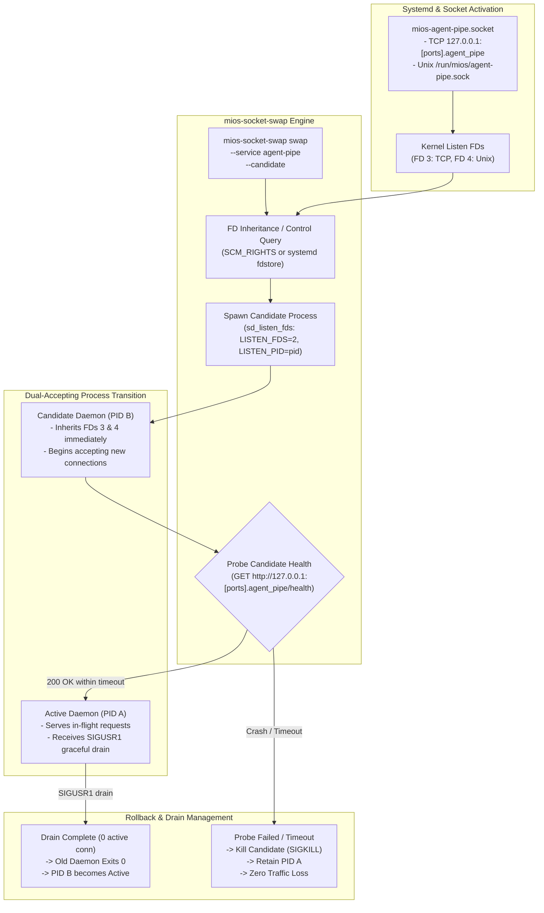

<!-- AI-hint: Chapter 87: Zero-Downtime Systemd Socket Handoff (sd_listen_fds) Daemon Swapper for Agent-Pipe (T-542, AGY-2140). Covers systemd socket activation, file descriptor inheritance, SCM_RIGHTS FD transfer, graceful connection draining, and automated rollback upon candidate failure. -->

# Chapter 87: Zero-Downtime Socket Activation and Daemon Handoff Swapper

> Part VIII: Substrate Daemons, Resilient Clustering & Hardware Acceleration of the [MiOS manual](../manual.md).

This chapter documents the architecture, file descriptor passing protocols, connection draining mechanisms, and automated failure recovery implemented in [`usr/libexec/mios/mios-socket-swap`](file:///usr/libexec/mios/mios-socket-swap) and [`usr/lib/systemd/system/mios-agent-pipe.socket`](file:///usr/lib/systemd/system/mios-agent-pipe.socket).



## 1. Architectural Motivation

In high-availability edge and bare-metal blade environments, agent orchestration (`agent-pipe`) and AI gateways (`hermes`, `opencode`) must support hot upgrades, dynamic model redeployments, and patch application without dropping active client connections or interrupting real-time reasoning sessions.

Standard service restart paradigms (`systemctl restart`) close the listening socket during process exit, creating a TCP window starvation period (RST or connection refused errors). Systemd socket activation paired with explicit file descriptor inheritance (`sd_listen_fds`) solves this by decoupling the network listener from the worker process lifecycle.

## 2. File Descriptor Inheritance & `sd_listen_fds`

Under systemd socket activation, systemd binds and listens on specified endpoints before any service starts. When activated, file descriptors are passed starting at file descriptor index `3`:
- `FD 3`: First listening socket (e.g. TCP `127.0.0.1:<[ports].agent_pipe>`).
- `FD 4`: Second listening socket (e.g. Unix Domain Socket `/run/mios/agent-pipe.sock`).

The `mios-socket-swap` daemon implements the systemd socket activation protocol:
1. **Control Socket Discovery**: Connects to the active daemon via its local control socket or systemd runtime directory.
2. **FD Passing via `SCM_RIGHTS`**: Queries active listening sockets using Unix domain socket control messages (`sendmsg`/`recvmsg` with `SOL_SOCKET`/`SCM_RIGHTS`).
3. **Child Process Launch**: Launches candidate process with inherited file descriptors using `subprocess.Popen(pass_fds=...)` and environment variables `LISTEN_FDS=2`, `LISTEN_PID=<child_pid>`.

## 3. Dual-Accepting Phase & Graceful Drain

Once spawned, the candidate process immediately calls `accept()` on the inherited file descriptors. Both the old and new processes temporarily accept connections concurrently:
- New connections are distributed by the Linux kernel across both processes.
- The swapper performs a health probe (`GET http://127.0.0.1:[ports].agent_pipe/health`).
- Upon probe confirmation, the swapper sends `SIGUSR1` to the old process.
- The old process stops accepting new connections, allows in-flight HTTP/streaming requests to complete within the grace period (`--drain-timeout 30.0`), and exits cleanly.

## 4. Automated Rollback Safety Guard

If the candidate daemon encounters a crash, syntax error, or unhandled exception during initialization:
- The health probe times out or detects process exit.
- `mios-socket-swap` immediately terminates the failing candidate (sending `SIGKILL`).
- The active daemon (PID A) is never signaled with `SIGUSR1` and continues serving all traffic without interruption.
- A non-zero exit code is returned and an incident log is recorded in `/var/lib/mios/swap/status.json`.

## 5. CLI Reference

```bash
# Execute hot socket swap
mios-socket-swap swap --service agent-pipe --candidate "/usr/bin/python3 /usr/lib/mios/agent-pipe/agent_pipe.py"

# Inspect active listener ownership and swap metrics
mios-socket-swap status --service agent-pipe --json

# Run under mock test harness
mios-socket-swap --mock swap --service agent-pipe
```
