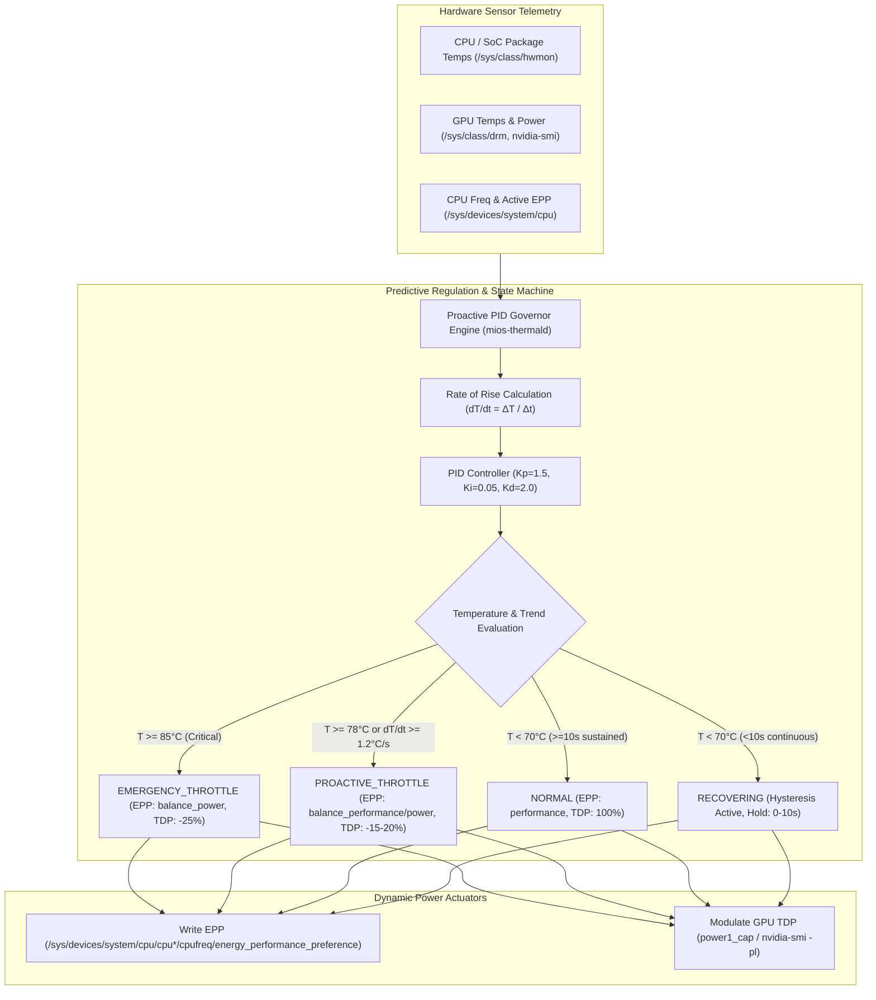

<!-- AI-hint: Chapter 88: Proactive PID Thermal Daemon, Dynamic CPU/GPU Power Cap Modulator, and Thermal Stress Recovery (T-543, AGY-2141, T-544, AGY-2142). Details proactive PID thermal regulation, sysfs telemetry, rate-of-rise (dT/dt) early intervention before silicon throttling (80°C vs 95°C), dynamic EPP and GPU TDP modulation, and automated 10s hysteresis cooldown recovery. -->

# Chapter 88: Proactive PID Thermal Daemon and Dynamic Power Cap Modulator

> Part VIII: Substrate Daemons, Resilient Clustering & Hardware Acceleration of the [MiOS manual](../manual.md).

This chapter documents the proactive PID thermal daemon, dynamic CPU/GPU power cap modulation, and automated hysteresis recovery implemented in [`usr/libexec/mios/mios-thermald`](file:///usr/libexec/mios/mios-thermald), managed by the systemd unit [`usr/lib/systemd/system/mios-thermald.service`](file:///usr/lib/systemd/system/mios-thermald.service), and verified by [`tests/test-thermal-governor-recovery.sh`](file:///tests/test-thermal-governor-recovery.sh).



---

### <a name="88_proactive_thermal_regulation_architecture"></a>88.1 The Proactive Paradigm: Overcoming Reactive Silicon Throttling

> Path Reference: `/usr/share/doc/mios/manual.md#88_proactive_thermal_regulation_architecture`

#### The Cost of Reactive Throttling
Modern high-performance silicon (AMD Zen, Intel Core/Xeon, NVIDIA Ada Lovelace/Blackwell) features hardware-enforced thermal shutdown thresholds (typically $100^\circ\text{C}$ to $105^\circ\text{C}$) and hardware thermal throttling clamps (starting at $95^\circ\text{C}$). When hardware-enforced throttling triggers:
1. **Severe Pipeline Stalls**: Silicon clocks are abruptly truncated by 50% or more within single clock cycles, causing acute latency spikes in token generation during local LLM batching or streaming voice pipelines.
2. **Thermal Shock & Oscillation**: Heavy loads push temperatures past $95^\circ\text{C}$, the hardware throttles violently, temperatures plummet below $80^\circ\text{C}$, full clocks resume, and the system immediately heats up again—resulting in an aggressive sawtooth performance degradation.
3. **Power Budget Collisions**: In unified compute chassis (such as MiOS mini blades or workstations with colocated CPU and dGPU), simultaneous CPU and GPU loads saturate heatsink heat-pipe dissipation capacity before fans can ramp up.

#### The Proactive Alternative
The MiOS Proactive Thermal Governor (`mios-thermald`) shifts thermal control from *reactive damage control* to *proactive load shaping*:
- It initiates thermal governance **before** silicon reaches $80^\circ\text{C}$—providing a 15°C buffer prior to hardware clamping.
- By tracking the derivative of temperature ($dT/dt$), it detects explosive thermal gradients (such as multi-modal LLM prompt ingestion or parallel tensor compilation) and throttles power caps before heat accumulates in the silicon substrate.
- It employs a minimum 10-second hysteresis recovery window below $70^\circ\text{C}$ to prevent cyclic sawtooth oscillations.

---

### <a name="88_pid_control_and_rate_of_rise"></a>88.2 The Mathematical Formulation of Predictive Thermal Governance

> Path Reference: `/usr/share/doc/mios/manual.md#88_pid_control_and_rate_of_rise`

#### Differential Temperature and Rate-of-Rise
At each monitoring tick $t_k$ separated by interval $\Delta t = t_k - t_{k-1}$, the daemon reads CPU package temperature $T_{\text{cpu}}$ and GPU junction temperature $T_{\text{gpu}}$. The governing temperature is the maximum active silicon temperature:

$$T_{\text{eff}}(t_k) = \max(T_{\text{cpu}}(t_k), T_{\text{gpu}}(t_k))$$

The rate of temperature rise is calculated numerically:

$$\frac{dT}{dt}(t_k) = \frac{T_{\text{eff}}(t_k) - T_{\text{eff}}(t_{k-1})}{\Delta t}$$

When $\frac{dT}{dt} \ge 1.2^\circ\text{C/s}$ and $T_{\text{eff}} \ge 75^\circ\text{C}$, thermal runaway is anticipated, and throttling engages immediately even if the absolute temperature has not yet breached $78^\circ\text{C}$.

#### PID Control Equation
The regulation loop calculates the control error against a target setpoint $T_{\text{target}} = 75.0^\circ\text{C}$:

$$e(t_k) = T_{\text{eff}}(t_k) - T_{\text{target}}$$

The PID control signal is given by:

$$u(t_k) = K_p \cdot e(t_k) + K_i \cdot \int_{0}^{t} e(\tau)\,d\tau + K_d \cdot \frac{dT}{dt}(t_k)$$

Where:
- **Proportional Gain ($K_p = 1.5$)**: Provides proportional response to steady thermal offset above target.
- **Integral Gain ($K_i = 0.05$)**: Accumulates persistent elevated temperatures while preventing integral windup via clamping:
  
  $$-25.0 \le I_k \le 25.0$$

- **Derivative Gain ($K_d = 2.0$)**: Delivers strong anticipatory braking against rapid thermal spikes.

---

### <a name="88_hardware_sensor_telemetry"></a>88.3 Hardware Sensor Telemetry & Sysfs Interfaces

> Path Reference: `/usr/share/doc/mios/manual.md#88_hardware_sensor_telemetry`

The daemon monitors Linux kernel sysfs abstractions and vendor interfaces without proprietary binary drivers:

| Subsystem | Sysfs / Tool Interface | Reported Unit | Description |
| :--- | :--- | :--- | :--- |
| **CPU Package Temp** | `/sys/class/hwmon/hwmon*/temp*_input` | Millidegrees C ($10^{-3}\ ^\circ\text{C}$) | Scans `temp*_label` for `Package id 0`, `Tctl`, `Tdie`, or `core` |
| **GPU Core Temp** | `/sys/class/drm/card*/device/hwmon/hwmon*/temp1_input` | Millidegrees C ($10^{-3}\ ^\circ\text{C}$) | Native DRM hwmon for AMDGPU and Intel Xe/i915 |
| **GPU Core Temp (NV)** | `nvidia-smi --query-gpu=temperature.gpu...` | Degrees Celsius ($^\circ\text{C}$) | Native NVML query fallback for NVIDIA architectures |
| **GPU Current Power** | `hwmon*/power1_average` or `nvidia-smi` | Microwatts ($10^{-6}\ \text{W}$) or Watts | Instantaneous GPU board power draw |
| **GPU Power Cap** | `hwmon*/power1_cap` or `nvidia-smi -pl` | Microwatts ($10^{-6}\ \text{W}$) or Watts | Active hardware TDP limit |
| **CPU Frequency** | `/sys/devices/system/cpu/cpu*/cpufreq/scaling_cur_freq` | Kilohertz ($10^3\ \text{Hz}$) | Per-core scaling clock frequency |
| **CPU EPP** | `/sys/devices/system/cpu/cpu*/cpufreq/energy_performance_preference` | String Profile | Active hardware Energy Performance Preference |

---

### <a name="88_dynamic_power_cap_actuation"></a>88.4 Dynamic Power Cap Actuation & Modulation Matrix

> Path Reference: `/usr/share/doc/mios/manual.md#88_dynamic_power_cap_actuation`

`mios-thermald` controls both CPU Energy Performance Preference (EPP) and GPU Thermal Design Power (TDP) caps based on thermal evaluation:

| Governor State | Trigger Conditions | CPU EPP Action | GPU Power Cap Modulation |
| :--- | :--- | :--- | :--- |
| **`NORMAL`** | $T_{\text{eff}} < 70^\circ\text{C}$ (sustained $\ge 10\text{s}$) | `performance` | 100% Baseline TDP (e.g. 250W) |
| **`PROACTIVE_THROTTLE`** (Mild) | $78^\circ\text{C} \le T < 80^\circ\text{C}$ or ($T \ge 75^\circ\text{C} \land \frac{dT}{dt} \ge 1.2^\circ\text{C/s}$) | `balance_performance` | 85% Baseline TDP (-15% reduction) |
| **`PROACTIVE_THROTTLE`** (High) | $80^\circ\text{C} \le T < 85^\circ\text{C}$ or $\frac{dT}{dt} \ge 2.0^\circ\text{C/s}$ | `balance_power` | 80% Baseline TDP (-20% reduction) |
| **`EMERGENCY_THROTTLE`** | $T_{\text{eff}} \ge 85^\circ\text{C}$ | `balance_power` | 75% Baseline TDP (-25% reduction) |
| **`RECOVERING`** | $T_{\text{eff}} < 70^\circ\text{C}$ for $t_{\text{rec}} < 10\text{s}$ | `balance_performance` | 90% Baseline TDP (-10% reduction) |
| **`MANUAL`** | Operator override via `set-policy` | Operator selected | Operator selected |

---

### <a name="88_hysteresis_and_smooth_recovery"></a>88.5 Hysteresis Cooldown & Smooth Performance Restoration

> Path Reference: `/usr/share/doc/mios/manual.md#88_hysteresis_and_smooth_recovery`

#### The Hysteresis State Machine
To guarantee stability, the governor implements a non-oscillating finite state machine:
1. When temperatures cross into thermal mitigation, `recovery_seconds` is cleared to `0.0`.
2. When cooling commences, the system enters `RECOVERING` once temperature drops below $70.0^\circ\text{C}$.
3. During `RECOVERING`, the daemon applies a stepped power limit (90% GPU TDP and `balance_performance`), allowing compute pipelines to accelerate without triggering immediate thermal relapse.
4. If temperature remains continuously below $70.0^\circ\text{C}$ for a full $10.0$ seconds ($t_{\text{rec}} \ge 10.0$), the state transitions back to `NORMAL`, unlocking full 100% TDP and `performance` EPP.
5. If at any point during recovery temperature rises above $70.0^\circ\text{C}$, the recovery timer resets to $0.0$, holding current mitigation until true equilibrium is re-established.

---

### <a name="88_operational_guide_and_systemd"></a>88.6 Operational Guide, CLI Reference, and Systemd Service

> Path Reference: `/usr/share/doc/mios/manual.md#88_operational_guide_and_systemd`

#### Systemd Service Integration
The daemon runs as a continuous system service:

```bash
# Check daemon service status
systemctl status mios-thermald.service

# Inspect live journal logs
journalctl -u mios-thermald.service -f
```

#### CLI Reference
The `mios-thermald` binary provides daemon, inspection, and manual override modes:

```bash
# Query live thermal status and governor state
mios-thermald status

# Emit status telemetry in structured JSON (ideal for Prometheus/telegraf)
mios-thermald status --json

# Manually set policy override
mios-thermald set-policy --epp balance_performance --gpu-cap 220

# Run in mock mode against simulated sysfs trees
mios-thermald --mock --sysfs-root /tmp/custom_sysfs daemon --interval 0.5
```

---

### <a name="88_verification_and_stress_testing"></a>88.7 Verification and Stress Testing Test Suite

> Path Reference: `/usr/share/doc/mios/manual.md#88_verification_and_stress_testing`

The implementation is verified by the integration test suite [`tests/test-thermal-governor-recovery.sh`](file:///tests/test-thermal-governor-recovery.sh), covering 7 exhaustive validation tiers:
1. **CLI & Help Conformance**: Validates root `-h/--help`, subcommands (`daemon`, `status`, `set-policy`), and rejection of malformed arguments.
2. **Hardware Sensor Discovery (Positive Control)**: Validates correct parsing of multi-core CPU package temperatures, GPU core temperatures, and cpufreq scaling.
3. **Power Cap Modulation (Positive Control)**: Asserts that synthetic thermal elevation ($82^\circ\text{C}$) triggers `PROACTIVE_THROTTLE`, down-stepping EPP and dropping GPU TDP by $\ge 15\%$.
4. **Dynamic Recovery (Positive Control)**: Asserts that cooldown to $62^\circ\text{C}$ held for $\ge 10$ seconds successfully restores `performance` EPP and 100% baseline GPU TDP.
5. **Fault Isolation & Negative Control**: Confirms that non-numeric corrupted sensor data and missing `/sys/class/hwmon` directories are handled gracefully without unhandled tracebacks.
6. **Systemd Unit Verification**: Runs `systemd-analyze verify` ensuring service unit validity.
7. **End-to-End Stress & Recovery Lifecycle**: Runs a multi-stage thermal burst scenario (Idle $\to$ Thermal Burst $\to$ Cooldown Hold $\to$ Full Restoration) validating state transitions.

```bash
# Execute integration test suite
./tests/test-thermal-governor-recovery.sh --mock -v
```
