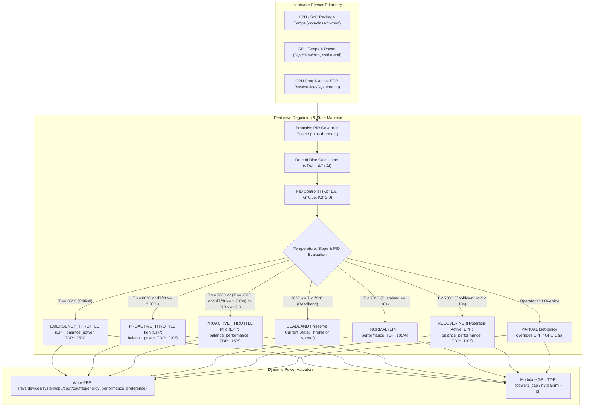

<!-- AI-hint: Chapter 88: Proactive PID Thermal Daemon, Dynamic CPU/GPU Power Cap Modulator, and Thermal Stress Recovery (T-543, AGY-2141, T-544, AGY-2142). Details proactive PID thermal regulation, sysfs telemetry, rate-of-rise (dT/dt) early intervention before silicon throttling (80°C vs 95°C), dynamic EPP and GPU TDP modulation, and automated 10s hysteresis cooldown recovery. -->

# Chapter 88: Proactive PID Thermal Daemon and Dynamic Power Cap Modulator

> Part VIII: Substrate Daemons, Resilient Clustering & Hardware Acceleration of the [MiOS manual](../manual.md).

This chapter documents the proactive PID thermal daemon, dynamic CPU/GPU power cap modulation, and automated hysteresis recovery implemented in [`usr/libexec/mios/mios-thermald`](file:///usr/libexec/mios/mios-thermald), managed by the systemd unit [`usr/lib/systemd/system/mios-thermald.service`](file:///usr/lib/systemd/system/mios-thermald.service), and verified by [`tests/test-thermal-governor-recovery.sh`](file:///tests/test-thermal-governor-recovery.sh).


```mermaid
flowchart TD
    subgraph Telemetry ["Hardware Sensor Telemetry"]
        CPU_Sens["CPU / SoC Package Temps (/sys/class/hwmon)"]
        GPU_Sens["GPU Temps & Power (/sys/class/drm, nvidia-smi)"]
        Freq_Sens["CPU Freq & Active EPP (/sys/devices/system/cpu)"]
    end

    Telemetry --> Engine["Proactive PID Governor Engine (mios-thermald)"]

    subgraph Regulation ["Predictive Regulation & State Machine"]
        Engine --> Deriv["Rate of Rise Calculation (dT/dt = ΔT / Δt)"]
        Deriv --> PID["PID Controller (Kp=1.5, Ki=0.05, Kd=2.0)"]
        PID --> Decision{"Temperature, Slope & PID Evaluation"}

        Decision -- "T >= 85°C (Critical)" --> Emergency["EMERGENCY_THROTTLE (EPP: balance_power, TDP: -25%)"]
        Decision -- "T >= 80°C or dT/dt >= 2.0°C/s" --> ProactiveHigh["PROACTIVE_THROTTLE High (EPP: balance_power, TDP: -20%)"]
        Decision -- "T >= 78°C or (T >= 75°C and dT/dt >= 1.2°C/s) or PID >= 12.0" --> ProactiveMild["PROACTIVE_THROTTLE Mild (EPP: balance_performance, TDP: -15%)"]
        Decision -- "70°C <= T < 78°C (Deadband)" --> Deadband["DEADBAND (Preserve Current State: Throttle or Normal)"]
        Decision -- "T < 70°C (Cooldown Hold < 10s)" --> Recovering["RECOVERING (Hysteresis Active, EPP: balance_performance, TDP: -10%)"]
        Decision -- "T < 70°C (Sustained >= 10s)" --> Normal["NORMAL (EPP: performance, TDP: 100%)"]
        Decision -- "Operator CLI Override" --> Manual["MANUAL (set-policy overrides EPP / GPU Cap)"]
    end

    subgraph Actuation ["Dynamic Power Actuators"]
        Emergency --> ApplyEPP["Write EPP (/sys/devices/system/cpu/cpu*/cpufreq/energy_performance_preference)"]
        ProactiveHigh --> ApplyEPP
        ProactiveMild --> ApplyEPP
        Normal --> ApplyEPP
        Recovering --> ApplyEPP
        Manual --> ApplyEPP

        Emergency --> ApplyGPU["Modulate GPU TDP (power1_cap / nvidia-smi -pl)"]
        ProactiveHigh --> ApplyGPU
        ProactiveMild --> ApplyGPU
        Normal --> ApplyGPU
        Recovering --> ApplyGPU
        Manual --> ApplyGPU
    end
```

---

### <a name="88_proactive_thermal_regulation_architecture"></a>88.1 The Proactive Paradigm: Overcoming Reactive Silicon Throttling

> Path Reference: `/usr/share/doc/mios/manual.md#88_proactive_thermal_regulation_architecture`

#### The Cost of Reactive Throttling
Modern high-performance silicon (AMD Zen, Intel Core/Xeon, NVIDIA Ada Lovelace/Blackwell) features hardware-enforced thermal shutdown thresholds (typically $100^\circ\text{C}$ to $105^\circ\text{C}$) and hardware thermal throttling clamps (starting at $95^\circ\text{C}$). When hardware-enforced throttling triggers:
1. **Severe Pipeline Stalls**: Silicon clocks are abruptly truncated by 50% or more within single clock cycles, causing acute latency spikes in token generation during local LLM batching or streaming voice pipelines.
2. **Thermal Shock & Oscillation**: Heavy loads push temperatures past $95^\circ\text{C}$, the hardware throttles violently, temperatures plummet below $80^\circ\text{C}$, full clocks resume, and the system immediately heats up again—resulting in an aggressive sawtooth performance degradation.
3. **Power Budget Collisions**: In unified compute chassis (such as MiOS mini blades or workstations with colocated CPU and dGPU), simultaneous CPU and GPU loads saturate heatsink heat-pipe dissipation capacity before fans can ramp up.

#### The Proactive Alternative
The MiOS Proactive Thermal Governor (`mios-thermald`) shifts thermal control from *reactive damage control* to *proactive load shaping*:
- It initiates thermal governance **before** silicon reaches $80^\circ\text{C}$—providing a $15^\circ\text{C}$ to $17^\circ\text{C}$ buffer prior to hardware clamping at $95^\circ\text{C}$.
- By tracking the derivative of temperature ($dT/dt$) and the PID control signal, it detects explosive thermal gradients (such as multi-modal LLM prompt ingestion or parallel tensor compilation) and throttles power caps before heat accumulates in the silicon substrate.
- It employs a minimum 10-second hysteresis recovery window strictly below $70^\circ\text{C}$ with intermediate stepped restoration to prevent cyclic sawtooth oscillations.
- It coordinates with system fans and discrete GPU thermal watchdogs ([`usr/libexec/mios/hw/gpu_thermal_watchdog.py`](file:///usr/libexec/mios/hw/gpu_thermal_watchdog.py)), which strictly maintain a non-zero fan floor ($\ge 25\%$ PWM) to guarantee baseline convection even under idle states.

---

### <a name="88_pid_control_and_rate_of_rise"></a>88.2 The Mathematical Formulation of Predictive Thermal Governance

> Path Reference: `/usr/share/doc/mios/manual.md#88_pid_control_and_rate_of_rise`

#### Differential Temperature and Rate-of-Rise
At each monitoring tick $t_k$ separated by interval $\Delta t = t_k - t_{k-1}$ (default $\Delta t = 1.0\text{s}$), the daemon reads CPU package temperature $T_{\text{cpu}}$ and GPU junction/core temperature $T_{\text{gpu}}$. The governing temperature is the maximum active silicon temperature:

$$T_{\text{eff}}(t_k) = \max(T_{\text{cpu}}(t_k), T_{\text{gpu}}(t_k))$$

The rate of temperature rise is calculated numerically:

$$\frac{dT}{dt}(t_k) = \frac{T_{\text{eff}}(t_k) - T_{\text{eff}}(t_{k-1})}{\Delta t}$$

When $\Delta t \le 0$ or during initial evaluation, $\Delta t$ defaults to $1.0\text{s}$. If no prior temperature sample exists, $\frac{dT}{dt}$ initializes to $0.0^\circ\text{C/s}$.

#### PID Control Equation
The regulation loop calculates the control error against a target setpoint $T_{\text{target}} = 75.0^\circ\text{C}$:

$$e(t_k) = T_{\text{eff}}(t_k) - T_{\text{target}}$$

The PID control signal is given by:

$$u(t_k) = K_p \cdot e(t_k) + K_i \cdot \int_{0}^{t} e(\tau)\,d\tau + K_d \cdot \frac{dT}{dt}(t_k)$$

Where:
- **Proportional Gain ($K_p = 1.5$)**: Delivers proportional response to steady thermal offset above target.
- **Integral Gain ($K_i = 0.05$)**: Accumulates persistent elevated temperatures while preventing integral windup via anti-windup clamping:
  
  $$-25.0 \le I_k \le 25.0$$

- **Derivative Gain ($K_d = 2.0$)**: Delivers strong anticipatory braking against rapid thermal spikes.

#### Predictive Trigger Conditions
Proactive intervention engages when any of the following conditions are met:
1. **Absolute Temperature Breach**: $T_{\text{eff}}(t_k) \ge 78.0^\circ\text{C}$ (`DEFAULT_PROACTIVE_TEMP`).
2. **Elevated Rate-of-Rise**: $T_{\text{eff}}(t_k) \ge 75.0^\circ\text{C}$ AND $\frac{dT}{dt}(t_k) \ge 1.2^\circ\text{C/s}$.
3. **PID Signal Saturation**: $u(t_k) \ge 12.0$, anticipating imminent thermal runaway even if temperature is temporarily hovering below $78^\circ\text{C}$.

---

### <a name="88_hardware_sensor_telemetry"></a>88.3 Hardware Sensor Telemetry & Sysfs Interfaces

> Path Reference: `/usr/share/doc/mios/manual.md#88_hardware_sensor_telemetry`

The daemon monitors Linux kernel sysfs abstractions and vendor interfaces without proprietary binary drivers:

| Subsystem | Sysfs / Tool Interface | Reported Unit | Discovery & Fallback Algorithm |
| :--- | :--- | :--- | :--- |
| **CPU Package Temp** | `/sys/class/hwmon/hwmon*/temp*_input` | Millidegrees C ($10^{-3}\ ^\circ\text{C}$) | Scans `temp*_label` for `package id 0`, `tctl`, `tdie`, `cpu`, or `soc`. If no label matches, selects the maximum reported core temperature across all hwmon nodes. If hwmon is unreadable, returns safe fallback `(45.0, "fallback:no_temp_nodes")`. |
| **GPU Core Temp (DRM)** | `/sys/class/drm/card*/device/hwmon/hwmon*/temp1_input` | Millidegrees C ($10^{-3}\ ^\circ\text{C}$) | Native DRM hwmon interface for AMDGPU, Intel Xe/i915, and Nouveau. Converted via $\text{val} / 1000.0$. |
| **GPU Current Power (DRM)** | `/sys/class/drm/card*/device/hwmon/hwmon*/power1_average` | Microwatts ($10^{-6}\ \text{W}$) | Instantaneous board power draw. Converted to Watts via $\text{val} / 10^6$ (defaults to 50W if unreadable). |
| **GPU Power Cap (DRM)** | `/sys/class/drm/card*/device/hwmon/hwmon*/power1_cap` | Microwatts ($10^{-6}\ \text{W}$) | Active hardware TDP limit. Written in microwatts ($\text{Watts} \times 10^6$). Baseline defaults to 250W. |
| **GPU Telemetry (NVIDIA)** | `nvidia-smi --query-gpu=temperature.gpu,power.draw,power.limit --format=csv,noheader,nounits` | Degrees C / Watts | Direct NVML CLI query fallback when proprietary NVIDIA hardware is present. Actuates via `nvidia-smi -pl <Watts>`. |
| **CPU Scaling Frequency** | `/sys/devices/system/cpu/cpu*/cpufreq/scaling_cur_freq` | Kilohertz ($10^3\ \text{Hz}$) | Reads instantaneous scaling frequency across all online CPU cores, reporting the arithmetic average in MHz ($\text{kHz} / 1000.0$). |
| **CPU EPP Profile** | `/sys/devices/system/cpu/cpu*/cpufreq/energy_performance_preference` | String Profile | Queries and applies EPP across all discovered CPU cores (`cpu0`, `cpu1`, etc.). Supported profiles: `performance`, `balance_performance`, `balance_power`, `power`. |

---

### <a name="88_dynamic_power_cap_actuation"></a>88.4 Dynamic Power Cap Actuation & Modulation Matrix

> Path Reference: `/usr/share/doc/mios/manual.md#88_dynamic_power_cap_actuation`

`mios-thermald` controls both CPU Energy Performance Preference (EPP) and GPU Thermal Design Power (TDP) caps based on thermal evaluation:

| Governor State | Trigger Conditions | CPU EPP Action | GPU Power Cap Modulation |
| :--- | :--- | :--- | :--- |
| **`NORMAL`** | $T_{\text{eff}} < 70^\circ\text{C}$ sustained for $\ge 10\text{s}$, or clean initial startup | `performance` | 100% Baseline TDP (e.g. 250W) |
| **`PROACTIVE_THROTTLE` (Mild)** | $78^\circ\text{C} \le T < 80^\circ\text{C}$ OR ($T \ge 75^\circ\text{C} \land \frac{dT}{dt} \ge 1.2^\circ\text{C/s}$) OR $u(t_k) \ge 12.0$ | `balance_performance` | 85% Baseline TDP (-15% reduction, e.g. 212.5W) |
| **`PROACTIVE_THROTTLE` (High)** | $80^\circ\text{C} \le T < 85^\circ\text{C}$ OR $\frac{dT}{dt} \ge 2.0^\circ\text{C/s}$ | `balance_power` | 80% Baseline TDP (-20% reduction, e.g. 200.0W) |
| **`EMERGENCY_THROTTLE`** | $T_{\text{eff}} \ge 85^\circ\text{C}$ (critical threshold) | `balance_power` | 75% Baseline TDP (-25% reduction, e.g. 187.5W) |
| **`RECOVERING`** | $T_{\text{eff}} < 70^\circ\text{C}$ with cooldown hold $t_{\text{rec}} < 10\text{s}$ | `balance_performance` | 90% Baseline TDP (-10% reduction, e.g. 225.0W) |
| **`DEADBAND` (Hysteresis Hold)** | $70^\circ\text{C} \le T_{\text{eff}} < 78^\circ\text{C}$ with $\frac{dT}{dt} < 1.2^\circ\text{C/s}$ and $u(t_k) < 12.0$ | Preserves prior state: if previously throttled, holds throttle; if normal, remains normal | Preserves active power cap |
| **`MANUAL`** | Operator override via `mios-thermald set-policy` | Operator selected | Operator selected (50W to 600W range) |

---

### <a name="88_hysteresis_and_smooth_recovery"></a>88.5 Hysteresis Cooldown & Smooth Performance Restoration

> Path Reference: `/usr/share/doc/mios/manual.md#88_hysteresis_and_smooth_recovery`

#### The Hysteresis State Machine
To guarantee thermal and acoustic stability, the governor implements a non-oscillating finite state machine:
1. **Throttle Engagement**: Whenever temperatures cross into `PROACTIVE_THROTTLE` or `EMERGENCY_THROTTLE`, `recovery_seconds` is cleared to `0.0`.
2. **Cooldown Entry**: Once effective temperature drops strictly below $70.0^\circ\text{C}$ (`DEFAULT_RECOVERY_TEMP`), cooling commences and the system transitions into `RECOVERING`.
3. **Smooth Stepped Restoration**: During `RECOVERING`, the daemon applies an intermediate power profile (90% GPU TDP and `balance_performance` EPP). This allows compute pipelines to accelerate without triggering immediate thermal relapse.
4. **Hysteresis Hold Timer**: Each evaluation tick advances `recovery_seconds += dt`. If temperature remains continuously below $70.0^\circ\text{C}$ for a full $10.0$ seconds ($t_{\text{rec}} \ge 10.0$), the state transitions back to `NORMAL`, unlocking 100% baseline TDP, `performance` EPP, and resetting the PID integral accumulator ($I_k = 0.0$).
5. **Relapse Reset**: If at any point during recovery temperature rebounds to $\ge 70.0^\circ\text{C}$, the recovery timer resets immediately to $0.0$, holding current mitigation until true equilibrium is re-established.
6. **Deadband Protection**: In the intermediate zone ($70.0^\circ\text{C} \le T < 78.0^\circ\text{C}$), if the system is already throttled, it does not advance the recovery timer or exit mitigation. This eliminates cyclic fan ramp-up and clock jitter around threshold boundaries.

---

### <a name="88_operational_guide_and_systemd"></a>88.6 Operational Guide, CLI Reference, and Systemd Service

> Path Reference: `/usr/share/doc/mios/manual.md#88_operational_guide_and_systemd`

#### Systemd Service Integration
The daemon runs as a continuous system service defined in [`usr/lib/systemd/system/mios-thermald.service`](file:///usr/lib/systemd/system/mios-thermald.service):

```ini
[Unit]
Description=MiOS Proactive PID Thermal Daemon and Dynamic Power Cap Modulator
Documentation=file:///usr/libexec/mios/mios-thermald file:///usr/share/doc/mios/manual/ch88-proactive-thermal-governor.md
After=basic.target sys-devices-system-cpu.mount
Wants=basic.target

[Service]
Type=simple
EnvironmentFile=-/etc/mios/install.env
ExecStart=/usr/libexec/mios/mios-thermald daemon --interval 1.0
Restart=on-failure
RestartSec=5s
ProtectHome=read-only
PrivateTmp=yes

[Install]
WantedBy=multi-user.target
```

Operator service management commands:

```bash
# Enable and start the thermal daemon at system boot
sudo systemctl enable --now mios-thermald.service

# Check active service status and current PID
systemctl status mios-thermald.service

# Stream live journal logs with timestamp
journalctl -u mios-thermald.service -f

# Filter log stream specifically for governor state transitions
journalctl -u mios-thermald.service -n 50 --grep="Thermal Governor Transition"

# Restart the service (also resets manual policy overrides back to autonomous regulation)
sudo systemctl restart mios-thermald.service
```

#### Runtime State Cache (`/run/mios/thermald_state.json`)
The daemon persists its live state to `/run/mios/thermald_state.json` (falling back to `/tmp/mios_thermald_state.json` if `/run/mios` is unavailable) on every evaluation tick. Operators and observability pipelines can inspect this state snapshot directly:

```bash
# Pretty-print active thermal state snapshot
cat /run/mios/thermald_state.json | jq .
```

The state file contains the following JSON structure:

```json
{
  "timestamp": 1727546000.12,
  "cpu_temp": 58.4,
  "cpu_sensor": "/sys/class/hwmon/hwmon0/temp1_input",
  "gpu_temp": 52.0,
  "gpu_draw_watts": 48.2,
  "gpu_cap_watts": 250.0,
  "gpu_source": "drm:/sys/class/drm/card0/device/hwmon/hwmon0/temp1_input",
  "cpu_freq_mhz": 3400.0,
  "cpu_cores": 16,
  "active_epp": "performance",
  "governor_state": "NORMAL",
  "rate_of_rise": -0.25,
  "pid_output": -24.9,
  "recovery_seconds": 0.0,
  "headroom_to_95c": 36.6
}
```

#### CLI Reference & Subcommands
The `mios-thermald` executable provides comprehensive inspection, daemon execution, and policy override modes:

##### Global Options
- `-v, --verbose`: Enable detailed debug logging.
- `--dry-run`: Simulate sysfs writes and hardware actuation without altering kernel parameters or GPU limits.
- `--mock`: Force synthetic execution (handles non-existent hardware gracefully).
- `--sysfs-root PATH`: Path to alternative sysfs root directory (defaults to `$MIOS_SYSFS_ROOT` or `/`).

##### Subcommands
1. **`status`**: Queries live temperatures, power limits, and governor state.
   ```bash
   # Human-readable summary table
   mios-thermald status

   # Structured JSON output for Prometheus node_exporter, Telegraf, or Vector
   mios-thermald status --json
   ```
   > **Operator Note**: If the daemon is active and `/run/mios/thermald_state.json` is younger than 60 seconds, `status` reports the running state, rate-of-rise, and cooldown hold time computed by the daemon. If the daemon is inactive or the cache is stale, `status` reads sensors directly and derives the instantaneous state.

2. **`set-policy`**: Manually overrides CPU EPP and/or GPU power cap, setting governor state to `MANUAL`.
   ```bash
   # Set CPU EPP to balance_performance and clamp GPU to 220W
   sudo mios-thermald set-policy --epp balance_performance --gpu-cap 220

   # Clamp GPU power limit only (safety bounds: 50W to 600W)
   sudo mios-thermald set-policy --gpu-cap 180

   # Set energy performance preference profile only
   sudo mios-thermald set-policy --epp power
   ```
   > **Resetting Manual Overrides**: To release manual overrides and return control to the autonomous PID governor, restart the daemon:
   > ```bash
   > sudo systemctl restart mios-thermald.service
   > ```

3. **`daemon`**: Runs the proactive regulation loop.
   ```bash
   # Default execution (1.0s interval)
   mios-thermald daemon --interval 1.0

   # Run a single evaluation tick and exit
   mios-thermald daemon --once

   # Run a finite number of ticks for synthetic validation
   mios-thermald daemon --ticks 10 --dt 1.0 --mock
   ```

---

### <a name="88_verification_and_stress_testing"></a>88.7 Verification and Stress Testing Test Suite

> Path Reference: `/usr/share/doc/mios/manual.md#88_verification_and_stress_testing`

The implementation is verified by the integration test suite [`tests/test-thermal-governor-recovery.sh`](file:///tests/test-thermal-governor-recovery.sh), covering 7 exhaustive validation tiers:
1. **CLI & Help Conformance**: Validates root `-h/--help`, subcommands (`daemon`, `status`, `set-policy`), and rejection of malformed or invalid subcommands.
2. **Hardware Sensor Discovery (Positive Control)**: Validates correct parsing of multi-core CPU package temperatures, GPU core temperatures, and cpufreq scaling under mock sysfs structures.
3. **Power Cap Modulation (Positive Control)**: Asserts that synthetic thermal elevation ($82^\circ\text{C}$) triggers `PROACTIVE_THROTTLE`, stepping down EPP to `balance_power`/`balance_performance` and dropping GPU TDP to $\le 213\text{W}$ ($\ge 15\%$ reduction from 250W baseline).
4. **Dynamic Recovery (Positive Control)**: Asserts that synthetic cooldown to $62^\circ\text{C}$ held for $\ge 10$ seconds (11 ticks with $dt=1.0\text{s}$) successfully restores `performance` EPP and 100% baseline GPU TDP (250W).
5. **Fault Isolation & Negative Control**: Confirms that non-numeric corrupted sensor data (`INVALID_HEX_DATA_CORRUPT`) and empty `/sys/class/hwmon` directories are handled gracefully with safe fallbacks and zero unhandled Python tracebacks.
6. **Systemd Unit Verification**: Verifies presence of mandatory unit directives (`Description`, `ExecStart`, `Restart`, `WantedBy`) and passes `systemd-analyze verify`.
7. **End-to-End Stress & Recovery Lifecycle**: Runs a multi-stage thermal burst scenario (Idle $45^\circ\text{C} \to$ Thermal Burst $84^\circ\text{C} \to$ Cooldown Hold $64^\circ\text{C} \to$ Full Restoration at 11s) validating state transitions.

#### Running the Test Suite
Because `test-thermal-governor-recovery.sh` automatically provisions isolated synthetic sysfs trees in temporary directories (`$TMP_DIR/mock_sysfs`), it can be executed safely in any development or CI environment without root privileges or physical hardware:

```bash
# Execute integration test suite with verbose diagnostics
./tests/test-thermal-governor-recovery.sh -v

# Run dry-run validation (verifies syntax, paths, and unit file presence)
./tests/test-thermal-governor-recovery.sh --dry-run
```

#### Complementary Hardware Test Suites
The thermal governor is further covered in unit and adversarial tests in [`tests/test-hw.py`](file:///tests/test-hw.py):
- `ahp_TestAdversarialGPUThermalWatchdog`: Stress-tests junction temperature telemetry parsing, non-zero fan floor preservation, and fan curve stepping.
- `ahp_TestThermalGovernorManager`: Validates the lightweight standalone EPP stepping logic in [`usr/libexec/mios/hw/thermald.py`](file:///usr/libexec/mios/hw/thermald.py).
