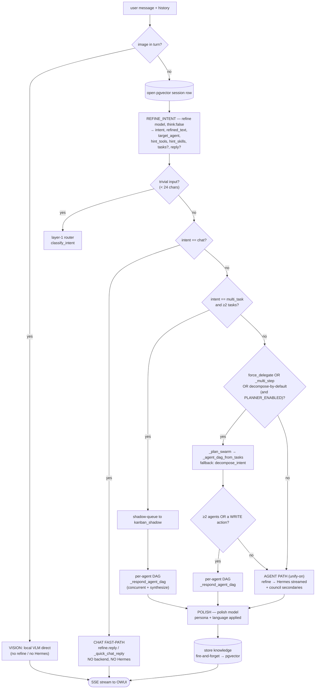

<!-- AI-hint: Maps the end-to-end local inference flow from user input to final response inside MiOS's agentic-AI plane, defining the Refine-Work-Polish architecture and the routing logic the agent-pipe orchestrator uses to manage sub-agents, inference lanes, and tool execution.
     AI-related: mios-agent-pipe, mios-hermes, mios-llm-light, mios-llm-heavy, mios-pgvector, mios-searxng, mios-winget, mios-web-search, mios-discord-send, mios-window, mios-daemon-agent -->
# MiOS AI — End-to-End Pipeline Map

## What this document is, and where it sits in MiOS

MiOS is one thing built two ways at once: an **immutable, bootc/OCI-shaped
Fedora workstation** (the whole OS is a single container image — boot it,
`bootc upgrade` it like a `git pull`, `bootc rollback` it like a Ctrl-Z) that is
*also* a **local, self-replicating, agentic AI operating system**. The same image
that ships GNOME/Wayland, GPU access via CDI, KVM/libvirt, and a one-node-cluster
path also ships a full local agent stack behind one OpenAI-compatible endpoint.

This document maps the **agentic-AI half** of that whole: how a user message
becomes an answer. It is the runtime counterpart to the build/lifecycle story
(build pipeline → OCI image → bootc deploy/rollback) — once the image is booted,
*this* is what runs when someone talks to MiOS. Every query-resolution path, the
loops inside each, and where they branch. Grounded in
`usr/lib/mios/agent-pipe/server.py` (the orchestrator) +
`usr/share/mios/owui/pipes/mios_agent_pipe.py` (the OWUI front).

Everything below runs **100% locally** — the local inference lanes
(`mios-llm-light` and the gated heavy lanes), the local Hermes gateway, local
SearXNG, and the local PostgreSQL + pgvector datastore. No cloud AI, no CDN at
runtime. This satisfies Architectural Law 5 (UNIFIED-AI-REDIRECTS): every agent
and tool resolves the one OpenAI-compatible endpoint from `MIOS_AI_ENDPOINT` —
no vendor-hardcoded URLs.

---

## 0. The prime directive (read this first)

MiOS does **not** let a sub-agent write the answer. The pipeline is shaped
around one rule the operator set:

> **Refine PREPARES the plan. Sub-agents only emit think-blocks + tool results.
> Polish PREPARES the final, user-facing answer.**

So every path has the same skeleton:

```
   user → REFINE (plan + route) → [one or more backends do the work] → POLISH (the answer)
```

The backends differ in *how many agents* engage and *how they're wired*
(single, council, swarm/DAG), but they always feed raw material UP to polish,
which consolidates it into the operator's voice. Sub-agent reasoning is shown
to the user only inside a collapsible `<details type="reasoning">` think-block;
the visible answer is always polish's output.

---

## 1. Components (the 10,000-ft view)

```
┌──────────────────────────────────────────────────────────────────────────┐
│  OWUI chat  (Open WebUI)                                                   │
│    • injects persona / locale / language system messages                   │
│    • injects mios_flags toggles: 🧩 delegate · full-swarm · force-tool      │
│    • renders sub-agent output → <details> think-block; polish = visible     │
└───────────────┬────────────────────────────────────────────────────────────┘
                │  OpenAI /v1/chat/completions (SSE stream)
                ▼
┌──────────────────────────────────────────────────────────────────────────┐
│  mios-agent-pipe  (FastAPI, server.py, :8640)  ── THE ORCHESTRATOR/ROUTER  │
│                                                                            │
│   REFINE ─► route ─► { chat | dispatch | agent | swarm/DAG } ─► POLISH     │
│      │                         │                                  │        │
│   refine model            Hermes + council               polish model     │
│   (think:false)           + per-agent DAG               (persona applied)  │
└──┬─────────────┬───────────────┬──────────────────────────┬───────────────┘
   │             │               │                          │
   ▼             ▼               ▼                          ▼
 micro lane   Hermes :8642   sub-agent registry        PostgreSQL+pgvector
 (mios-llm-   OpenAI gateway  [agents.*] in mios.toml   (mios-pgvector :5432:
  light)      standard         opencode, daemon-agent,   session, tool_call,
 classify/    tool-loop        client nodes…)            knowledge, scratch,
 refine/web                                              event, agent_memory)
                  │
                  ▼
            verb dispatch  ── _build_dispatch_cmd ──►  launcher broker
            (SSOT [verbs.*].cmd templates in mios.toml)   │
                                                          ▼
                                              mios-* shell verbs / helpers
                                              (mios-winget, mios-web-search,
                                               mios-discord-send, mios-window…)
```

**Lanes & models (SSOT: `mios.toml` + `llamacpp/llama-swap.yaml`, overridable by
env).** All chat/reasoning/embedding generation resolves through the primary
inference lane **`mios-llm-light`** (`:11450`) — llama.cpp behind the upstream
`llama-swap` proxy image, which auto-swaps a `llama-server` per requested model
and supports KV-cache paging (per-slot save/restore). The same lane serves
embeddings (`nomic-embed-text`, OpenAI-compat `/v1/embeddings`) and the
`mios-opencode` coder model. Heavy lanes are gated off by default (VRAM).

| Role | Model (default) | Lane / served by | Notes |
|---|---|---|---|
| Refine (routing) | refine model (e.g. `qwen3.5:4b`) | `mios-llm-light` :11450 | `think:false`; `keep_alive`/TTL to kill the cold-start gap |
| Polish (answer) | polish model | `mios-llm-light` :11450 | persona applied; the real output step |
| Classify / micro | `micro_model` (`qwen3:1.7b`) | `mios-llm-light` :11450 | cheap intent + task-gen |
| Hermes orchestrator | served via the gateway | `:8642` MiOS-Hermes → `mios-llm-light` backend | OpenAI gateway, full tool-loop |
| Swarm decomposer | refine model | `mios-llm-light` :11450 | `_plan_swarm`; `/api/chat think:false` |
| Vision | opt-in VLM (e.g. `qwen3-vl:4b`) | `mios-llm-light` :11450 (vision GGUF) | image turns bypass refine; slot ships **empty** (operator opt-in) |
| Heavy GPU lane | `mios-heavy` | `mios-llm-heavy` (SGLang) :11441 | gated/off-by-default (VRAM) |
| Heavy GPU lane (alt) | — | `mios-llm-heavy-alt` (vLLM) :11440 | gated/off-by-default (VRAM) |
| Embeddings | `nomic-embed-text` | `mios-llm-light` :11450 | knowledge recall + RAG |

> Note on model names: the agent registry, Hermes, and the planner still emit
> several legacy/role tags (`qwen3.5:4b`, `mios-hermes`, `mios-planner`, …).
> `llama-swap.yaml` **aliases** those onto the served GGUFs so the lane is a
> drop-in and never returns "no router for requested model." The MiOS *service
> identity* is `mios-llm-light`; `llama-swap` (`ghcr.io/mostlygeek/llama-swap`)
> and the OpenAI/Ollama-compatible API are legitimate upstream references.

---

## 2. The master resolve flow (the router)

This is the decision tree inside `chat_completions`. Each diamond is a
short-circuit — the first one that matches *returns*, so simple queries never
pay for machinery they don't need.



**Override toggles** (per-turn, from the OWUI chat-bar → `body.mios_flags`,
stripped before Hermes sees them):

- `force_council` → engage the **full swarm** (every eligible agent, equal weight).
- `force_delegate` (🧩) → **force** per-agent DAG decomposition; if the planner
  declines, escalates to `force_council` so the toggle never collapses to one agent.
- `force_tool` → `tool_choice=required` on the executor (anti-narration guard).

These override the `mios.toml [dispatch]` SSOT defaults **for that turn only** —
the "forced vs. natural" control, in the spirit of OpenAI `tool_choice`.

---

## 3. The five backend patterns (and the loop inside each)

### 3a. Chat fast-path — *no backend*
`intent=chat` (and no force flags) → use `refine.reply`, or generate one with
`_quick_chat_reply`. Streams straight out. This is the sub-50 ms path that keeps
"hey, how's it going?" from triggering a 30–90 s Hermes tool cascade.
**Loop:** none. One model call, already done by refine.

### 3b. Dispatch fast-path — *one verb, no LLM answer* (unify-off only)
Layer-1 router returns `{action:dispatch, tool, args}` → `dispatch_mios_verb` →
broker → result wrapped in an OpenAI-shaped `tool_call` + `tool_result`
`<details>` envelope. A `tool_call` row is written to pgvector.
**Loop:** none — single tool execution. (Under unify-on this folds into the agent path.)

### 3c. Agent path (unify-on default) — *Hermes + live council*
The workhorse. `intent=agent` →

```
   refine plan ─► Hermes orchestrator (:8642, standard OpenAI tool-loop)
                     │   while (model emits tool_calls):
                     │       run verb via broker → feed tool_result back
                     │   until: final assistant message (no more tool_calls)
                     │
                     ├─► COUNCIL secondaries fan out CONCURRENTLY (equal weight)
                     │       every chat-eligible [agents.*] node, bounded by
                     │       _agent_sem (MIOS_AGENT_CONCURRENCY) + jitter
                     │
                     ▼
   merged asyncio.Queue  ◄── primary pumped in background
                         ◄── secondaries push events: PR/PT/SF/PD
                     │
                     ▼
   one think-block stream (live reasoning) ─► critic ─► POLISH (the answer)
```

- **Hermes tool-loop** = the standard OpenAI tool-call loop. The model decides,
  emits a `tool_call`, the broker executes the verb, the result is fed back; it
  repeats until a final message. This is the one part already on open standards
  (and the surface MCP exposes / A2A federates to peer agents).
- **Council** = *equal weighting*: every eligible agent answers the same prompt
  in parallel. Secondaries stream their reasoning **live** into the think-block
  while the primary is still in its silent tool-loop, via one merged queue
  (race-free). GPU-lane concurrency is bounded (`lane_concurrency_gpu`) so a
  broad fan-out queues rather than OOMing the shared GPU.
- Each hop carries the **refined plan injected as a system-message prefix** — no
  sub-agent ever runs on raw user text.

### 3d. Swarm / per-agent DAG — *split one goal across agents, then synthesize*
Triggered by `multi_task` (≥2 itemized tasks), `_multi_step`, the 🧩 toggle, or
**decompose-by-default** (a substantive agent ask ≥ N words).

```
   _plan_swarm (refine model)  →  [ {agent, sub-task}, … ]   (self-gates: [] if trivial)
        │  fallback → decompose_intent (general verb-DAG planner)
        ▼
   _agent_dag_from_tasks → DAG {nodes:[{agent|tool, deps}]}
        │  taken only if ≥2 agents OR contains a WRITE action
        ▼
   _execute_dag_emitting → run nodes concurrently, respecting deps
        │   per-node live emitters:  🛰️ engaged · ✅ responded · 💤 silent
        │   (each shows lane · model · endpoint)
        ▼
   🧬 synthesis → POLISH → one answer
```

**Loop:** the DAG executor — nodes with satisfied dependencies fire in parallel
(shared `_agent_sem`), their outputs gate downstream nodes, until the graph drains.
Distinct agents/lanes do *distinct* work (not a Hermes duplicate).

### 3e. Vision — *direct to VLM*
An image-bearing turn can't be served by the text executor, so it bypasses
refine/planning/Hermes entirely and goes straight to the local VLM on
`mios-llm-light`. The vision model slot ships **empty** (opt-in: the operator
adds a vision GGUF to the llama-swap map to activate it), so an image turn never
silently pulls a multi-GB VLM. No session or refine overhead. **Loop:** none.

---

## 4. Cross-cutting loops & context (active across all backends)

These aren't separate paths — they wrap the backends above. The unified
datastore for all of them is **PostgreSQL + pgvector** (`mios-pgvector`, `:5432`,
accessed via `mios-pg-query` / `mios-db --pg`); the vector columns hold the
embeddings produced by `nomic-embed-text` on `mios-llm-light`.

| Mechanism | What it does | Where |
|---|---|---|
| **Knowledge recall** | Embed-at-write + cosine recall of prior Q&A (pgvector), threshold-gated, injected into each agent's `_sys_prefix`. | `_recall_knowledge` |
| **Knowledge store** | Every finished Q&A (+ derived sources: verbs invoked, URLs) persisted to the pgvector `knowledge` table, fire-and-forget after polish. | `_store_knowledge` |
| **RAG enrich** | Pulls from OWUI knowledge collections (embeddings via `nomic-embed-text`) into the prompt. | `_rag_enrich` |
| **Per-chat scratchpad** | Rolling cross-agent blackboard keyed by OpenAI `metadata.chat_id`, contextvar-threaded so concurrent council/DAG tasks inherit it; rendered into every node's prompt. | `_scratchpad_note` / `_scratchpad_render` |
| **A2A / ACP context** | The same blackboard exposed in open `Message{role,parts[],contextId}` shape at `GET /a2a/contexts/{id}`. | `_a2a_messages_for` / `_a2a_context` |
| **Web fan-out** | One `web_search` query expands into K concurrent sub-queries → RRF merge (in `mios-web-search`, backed by SearXNG `:8888`), bounded by a semaphore. | verb → helper |
| **Temporal grounding** | `today`/`tomorrow` injected into refine/polish/dispatch (fixes "tomorrow = today"). | refine/polish |
| **Anti-fabrication (P5)** | Structural check flags narrated-but-not-executed WRITE actions (`write_action_unmet`) to polish, so the model can't fake "I posted it." | `refine_intent` post-pass |
| **Satisfaction / auto-halt** | `mios-daemon-agent` runs a Definition-of-Done checker across tool_call/window/file/URL signals; emits `user_query_satisfied`; agents halt on that instead of looping. | `mios-daemon-agent` |

### Verb dispatch (the bottom of every action)
When any agent invokes a verb, `_build_dispatch_cmd(tool, args)` renders it.
**SSOT first:** a verb with a `cmd` template in `mios.toml [verbs.*]` renders via
the catalog (`_template_to_cmd`); only verbs whose logic genuinely needs code
(conditionals, enums, base64 staging, recursion) keep a hardcoded branch. The
rendered line goes to the launcher broker, which runs the `mios-*` helper.
Template placeholders: `{arg}` · `{arg=default}` · `{arg?FLAG}` (optional flag).

---

## 5. The bypass: task-generation calls

OWUI also fires non-conversational helper calls — **title, tags, follow-up
suggestions, autocomplete**. These do **not** touch refine / Hermes / council.
They go straight to the cheap micro model (`micro_model`, on `mios-llm-light`)
and return. Keeping them off the main path is why the conversation list stays
snappy.

```
   OWUI task-gen (title/tags/followup/autocomplete) ──► micro model (mios-llm-light) ──► done
```

---

## 6. Live status emitters (what the user sees while it works)

The pipe streams SSE status events so the chat shows live progress, not a
spinner. Per-AI-node, during council/DAG fan-out:

| Emit | Meaning |
|---|---|
| 🛰️ | node **engaged** (lane · model · endpoint) |
| ✅ | node **responded** |
| 💤 | node **went silent** (e.g. a client node that's asleep; short-timeout drop) |
| 🧬 | **synthesis** pass running (covers the gap before polish) |

Phase events (`prompt` → `refine` → backend → `…_done`) drive the top-line
status. Client-hosted nodes (a phone over the local network/Tailscale) auto-join
when up and auto-drop when gone (`health_gate` → short timeout) — the same
`health_gate` mechanism keeps the gated heavy lanes inert until reachable.

---

## 7. One query, traced end-to-end

> **User:** "find the biggest log files under /var and tell me what's filling them"

```
1. OWUI       → injects persona+locale, no flags. POST /v1/chat/completions (stream).
2. refine     → intent=agent, refined_text + hint_tools=[fs_search, directory_lookup,
                system_logs], target_agent=hermes. (not chat, not multi_task)
3. decompose? → substantive agent ask ≥ N words → _plan_swarm. Self-gates: this is
                ONE goal with dependent steps, not 2 independent goals → falls through.
4. agent path → Hermes tool-loop (:8642 → mios-llm-light backend):
                  tool_call fs_search(path=/var, type=f, …)      → broker → results 🛰️✅
                  tool_call directory_lookup(...) / system_logs  → broker → results
                council secondaries stream reasoning live into the think-block.
                knowledge recall (pgvector) + scratchpad injected into the prompt.
5. polish     → consolidates tool results into a ranked answer, operator's voice,
                correct language. 🧬→ visible reply; raw reasoning in <details>.
6. store      → Q&A + sources (verbs, paths) → pgvector knowledge (fire-and-forget).
```

If the same user had said *"install VS Code **and** open it"* → step 2 yields a
**dag** (one goal, dependent steps) → `_respond_agent_dag` runs
`winget_install` then `open_app` in order, emitting per-node status, then polish.
If they'd said *"check disk usage, summarize my unread mail, and list running
containers"* → **multi_task** (3 independent goals) → concurrent per-agent DAG →
synthesize one answer.

---

## 8. Design invariants (why it's shaped this way)

These follow directly from the MiOS Architectural Laws — Law 5
(UNIFIED-AI-REDIRECTS) and Law 6 (UNPRIVILEGED-QUADLETS) keep this whole plane
unified and least-privileged.

- **Nothing hardcoded** — models, ports, agents, verbs, recipes, and tunables
  all flow from `mios.toml` (SSOT) → `${MIOS_*:-default}`. Command literals live
  in the `mios-*` helpers, not in dispatch.
- **No canned English** — status text and gates are generated, not hardcoded
  strings; intent routing is model-decided, with **no topic deny-lists**.
- **One endpoint, full offline** — every lane, gateway, search, and DB is local;
  every agent/tool resolves `MIOS_AI_ENDPOINT` rather than a vendor URL (Law 5).
- **Truthful actions** — a real ask → a real `tool_call` → a real result; the P5
  check + `force_tool` exist to stop the model *narrating* an action it didn't take.
- **Fast path stays fast** — trivial input skips refine; chat skips the backend;
  task-gen skips everything but the micro model.

---

*Source of truth: `usr/lib/mios/agent-pipe/server.py` (+ `mios.toml` and
`usr/share/mios/llamacpp/llama-swap.yaml`). This map is descriptive — when in
doubt, the code wins. Related: `docs/agentic-standards-roadmap.md`,
`docs/agentos-roadmap.md`.*
